# GAO-Dev System Architecture Overview

**Document Type**: Executive Architecture Summary
**Author**: Winston (Technical Architect)
**Date**: 2025-11-22
**Version**: 1.0
**Status**: Production System Documentation

---

## TL;DR

**What**: Full-stack autonomous development system with CLI + Web UI orchestrating 8 specialized agents

**Why**: Manage complete software development lifecycle from requirements to deployment with full visibility and control

**Key Points**:
- Layered architecture (User Interfaces > Orchestration > Services > Infrastructure)
- Event-driven coordination with real-time WebSocket updates
- Production-ready with 400+ tests, type-safe, comprehensive observability
- Dual-mode operation: CLI for automation, Web UI for monitoring
- Scale-adaptive workflows (Levels 0-4) with intelligent routing

**Quick Links**:
- [Quick Start Guide](../QUICK_START.md) - Integration patterns and code examples
- [API Reference](../API_REFERENCE.md) - Complete endpoint and event catalog
- [Web Interface Architecture](features/web-interface/ARCHITECTURE.md) - Frontend/backend details

---

## Executive Summary

GAO-Dev (Generative Autonomous Organisation - Development Team) is a **production-ready, full-stack autonomous development orchestration system** that combines CLI-based agent coordination with a browser-based mission control center. The system manages the complete software development lifecycle through 8 specialized Claude agents working autonomously across workflows, ceremonies, and project management.

**Architecture Style**: **Layered Full-Stack with Event-Driven Orchestration**

```
┌─────────────────────────────────────────────────────────────────┐
│                      USER INTERFACES                             │
│                                                                   │
│  ┌──────────────────┐         ┌──────────────────────┐          │
│  │   CLI (Primary)   │         │   Web UI (Mission    │          │
│  │   - Commands      │         │   Control Center)     │          │
│  │   - Brian Chat    │         │   - React 19 SPA      │          │
│  │   - Workflows     │         │   - Real-time events  │          │
│  └───────┬──────────┘         └──────────┬───────────┘          │
└───────────┼──────────────────────────────┼──────────────────────┘
            │                                │
┌───────────┼──────────────────────────────┼──────────────────────┐
│           │    APPLICATION ORCHESTRATION  │                       │
│           └──────────┬──────────────────┬┘                       │
│                      │                   │                        │
│    ┌─────────────────v──┐    ┌─────────v────────────┐           │
│    │  GAODevOrchestrator│    │  FastAPI Web Server  │           │
│    │  (CLI Coordinator) │    │  (WebSocket Gateway) │           │
│    └─────────┬──────────┘    └──────────┬───────────┘           │
└──────────────┼──────────────────────────┼───────────────────────┘
               │                           │
┌──────────────┼──────────────────────────┼───────────────────────┐
│              │   BUSINESS SERVICES       │                       │
│              │                           │                        │
│    ┌─────────v───────────┐    ┌─────────v────────────┐          │
│    │ WorkflowCoordinator │    │  BrianWebAdapter     │          │
│    │ CeremonyOrchestrator│    │  WebEventBus         │          │
│    │ StoryLifecycle      │    │  WebSocketManager    │          │
│    │ QualityGate         │    │  FileSystemWatcher   │          │
│    └─────────┬───────────┘    └──────────┬───────────┘          │
└──────────────┼──────────────────────────┼───────────────────────┘
               │                           │
┌──────────────┼──────────────────────────┼───────────────────────┐
│              │   DOMAIN LAYER            │                       │
│              │                           │                        │
│    ┌─────────v───────────────────────────v────────────┐         │
│    │  8 Specialized Agents (Brian, Mary, John,         │         │
│    │   Winston, Sally, Bob, Amelia, Murat)             │         │
│    │                                                     │         │
│    │  55+ Workflows (PRD, Architecture, Stories, etc.)  │         │
│    │                                                     │         │
│    │  Methodologies (BMAD Adaptive Agile, Simple)       │         │
│    └──────────────────┬──────────────────────────────────┘       │
└───────────────────────┼──────────────────────────────────────────┘
                        │
┌───────────────────────┼──────────────────────────────────────────┐
│                       │  INFRASTRUCTURE & DATA                     │
│                       │                                            │
│    ┌──────────────────v──────────────────────────────┐            │
│    │  GitIntegratedStateManager (Atomic Ops)        │            │
│    │    - File System (docs/, src/, .gao-dev/)      │            │
│    │    - SQLite DB (.gao-dev/documents.db)          │            │
│    │    - Git Repository (atomic commits)            │            │
│    │                                                   │            │
│    │  Credential Storage                              │            │
│    │    - Environment Variables (PRIMARY)             │            │
│    │    - System Keychain (Desktop)                   │            │
│    │    - Encrypted File (AES-256-GCM)                │            │
│    └───────────────────────────────────────────────────┘            │
└──────────────────────────────────────────────────────────────────┘
```

### System Context Diagram (Mermaid)

```mermaid
graph TB
    User[👤 Developer/Product Owner]

    subgraph "GAO-Dev System"
        CLI[🖥️ CLI Interface<br/>gao-dev commands]
        WebUI[🌐 Web UI<br/>React + FastAPI]
        Brian[🤖 Brian Agent<br/>Workflow Coordinator]
        Agents[👥 8 Specialized Agents<br/>Mary, John, Winston, etc.]
        State[💾 State Manager<br/>File + DB + Git]
    end

    Git[(🗂️ Git Repository)]
    FileSystem[(📁 File System<br/>.gao-dev/, docs/, src/)]
    Database[(🗄️ SQLite DB<br/>documents.db)]
    Claude[☁️ Anthropic Claude<br/>AI Provider]

    User -->|Commands| CLI
    User -->|Browser| WebUI
    CLI --> Brian
    WebUI --> Brian
    Brian --> Agents
    Agents --> State
    State --> Git
    State --> FileSystem
    State --> Database
    Agents -.->|API Calls| Claude

    classDef userClass fill:#e1f5ff,stroke:#0078d4,stroke-width:2px
    classDef coreClass fill:#ffe1f5,stroke:#d40078,stroke-width:2px
    classDef dataClass fill:#f5ffe1,stroke:#78d400,stroke-width:2px
    classDef cloudClass fill:#fff5e1,stroke:#d49000,stroke-width:2px

    class User userClass
    class CLI,WebUI,Brian,Agents coreClass
    class Git,FileSystem,Database dataClass
    class Claude cloudClass
```



### Component Architecture Diagram (Mermaid)


### Chat Message Flow Sequence Diagram (Mermaid)


---

## Core Architectural Principles

1. **Agent Specialization**: 8 specialized agents with distinct roles (Planning, Implementation, Quality, Management)
2. **Workflow-Driven**: All work flows through 55+ pre-defined workflows with intelligent selection
3. **Scale-Adaptive**: Auto-adjusts complexity (Levels 0-4) based on project size and requirements
4. **Event-Driven**: Real-time synchronization via WebSocket pub/sub (asyncio.Queue)
5. **Atomic Operations**: File + Database + Git commits succeed or fail together (ACID guarantees)
6. **Dual-Mode Operation**: CLI (write access) + Web UI (read-only observability) simultaneously
7. **Multi-Environment**: Desktop, Docker, SSH, WSL, CI/CD with automatic detection

---

## Technology Stack Summary

### Backend

| Layer | Technologies |
|-------|-------------|
| **CLI Framework** | Python 3.10+, Click, Rich (terminal UI) |
| **Web Framework** | FastAPI 0.104+, uvicorn (ASGI server) |
| **Agent Runtime** | Anthropic Claude (via Claude Code SDK or OpenCode SDK) |
| **Orchestration** | asyncio (Python native async), WorkflowExecutor |
| **Event Streaming** | WebSocket (FastAPI native), asyncio.Queue |
| **State Management** | SQLite 3.35+ (.gao-dev/documents.db), File System |
| **Version Control** | Git 2.30+, GitPython (atomic commits) |
| **File Watching** | watchdog (real-time change detection) |
| **Logging** | structlog (structured, observable logging) |
| **Testing** | pytest, pytest-asyncio, pytest-cov |

### Frontend (Web UI)

| Layer | Technologies |
|-------|-------------|
| **Framework** | React 19.2.0, TypeScript 5.9.3 |
| **Build Tool** | Vite 7.2.2 (fast HMR, optimal bundles) |
| **State Management** | Zustand 5.0.8 (8 core stores + localStorage persistence) |
| **Data Fetching** | @tanstack/react-query 5.90.10, native fetch |
| **UI Components** | shadcn/ui (Radix UI + Tailwind CSS 4.1.17) |
| **Code Editor** | @monaco-editor/react 4.7.0 (VS Code editor) |
| **Virtual Scrolling** | @tanstack/react-virtual 3.13.12 |
| **Drag-and-Drop** | @dnd-kit/* (Kanban board) |
| **Charts** | recharts 3.4.1 (workflow visualization) |
| **Toasts** | sonner 2.0.7 (notifications) |
| **Routing** | react-router-dom 7.9.6 |

---

## System Components

### 1. The 8 Specialized Agents

| Agent | Role | Primary Responsibilities |
|-------|------|-------------------------|
| **Brian** | Workflow Coordinator & Engineering Manager | Initial analysis, workflow selection, scale routing, quality gates |
| **Mary** | Business Analyst | Vision elicitation, brainstorming (35 BMAD techniques), requirements analysis |
| **John** | Product Manager | PRD creation, feature definition, prioritization, roadmaps |
| **Winston** | Technical Architect | System architecture, technical specifications, design decisions |
| **Sally** | UX Designer | User experience, wireframes, design systems, accessibility |
| **Bob** | Scrum Master | Story creation/management, sprint coordination, agile ceremonies |
| **Amelia** | Software Developer | Implementation, code reviews, testing, debugging |
| **Murat** | Test Architect | Test strategies, quality assurance, E2E testing, test automation |

**Agent Configuration**: All agents configured in YAML (`gao_dev/config/agents/*.yaml`) with externalized prompts for easy customization.

**Agent Architecture**: See [Agent Configuration System](#6-agent-configuration-system)

---

### 2. Scale-Adaptive Routing (Brian's Intelligence)

Brian analyzes user prompts and selects workflows based on **project scale** (Levels 0-4):

| Level | Type | Stories | Duration | Workflows | Ceremonies | Example |
|-------|------|---------|----------|-----------|------------|---------|
| **0** | Chore | 0 | <1 hour | Direct execution | None | Fix typo, update config |
| **1** | Bug Fix | 0-1 | 1-4 hours | Minimal planning | Retro on failure | Fix authentication bug |
| **2** | Small Feature | 3-8 | 1-2 weeks | PRD → Arch → Stories | Optional | Add user profile page |
| **3** | Medium Feature | 12-40 | 1-2 months | Full BMAD | Planning + Retros | Multi-factor authentication |
| **4** | Greenfield App | 40+ | 2-6 months | Comprehensive | Full ceremonies | Todo app with auth, sync |

**Key Insight**: Level determines workflow complexity, NOT quality. All levels maintain high standards.

**Implementation**: `gao_dev/methodologies/adaptive_agile/scale_levels.py`

---

### 3. Workflow-Driven Execution

**Workflow Registry**: 55+ embedded workflows across 4 phases:

1. **Analysis Phase**: Vision, brainstorming, problem analysis
2. **Planning Phase**: PRD, architecture, technical specifications
3. **Solutioning Phase**: Epic/story creation, acceptance criteria
4. **Implementation Phase**: Story development, testing, documentation

**Workflow Execution Flow**:

```
User Prompt → Brian Analysis → Scale Level Determination
  → Workflow Sequence Selection → Variable Resolution
  → Template Rendering → Agent Coordination → Artifact Creation
  → Atomic Git Commit → Document Registration → Metrics Collection
```

**Variable Resolution Priority**: Runtime params > Workflow defaults > Config defaults > Common variables

**Architecture**: See [Workflow System Documentation](./features/document-lifecycle-system/ARCHITECTURE.md)

---

### 4. Git-Integrated Hybrid Architecture (Epic 27)

**Core Service**: `GitIntegratedStateManager`

**Atomic Operations** (ACID guarantees):
```python
# All 3 operations succeed or all roll back:
1. File write (to docs/, src/, etc.)
2. Database insert (to .gao-dev/documents.db)
3. Git commit (with structured message)
```

**Performance**:
- Epic creation: <1s
- Story creation: <200ms
- Context load: <5ms (with LRU cache, >80% hit rate)

**Key Services**:
1. **GitIntegratedStateManager**: Atomic file+DB+git with auto-rollback
2. **FastContextLoader**: <5ms context loads (LRU cache)
3. **CeremonyOrchestrator**: Multi-agent ceremony coordination
4. **ConversationManager**: Natural dialogue with context awareness
5. **GitMigrationManager**: Safe migration with 4-phase rollback
6. **GitAwareConsistencyChecker**: File-DB sync validation and repair

**Architecture**: See [Git-Integrated Hybrid Wisdom](./features/git-integrated-hybrid-wisdom/ARCHITECTURE.md)

---

### 5. Web Interface (Epic 39)

**Architecture Style**: Full-stack SPA with real-time event streaming

**Technology**: FastAPI (backend) + React 19 (frontend) + WebSocket (real-time)

**Key Features**:
- **Real-Time Observability**: Activity stream (10,000+ events), WebSocket <50ms latency
- **Interactive Chat**: DMs with all 8 agents, ceremony channels, threading
- **Visual Project Management**: Kanban board (drag-drop, state transitions)
- **File Management**: Monaco editor, atomic saves (file + DB + git commit)
- **Workflow Visualization**: Timeline, DAG, critical path analysis
- **Git Integration**: Commit timeline, diffs, author badges

**Architecture Patterns**:
1. **Thin Adapter** (BrianWebAdapter → ChatSession, NO duplication)
2. **Event-Driven Sync** (FileSystemWatcher → WebEventBus → WebSocket → Frontend)
3. **Session Lock Coordination** (ReadOnlyMiddleware enforces CLI exclusivity)

**Performance** (Production):
- Page Load: <1.5s (target: <2s) ✅
- WebSocket Latency: <50ms (target: <100ms) ✅
- Activity Stream: 10,000 events with virtual scrolling ✅

**State Management** (Frontend):
- 8 Zustand stores (chatStore, activityStore, filesStore, workflowStore, kanbanStore, sessionStore, layoutStore, dmsStore)
- localStorage persistence for chat history and layout preferences
- Real-time synchronization via WebSocket

**API Endpoints**: 50+ REST endpoints + 25+ WebSocket event types

**Architecture**: See [Web Interface Architecture](./features/web-interface/ARCHITECTURE.md) and [Implementation Status](./features/web-interface/IMPLEMENTATION_STATUS.md)

---

### 6. Agent Configuration System (Epic 10)

**All agent configurations externalized to YAML**:

```
gao_dev/config/
├── agents/                      # Agent configurations
│   ├── brian.yaml              # Brian config + persona
│   ├── mary.yaml               # Mary config + persona
│   ├── john.yaml               # John config + persona
│   ├── winston.yaml            # Winston config + persona
│   ├── sally.yaml              # Sally config + persona
│   ├── bob.yaml                # Bob config + persona
│   ├── amelia.yaml             # Amelia config + persona
│   └── murat.yaml              # Murat config + persona
│
├── prompts/                     # Task prompts (YAML)
│   ├── tasks/                  # Task-specific prompts
│   ├── brian/                  # Brian's prompts
│   └── story_orchestrator/     # Story lifecycle prompts
│
└── defaults.yaml                # Default settings
```

**Benefits**:
- No code changes to update prompts or agent personalities
- Easy versioning and A/B testing
- Plugin ecosystem for domain-specific extensions
- Reference resolution (`@file:`, `@config:`)

**Architecture**: See [Prompt Abstraction System](./features/prompt-abstraction/ARCHITECTURE.md)

---

### 7. Streamlined Onboarding (Epics 40-42)

**Goal**: <3 minutes from `gao-dev start` to first Brian response

**Environment Detection**:
- Desktop (GUI): Web wizard (browser-based)
- Docker: TUI wizard (Rich-based terminal UI)
- SSH/Remote: TUI wizard
- CI/CD: Headless (environment variables only)

**Credential Storage Priority**:
1. **Environment Variables** (PRIMARY, recommended): `ANTHROPIC_API_KEY`, `AGENT_PROVIDER`
2. **System Keychain** (Desktop convenience): macOS Keychain, Windows Credential Manager
3. **Mounted Config** (Docker volumes): `.gao-dev/config.yaml`
4. **Encrypted File** (Last resort): AES-256-GCM with PBKDF2-SHA256

**Onboarding Wizard Steps**:
1. Project Configuration (name, type)
2. Git Configuration (user name, email)
3. Provider Selection (Claude Code, OpenCode, Direct API, Ollama)
4. Credentials (API key validation)
5. Finalization (initialize `.gao-dev/` structure)

**Architecture**: See [Streamlined Onboarding](./features/streamlined-onboarding/ARCHITECTURE.md)

---

### 8. Ceremony Integration & Self-Learning (Epics 28-29)

**Ceremony Orchestrator**: Multi-agent coordination for agile ceremonies

**Supported Ceremonies**:
- Sprint Planning (Epic/Story creation, estimation)
- Daily Stand-ups (Progress updates, blockers)
- Sprint Reviews (Demo, stakeholder feedback)
- Retrospectives (What went well, what to improve, action items)

**Self-Learning Features** (Epic 29):
- **LearningApplicationService**: Relevance scoring for retrospective insights
- **Brian Context Augmentation**: Inject learnings into workflow selection
- **Workflow Adjustment Engine**: Modify workflows based on past failures
- **Action Item Automation**: Convert retro action items to stories

**Architecture**: See [Ceremony Integration](./features/ceremony-integration-and-self-learning/ARCHITECTURE.md)

---

## Data Flow Diagrams

### Chat Message Flow (Web UI)

```
User Types Message in ChatInput
  ↓
POST /api/chat { message: "Build todo app" }
  ↓
BrianWebAdapter.send_message()
  ├─ Publish: CHAT_MESSAGE_SENT event (WebEventBus)
  ├─ Delegate to ChatSession.handle_input() ← Epic 30 reuse
  │   └─ ConversationalBrian.process()
  │       └─ BrianOrchestrator.select_workflow()
  │           └─ WorkflowRegistry.get_workflow("prd")
  └─ For each response chunk:
      ├─ Publish: CHAT_STREAMING_CHUNK event
      └─ Yield chunk to client
  ↓
WebSocket broadcasts events to all connected clients
  ↓
Frontend WebSocket Handler (App.tsx)
  ├─ CHAT_MESSAGE_SENT → chatStore.addMessage()
  ├─ CHAT_STREAMING_CHUNK → chatStore.addStreamingChunk()
  └─ CHAT_MESSAGE_RECEIVED → chatStore.finishStreamingMessage()
  ↓
ChatWindow re-renders with new messages
```

### File Change Detection Flow (Real-Time Sync)

```
Amelia writes file to src/auth.py
  ↓
FileSystemWatcher detects change (watchdog library)
  ↓
_emit_event("FILE_MODIFIED", "src/auth.py")
  ↓
WebEventBus.publish(FILE_MODIFIED event)
  ↓
WebSocketManager broadcasts to all clients
  ↓
Frontend WebSocket Handler
  ├─ filesStore.addRecentlyChanged("src/auth.py")
  ├─ activityStore.addEvent(file_modification_event)
  └─ FileTree component highlights recently changed file
  ↓
User sees real-time file update in web UI (< 50ms latency)
```

### Atomic State Transition Flow (Kanban Drag-Drop)

```
User drags Story 5.1 from "Backlog" to "Ready" (Kanban UI)
  ↓
POST /api/kanban/transition { epic: 5, story: 1, newState: "ready" }
  ↓
ConfirmationDialog: "Transition Story 5.1 to Ready? [Confirm] [Cancel]"
  ↓
User confirms
  ↓
GitIntegratedStateManager.transition_story(5, 1, "ready")
  ├─ BEGIN TRANSACTION
  ├─ 1. Update story status in .gao-dev/documents.db
  ├─ 2. Update story file in docs/features/<feature>/epics/<epic>/stories/story-5.1.md
  ├─ 3. Git commit with message: "chore(state): Transition Story 5.1 to ready"
  ├─ COMMIT or ROLLBACK (all or nothing)
  └─ Publish: STATE_STORY_TRANSITIONED event
  ↓
WebSocket broadcasts to all clients
  ↓
Frontend kanbanStore.updateCard(storyId, newState)
  ↓
Kanban board updates in real-time (optimistic UI with rollback on error)
```

---

## Security Architecture

### Threat Model

**Trust Boundary**: Localhost only (127.0.0.1)
**Assumption**: No untrusted networks, single-user development environment

### Security Layers

1. **WebSocket Authentication**:
   - 32-byte URL-safe session token (generated on startup)
   - Stored in `.gao-dev/session.token`
   - Constant-time validation (`secrets.compare_digest()`)
   - Required in `X-Session-Token` header or `?token=` query param

2. **CORS Restriction**:
   - Allowed origins: `localhost:3000-3010`, `127.0.0.1:5173-5180`
   - Prevents cross-origin requests from untrusted domains

3. **Path Validation**:
   - All file paths validated within `project_root`
   - Prevents directory traversal attacks (e.g., `../../etc/passwd`)

4. **Input Sanitization**:
   - Commit message validation (regex, max length)
   - YAML injection prevention (provider preferences)
   - SQL injection (parameterized queries, SQLite)

5. **Session Lock**:
   - PID tracking prevents conflicting writes
   - Stale lock detection (validate PID exists)
   - ReadOnlyMiddleware enforces exclusivity

6. **Credential Encryption**:
   - AES-256-GCM (authenticated encryption)
   - PBKDF2-SHA256 key derivation (600,000 iterations)
   - User password NOT stored (required on each start)

### Future Enhancements (Remote Deployment)

- JWT tokens or OAuth 2.0
- HTTPS/TLS (Let's Encrypt certificates)
- Secure WebSocket (WSS)
- Rate limiting (prevent DoS)
- Role-based access control (RBAC)
- CSRF tokens for state-changing operations
- Security headers (X-Frame-Options, CSP)

---

## Performance Characteristics

### CLI Performance

| Operation | Target | Actual | Method |
|-----------|--------|--------|--------|
| **Epic Creation** | <1s | ~800ms | GitIntegratedStateManager |
| **Story Creation** | <200ms | ~150ms | Atomic file+DB+git |
| **Context Load (Cached)** | <5ms | ~3ms | FastContextLoader (LRU cache) |
| **Context Load (Cold)** | <50ms | ~40ms | SQLite query + file read |
| **Workflow Execution (Simple)** | <10s | ~8s | Agent invocation + artifact |
| **Workflow Execution (Complex)** | <5min | ~4min | Multi-step PRD → Arch → Stories |

### Web UI Performance (95th Percentile)

| Metric | Target | Actual | Status |
|--------|--------|--------|--------|
| **Page Load (TTI)** | <2s | <1.5s | ✅ Exceeded |
| **WebSocket Message Latency** | <100ms | <50ms | ✅ Exceeded |
| **API Response Time** | <50ms | <100ms | ✅ Acceptable (git commit overhead) |
| **Activity Stream Render (1,000 events)** | <200ms | ~150ms | ✅ Exceeded |
| **File Tree Render (500 files)** | <300ms | ~250ms | ✅ Exceeded |
| **Monaco Load** | <500ms | ~400ms | ✅ Exceeded |
| **Kanban Render (100 stories)** | <400ms | ~300ms | ✅ Exceeded |

### Scalability Thresholds

| Resource | Limit | Behavior |
|----------|-------|----------|
| **Activity Stream Events** | 10,000 | Virtual scrolling (only render visible) |
| **File Tree Files** | 500+ | Virtual scrolling + lazy loading |
| **Monaco Editor Lines** | 10,000+ | Native Monaco optimization |
| **Kanban Stories** | 1,000+ | Virtual scrolling + pagination |
| **WebSocket Connections** | 10 | Configurable limit (localhost constraint) |
| **Event Queue Per Subscriber** | 1,000 | FIFO overflow handling |

---

## Deployment Modes

### 1. Desktop (Default)

```bash
gao-dev start
# Auto-detects: Desktop environment ($DISPLAY or Windows)
# Launches: Web wizard at localhost:3000
# Stores credentials: System keychain
```

### 2. Docker

```bash
docker run -p 3000:3000 \
  -v $(pwd):/workspace \
  -v gao-dev-config:/root/.gao-dev \
  -e ANTHROPIC_API_KEY=${ANTHROPIC_API_KEY} \
  -e AGENT_PROVIDER=claude-code \
  gao-dev:latest start
# Auto-detects: Docker (/.dockerenv or $GAO_DEV_DOCKER)
# Launches: TUI wizard (Rich terminal UI)
# Stores credentials: Environment variables (PRIMARY)
```

### 3. SSH/Remote Development

```bash
ssh user@remote-server
cd my-project
gao-dev start
# Auto-detects: SSH ($SSH_CLIENT or $SSH_TTY)
# Launches: TUI wizard
# Stores credentials: Environment variables or mounted config
```

### 4. CI/CD (Headless)

```bash
export GAO_DEV_HEADLESS=1
export ANTHROPIC_API_KEY=sk-...
export AGENT_PROVIDER=claude-code
gao-dev start
# Auto-detects: CI ($CI, $GITHUB_ACTIONS, $GITLAB_CI)
# Launches: No wizard (headless mode)
# Stores credentials: Environment variables only
```

---

## Testing Strategy

### Test Pyramid

```
                    ┌──────────────┐
                    │   E2E Tests  │  (Playwright, Cypress)
                    │   ~50 tests  │
                    └──────────────┘
                  ┌────────────────────┐
                  │ Integration Tests  │  (pytest, async workflows)
                  │    ~150 tests      │
                  └────────────────────┘
            ┌──────────────────────────────┐
            │       Unit Tests             │  (pytest, mocks, 80% coverage)
            │       ~800+ tests            │
            └──────────────────────────────┘
```

### Test Coverage

| Component | Coverage | Test Count | Framework |
|-----------|----------|------------|-----------|
| **CLI Commands** | 85% | 120+ | pytest |
| **Agents** | 80% | 80+ | pytest + mocks |
| **Workflows** | 75% | 150+ | pytest-asyncio |
| **GitIntegratedStateManager** | 95% | 100+ | pytest + temp repo |
| **Web Backend (FastAPI)** | 80% | 120+ | pytest + TestClient |
| **Web Frontend (React)** | 70% | 200+ | Vitest + React Testing Library |
| **E2E (Web UI)** | N/A | 50+ | Playwright |

### Testing Tools

- **Unit**: pytest, pytest-asyncio, pytest-cov, pytest-mock
- **Integration**: pytest + tempfile (temp git repos)
- **E2E**: Playwright MCP (AI-driven testing), Cypress
- **Frontend**: Vitest, React Testing Library, @testing-library/user-event
- **Linting**: ruff, mypy (strict mode)
- **Formatting**: black (line length 100)

---

## Deployment Architecture (Production)

### Directory Structure (Production Instance)

```
/workspace/my-project/                 # Project root
├── .gao-dev/                          # GAO-Dev project state
│   ├── documents.db                   # Document lifecycle (SQLite)
│   ├── session.lock                   # Session lock (PID tracking)
│   ├── session.token                  # WebSocket auth token
│   ├── config.yaml                    # Project configuration
│   ├── provider_preferences.yaml      # Provider settings
│   ├── onboarding_state.yaml          # Onboarding progress
│   └── metrics/                       # Project metrics
│
├── docs/                              # Documentation
│   ├── features/                      # Feature-based structure
│   │   └── <feature-name>/
│   │       ├── PRD.md
│   │       ├── ARCHITECTURE.md
│   │       ├── epics/                 # Co-located epic-story structure
│   │       │   └── <epic-num>-<name>/
│   │       │       ├── README.md      # Epic definition
│   │       │       ├── stories/       # Stories for this epic
│   │       │       └── context/       # Context XML files
│   │       └── retrospectives/
│   └── global docs...
│
├── src/                               # Application code
├── tests/                             # Test suite
└── .git/                              # Git repository
```

### Global Configuration (User Home)

```
~/.gao-dev/                            # User-level configuration
├── config.yaml                        # Global defaults
├── credentials.yaml                   # Encrypted credentials (if used)
└── plugins/                           # Custom agent plugins
```

---

## Documentation Map

### Core Documentation

| Document | Purpose | Audience |
|----------|---------|----------|
| **[README.md](../README.md)** | Project overview, quick start | All users |
| **[CLAUDE.md](../CLAUDE.md)** | **START HERE** - Claude agent guide | Claude AI |
| **[ARCHITECTURE_OVERVIEW.md](./ARCHITECTURE_OVERVIEW.md)** | **This document** - System overview | Architects, developers |
| **[INSTALLATION.md](../INSTALLATION.md)** | Installation instructions | New users |
| **[DEV_TROUBLESHOOTING.md](../DEV_TROUBLESHOOTING.md)** | Development troubleshooting | Contributors |

### Feature-Specific Architecture

| Epic | Feature | Architecture Doc |
|------|---------|-----------------|
| **Epic 39** | Web Interface | [Web Interface ARCHITECTURE.md](./features/web-interface/ARCHITECTURE.md) |
| **Epic 40-42** | Streamlined Onboarding | [Streamlined Onboarding ARCHITECTURE.md](./features/streamlined-onboarding/ARCHITECTURE.md) |
| **Epic 27** | Git-Integrated Hybrid Wisdom | [Git-Integrated ARCHITECTURE.md](./features/git-integrated-hybrid-wisdom/ARCHITECTURE.md) |
| **Epic 30** | Interactive Brian Chat | [Interactive Brian ARCHITECTURE.md](./features/interactive-brian-chat/ARCHITECTURE.md) |
| **Epic 28-29** | Ceremony & Self-Learning | [Ceremony ARCHITECTURE.md](./features/ceremony-integration-and-self-learning/ARCHITECTURE.md) |
| **Epic 35** | Provider Selection | [Provider Selection ARCHITECTURE.md](./features/interactive-provider-selection/ARCHITECTURE.md) |
| **Epic 10** | Prompt Abstraction | [Prompt Abstraction ARCHITECTURE.md](./features/prompt-abstraction/ARCHITECTURE.md) |

### Process Documentation

| Document | Purpose |
|----------|---------|
| **[bmm-workflow-status.md](./bmm-workflow-status.md)** | Current epic/story status |
| **[sprint-status.yaml](./sprint-status.yaml)** | All story statuses (YAML) |
| **[CHANGELOG.md](../CHANGELOG.md)** | Version history, releases |

---

## Version History

| Version | Date | Changes |
|---------|------|---------|
| **1.0** | 2025-11-22 | Initial architecture overview (Epics 1-42 complete) |

---

## Next Steps (Future Roadmap)

### Planned Enhancements

1. **Epic 43+**: To be determined based on user feedback and production metrics
2. **Performance Optimization**: Redis pub/sub for multi-project support
3. **Remote Deployment**: Authentication, HTTPS, multi-user collaboration
4. **Advanced Analytics**: Metrics dashboard, agent performance analysis
5. **Plugin Marketplace**: Community-contributed agents and workflows
6. **Mobile Web**: Responsive design for tablet/mobile monitoring

---

## Contact & Contributions

**Project**: GAO-Dev (Generative Autonomous Organisation - Development Team)
**Repository**: https://github.com/memyselfmike/gao-agile-dev
**License**: See LICENSE file
**Documentation Issues**: Report at GitHub Issues

---

**Status**: ✅ **Production-Ready System**
**Last Updated**: 2025-11-22
**Next Review**: After Epic 43 (next major feature)

---

**END OF ARCHITECTURE OVERVIEW**
