# Visual Architecture Guide

**TL;DR**: Visual diagrams showing GAO-Dev's system architecture, workflow execution, agent collaboration, and data flow. All diagrams render automatically in GitHub.

**Quick Links**:
- [System Architecture](#system-architecture) - Component overview
- [Workflow Execution Flow](#workflow-execution-flow) - How workflows execute
- [Agent Collaboration](#agent-collaboration) - Multi-agent coordination
- [Web Interface Architecture](#web-interface-architecture) - Frontend/backend integration
- [Git-Integrated State Management](#git-integrated-state-management) - Atomic operations
- [Scale-Adaptive Routing](#scale-adaptive-routing) - Brian's decision logic

---

## System Architecture

### High-Level Component Diagram

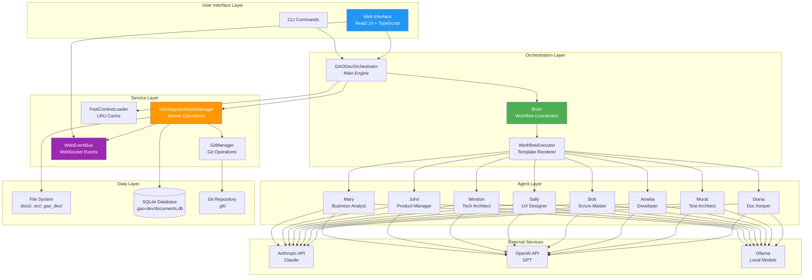

### Technology Stack

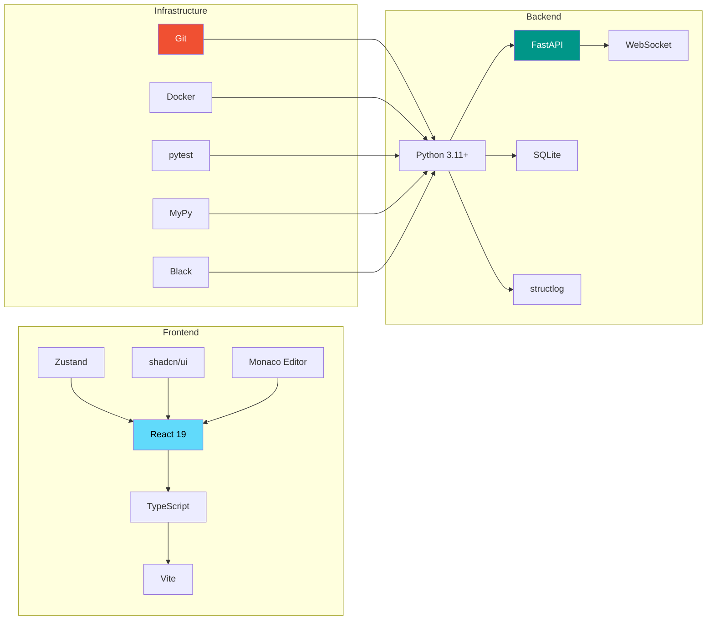

---

## Workflow Execution Flow

### Complete Workflow Lifecycle

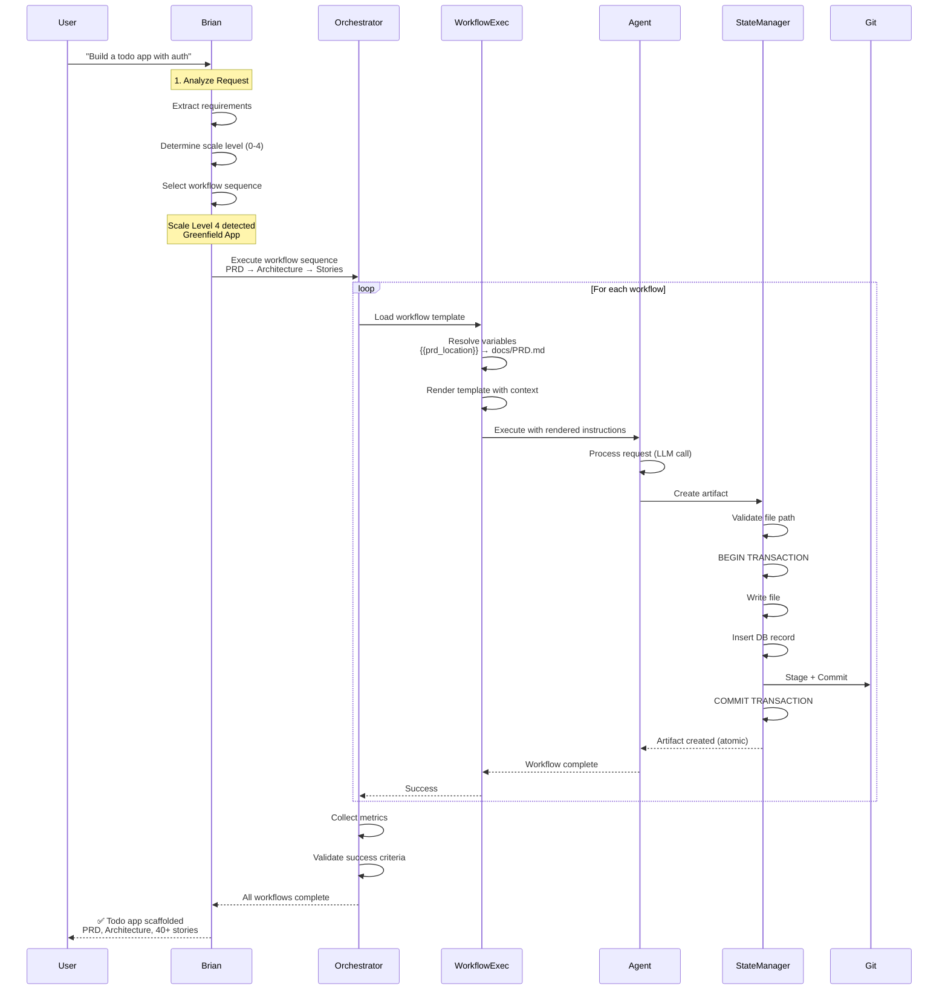

### Variable Resolution Priority

```mermaid
graph TD
    Start[Variable Needed<br/>e.g., {{prd_location}}]

    Start --> Runtime{1. Runtime<br/>Parameters?}
    Runtime -->|Yes| UseRuntime[Use Runtime Value]
    Runtime -->|No| Workflow{2. Workflow YAML<br/>Defaults?}

    Workflow -->|Yes| UseWorkflow[Use Workflow Value]
    Workflow -->|No| Config{3. Config<br/>Defaults?}

    Config -->|Yes| UseConfig[Use Config Value]
    Config -->|No| Common{4. Common<br/>Variables?}

    Common -->|Yes| UseCommon[Auto-generate<br/>date, project_name, etc.]
    Common -->|No| Error[❌ Unresolved Variable<br/>Fail workflow]

    UseRuntime --> Resolved[✅ Variable Resolved]
    UseWorkflow --> Resolved
    UseConfig --> Resolved
    UseCommon --> Resolved

    style Start fill:#2196F3,color:#fff
    style Resolved fill:#4CAF50,color:#fff
    style Error fill:#F44336,color:#fff
```

---

## Agent Collaboration

### Multi-Agent Ceremony Flow

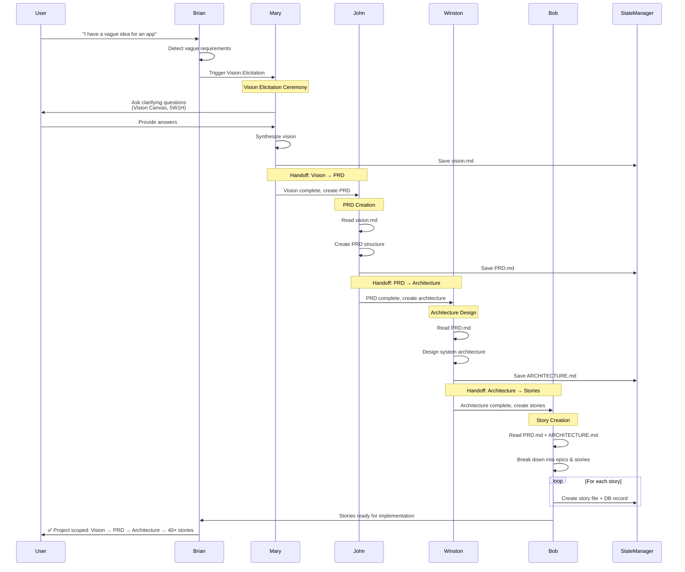

### Agent Specialization Matrix

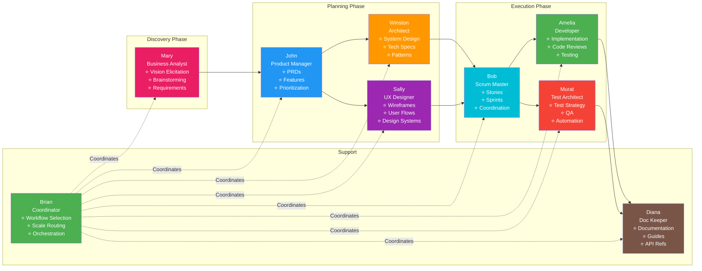

---

## Web Interface Architecture

### Frontend-Backend Integration

```mermaid
graph TB
    subgraph "Browser (Frontend)"
        UI[React Components]
        Stores[Zustand Stores<br/>8 core stores]
        WSClient[WebSocket Client]
        APIClient[API Client<br/>fetch()]
    end

    subgraph "Server (Backend)"
        FastAPI[FastAPI Server<br/>:3000]
        APIRouters[REST API Routers<br/>50+ endpoints]
        WSManager[WebSocket Manager]
        EventBus[WebEventBus<br/>Event Aggregation]
    end

    subgraph "Business Logic"
        BrianAdapter[BrianWebAdapter<br/>Thin Delegation]
        ChatSession[ChatSession<br/>Epic 30]
        StateManager[GitIntegratedStateManager<br/>Atomic Operations]
        FileWatcher[FileSystemWatcher<br/>Real-time Detection]
    end

    subgraph "Data"
        Files[File System]
        DB[(SQLite DB)]
        Git[Git Repo]
    end

    UI --> Stores
    UI --> APIClient
    UI --> WSClient

    APIClient -->|HTTP| FastAPI
    WSClient -->|WebSocket| FastAPI

    FastAPI --> APIRouters
    FastAPI --> WSManager

    APIRouters --> BrianAdapter
    APIRouters --> StateManager
    WSManager --> EventBus

    BrianAdapter --> ChatSession
    ChatSession --> EventBus
    StateManager --> EventBus
    FileWatcher --> EventBus

    EventBus -->|Broadcast| WSManager
    WSManager -->|Push Events| WSClient
    WSClient --> Stores

    StateManager --> Files & DB & Git

    style UI fill:#61DAFB,color:#000
    style FastAPI fill:#009688,color:#fff
    style EventBus fill:#9C27B0,color:#fff
    style StateManager fill:#FF9800,color:#fff
```

### WebSocket Event Flow

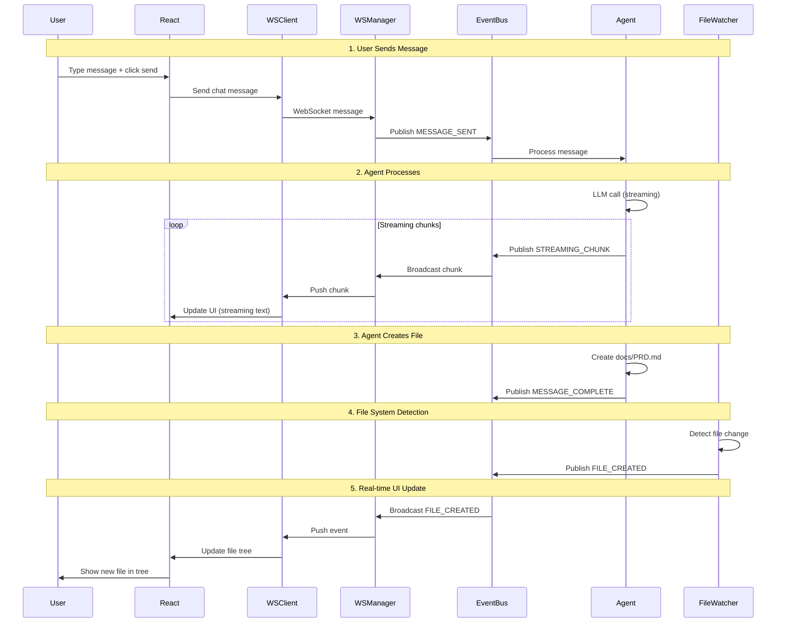

---

## Git-Integrated State Management

### Atomic Transaction Flow

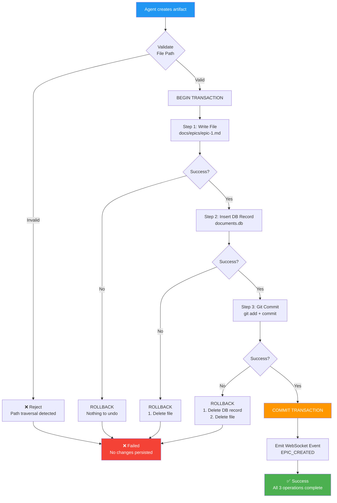

### State Manager Architecture

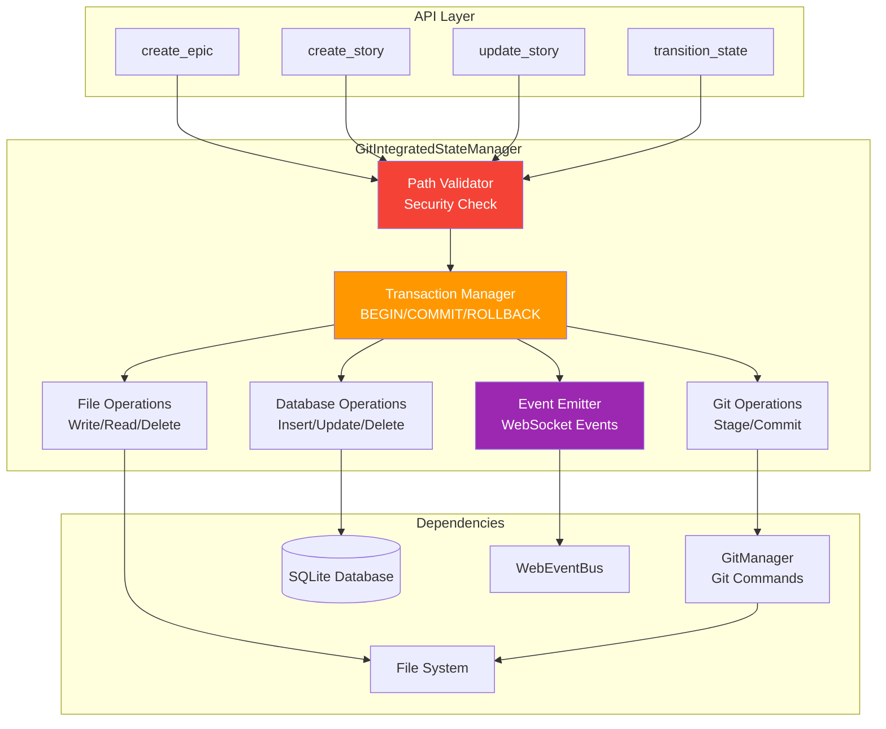

---

## Scale-Adaptive Routing

### Brian's Decision Logic

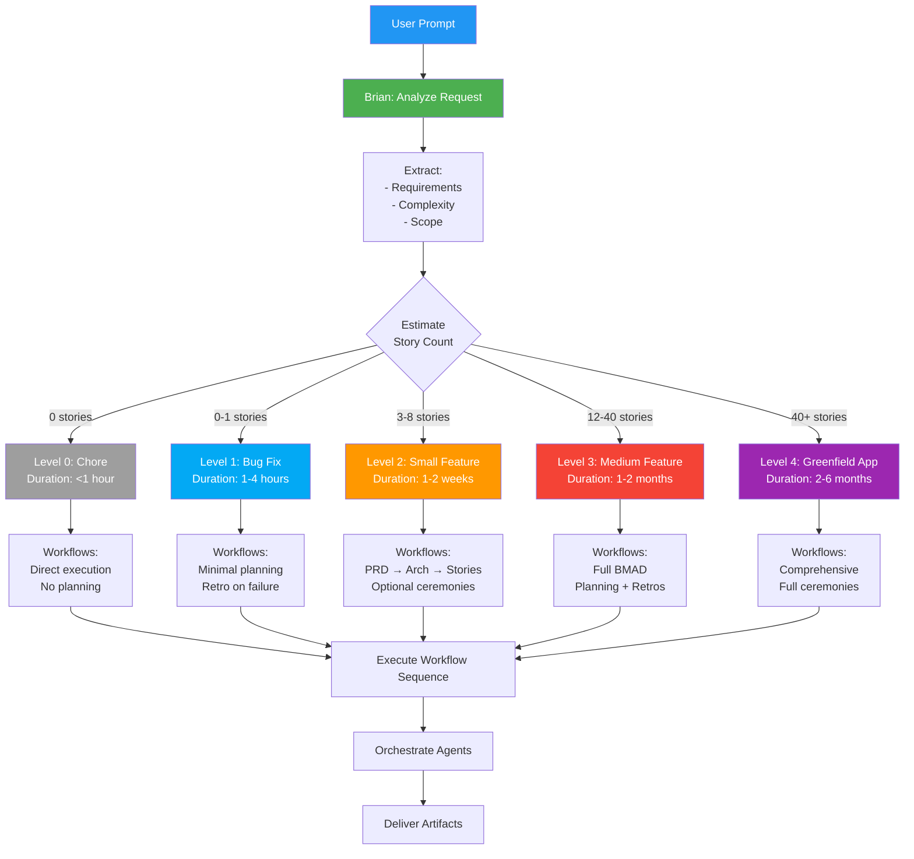

### Workflow Selection Matrix

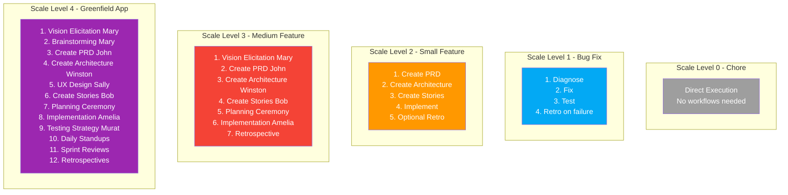

---

## Performance Characteristics

### Context Loading Performance

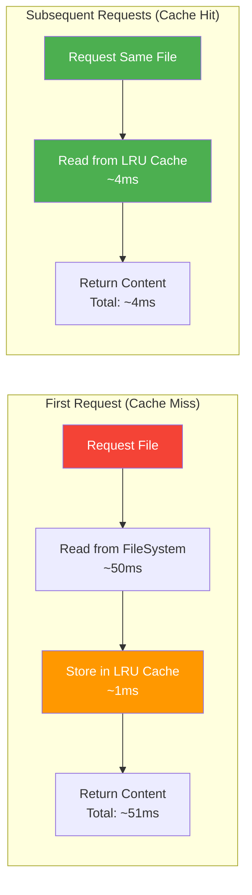

### Cache Statistics (Production)

| Metric | Target | Actual | Status |
|--------|--------|--------|--------|
| **Cache Hit Rate** | >80% | >85% | ✅ Exceeded |
| **Cache Hit Latency** | <5ms | ~4ms | ✅ Exceeded |
| **Cache Miss Latency** | <50ms | ~45ms | ✅ Exceeded |
| **Cache Size** | 128 entries | 128 entries | ✅ Met |

---

## Deployment Architecture

### Multi-Environment Support

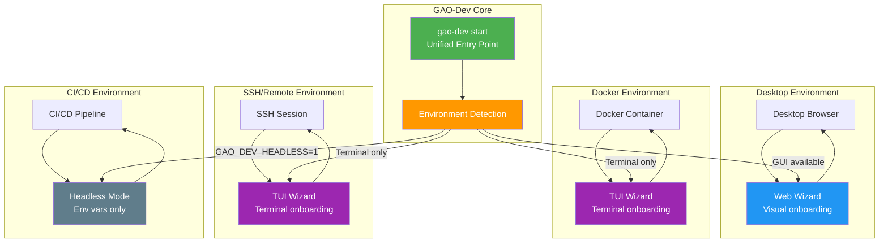

---

## See Also

- [Architecture Overview](ARCHITECTURE_OVERVIEW.md) - Text-based architecture description
- [Quick Start Guide](QUICK_START.md) - Integration examples
- [API Reference](API_REFERENCE.md) - Complete endpoint catalog
- [Development Patterns](developers/DEVELOPMENT_PATTERNS.md) - Development workflow
- [Web Interface Architecture](features/web-interface/ARCHITECTURE.md) - Detailed web specs
- [Git-Integrated Hybrid Wisdom](features/git-integrated-hybrid-wisdom/) - State management details

---

**Note**: All diagrams are rendered automatically in GitHub using Mermaid. If viewing locally, use a Mermaid-compatible markdown viewer or GitHub preview.
