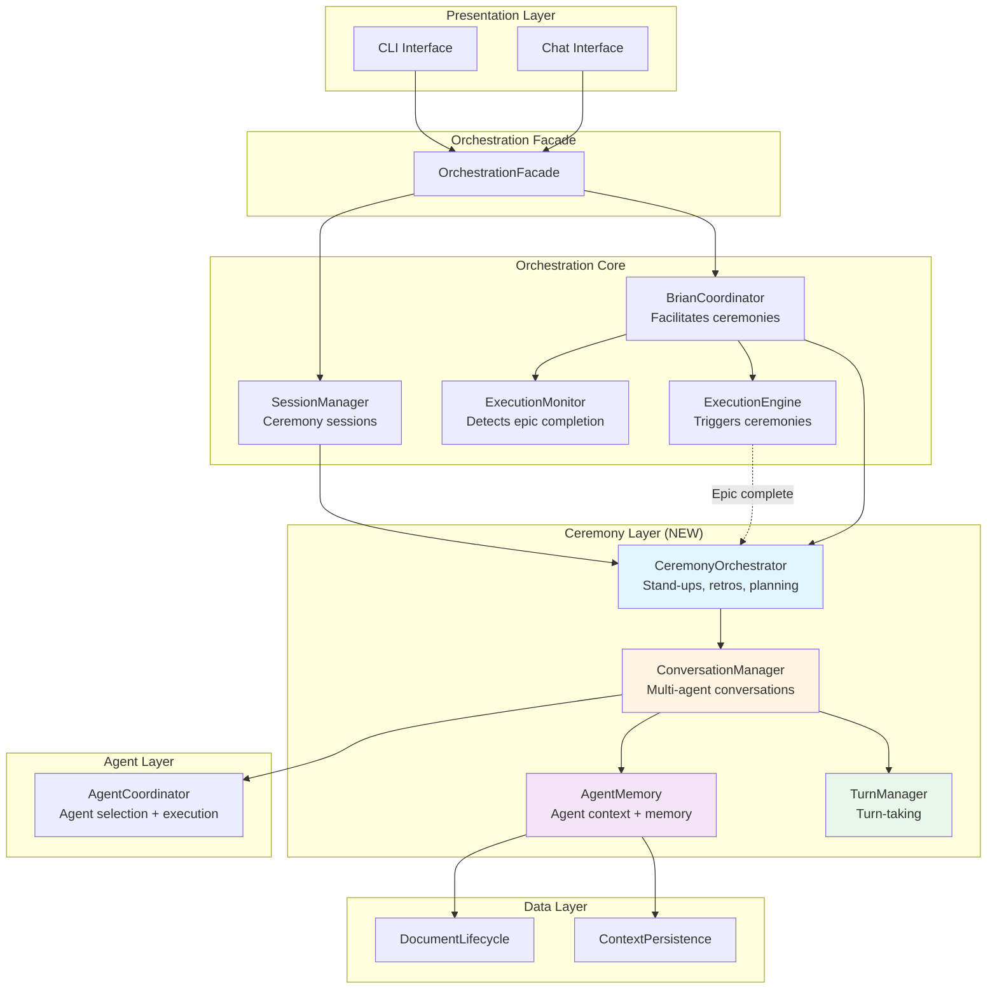
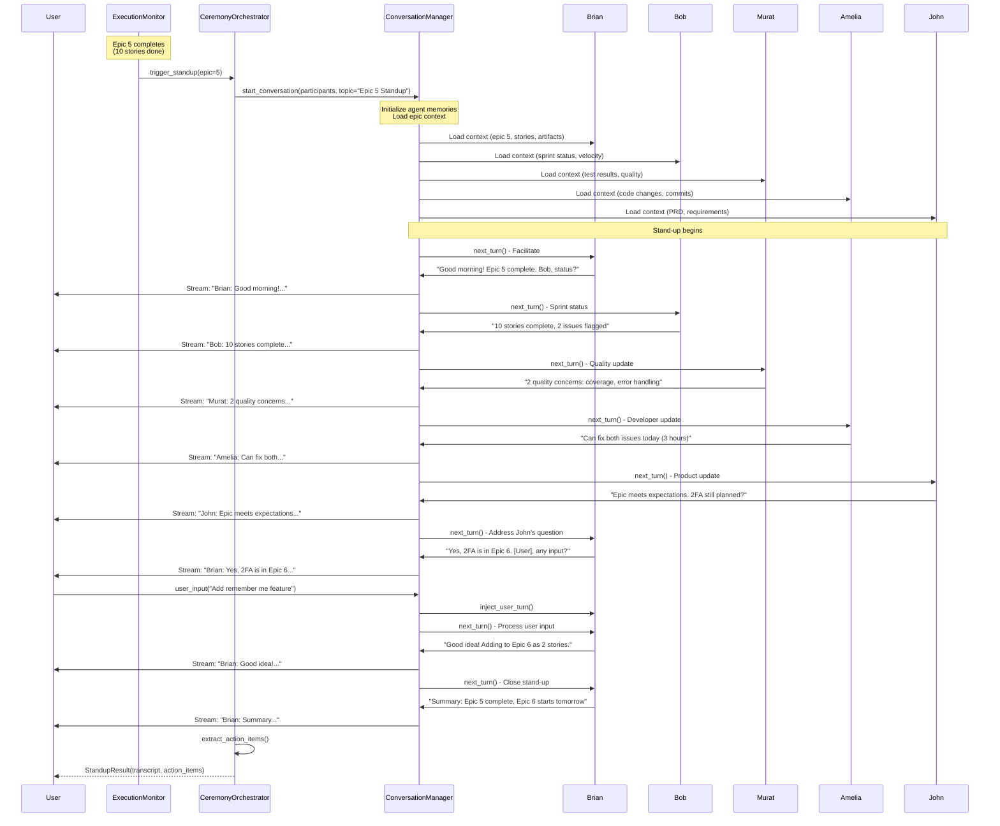
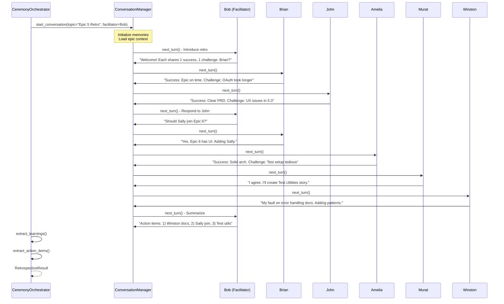
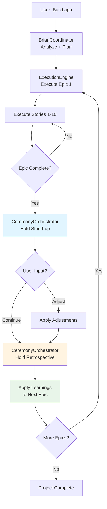

# Multi-Agent Agile Ceremonies - Architecture Analysis

**Date**: 2025-11-08
**Purpose**: Validate architecture can support real-time stand-ups and retrospectives
**Status**: Requirements Analysis + Architecture Enhancement

---

## Table of Contents

1. [Vision & Requirements](#vision--requirements)
2. [Use Cases](#use-cases)
3. [Architecture Validation](#architecture-validation)
4. [Gaps & Additional Components](#gaps--additional-components)
5. [Proposed Ceremony Architecture](#proposed-ceremony-architecture)
6. [Multi-Agent Conversation Flow](#multi-agent-conversation-flow)
7. [Integration with Orchestration Layer](#integration-with-orchestration-layer)
8. [Implementation Roadmap](#implementation-roadmap)

---

## Vision & Requirements

### User's Vision

**Real-time Agile ceremonies with multi-agent collaboration**:

1. **Stand-ups at end of each epic** (~10 stories max)
   - Multiple agents in one "room": Brian, Bob, John, Amelia, Murat, Sally
   - Each agent provides status update
   - Check alignment with user/Product Owner intent
   - Identify blockers or concerns
   - User (Product Owner) can participate

2. **Retrospectives at end of each epic**
   - Review what worked / didn't work
   - Incorporate learnings into next epic
   - Course correction in real-time
   - Multi-agent collaborative discussion
   - Update practices and standards

3. **Epic size constraint**
   - Max 10 stories per epic
   - Ensures frequent check-ins
   - Better course correction opportunities
   - More manageable chunks

### Key Requirements

**Multi-Agent Coordination**:
- ✅ Multiple agents in synchronous conversation
- ✅ Turn-taking (agents speak one at a time)
- ✅ Facilitation (Brian or Bob leads the ceremony)
- ✅ User participation (Product Owner joins)

**Context & Memory**:
- ✅ Agents remember previous discussions
- ✅ Agents aware of epic context (stories, commits, artifacts)
- ✅ Agents can reference past decisions
- ✅ Persistent conversation history

**Ceremony Types**:
- ✅ **Daily Stand-ups**: Quick status, blockers, plans
- ✅ **Sprint Planning**: Plan next epic
- ✅ **Retrospectives**: Lessons learned, improvements
- ✅ **Sprint Review**: Demo completed work

**Real-time Interaction**:
- ✅ Streaming conversation (see agents talk in real-time)
- ✅ User can interrupt/ask questions
- ✅ Asynchronous execution (doesn't block)

---

## Use Cases

### Use Case 1: Epic Completion Stand-up

**Scenario**: Epic 5 just completed (10 stories). Time for stand-up.

**Participants**:
- Brian (Engineering Manager) - Facilitator
- Bob (Scrum Master) - Sprint/story tracking
- John (Product Manager) - Requirements alignment
- Amelia (Developer) - Implementation status
- Murat (QA) - Quality status
- User (Product Owner) - Listening/participating

**Flow**:
```
Brian: 👋 Good morning team! Epic 5 "User Authentication" is complete.
       Let's do a quick stand-up to review progress.

       Bob, can you give us the sprint status?

Bob:   📊 Sure! Epic 5 completed all 10 stories:
       - 8 stories fully implemented and merged
       - 2 stories have minor issues flagged by Murat
       - All stories under original estimates
       - Git history clean with atomic commits

Brian: Thanks Bob. Murat, what are those issues?

Murat: 🧪 Two quality concerns:
       - Story 5.7: Test coverage at 75% (below 80% threshold)
       - Story 5.9: OAuth integration lacks error handling

       I'd recommend addressing before next epic.

Brian: Good catch. Amelia, can we fix those quickly?

Amelia: 💻 Yes, both are quick fixes:
        - Story 5.7: Add missing test cases (~1 hour)
        - Story 5.9: Add error handling (~2 hours)

        I can complete both today.

Brian: Perfect. John, from a product perspective, does Epic 5 meet expectations?

John:  📋 Yes! Authentication flow works well. Users can:
       - Register with email/password
       - Login with OAuth (Google, GitHub)
       - Reset passwords
       - Manage sessions

       One concern: We didn't implement 2FA yet. Is that still planned?

Brian: Good question. [Checking PRD and Epic 6 plan...]
       Yes, 2FA is in Epic 6. We'll tackle it next.

       [User], anything you want to add or adjust?

User:  2FA is important but not urgent. Let's proceed with Epic 6.
       One question: Can we add "remember me" functionality?

Brian: 🤔 That's a good enhancement. Let me check complexity...
       [Asks AI for quick analysis]
       That's a ~2 story addition. I'd recommend adding it to Epic 6
       as stories 6.11 and 6.12. Sound good?

User:  Yes, let's do that.

Brian: ✅ Great! Summary:
       - Epic 5: Complete (pending 2 quick fixes)
       - Amelia: Fix test coverage and error handling today
       - Epic 6: Starts tomorrow, now includes 2FA + "remember me" (12 stories total)

       Thanks everyone! Let's crush Epic 6! 💪
```

**Key Capabilities Demonstrated**:
- Multi-agent synchronous conversation
- Turn-taking facilitated by Brian
- Context awareness (epic, stories, test coverage, PRD)
- User participation and course correction
- Real-time decision making

### Use Case 2: Epic 5 Retrospective

**Scenario**: After completing Epic 5, team holds retrospective to identify improvements.

**Participants**:
- Bob (Facilitator) - Scrum Master leads retro
- Brian (Engineering Manager)
- John (Product Manager)
- Amelia (Developer)
- Murat (QA)
- Winston (Architect)

**Flow**:
```
Bob:   📝 Welcome to Epic 5 retrospective!
       Let's discuss what went well, what didn't, and what we'll improve.

       Format: Each person shares 1 thing that went well, 1 challenge.

       Brian, let's start with you.

Brian: ✅ What went well:
       - Epic stayed within scope (10 stories, no scope creep)
       - Team velocity consistent with estimates

       🤔 Challenge:
       - OAuth integration took longer than expected
       - Winston's architecture docs didn't cover error handling patterns

Bob:   Good feedback. Winston, thoughts on that?

Winston: 🏛️ You're right. I'll add error handling patterns to architecture docs.
        For next epic, I'll create a "Resilience Patterns" section covering:
        - Retry strategies
        - Circuit breakers
        - Graceful degradation

        Should take ~2 hours to document.

Bob:   Great action item. John, your turn.

John:  ✅ What went well:
       - PRD was clear and comprehensive
       - No mid-epic requirement changes

       🤔 Challenge:
       - We discovered UX issues in Story 5.3 during implementation
       - Should have involved Sally (UX Designer) earlier

Bob:   Sally wasn't included in Epic 5. Should she join Epic 6?

Brian: Yes, Epic 6 includes UI for 2FA. Sally should definitely be involved.
       I'll add her to Epic 6 team.

Bob:   Perfect. Amelia?

Amelia: ✅ What went well:
        - Architecture was solid, easy to implement
        - Code reviews were fast and helpful

        🤔 Challenge:
        - Test fixtures were tedious to set up
        - Spent ~20% of time on test setup

        Can we invest in better test infrastructure?

Murat: I agree. I'll create a "Test Utilities" story for Epic 6.
       Should save time for future epics.

Bob:   Excellent. Murat, what else?

Murat: ✅ What went well:
       - Code quality high
       - Most stories had good test coverage

       🤔 Challenge:
       - 2 stories fell below coverage threshold
       - Need better upfront test planning

       Suggestion: In Epic 6, let's review test strategy before implementation.

Bob:   Great idea. I'll add that to our Epic 6 kickoff.

       📋 Summary of action items:
       1. Winston: Add error handling patterns to architecture docs
       2. Brian: Add Sally to Epic 6 team
       3. Murat: Create "Test Utilities" story
       4. Team: Review test strategy at Epic 6 kickoff

       Anything else before we close?

Brian: One more thing: Epic 5 velocity was excellent.
       Team estimated 10 stories at 40 points, completed in 38 actual.
       Let's maintain this pace for Epic 6.

Bob:   ✅ Retro complete! Thanks everyone.
       Epic 6 kicks off tomorrow at 9am.
```

**Key Capabilities Demonstrated**:
- Structured ceremony facilitation
- Each agent contributes based on their role
- Identification of improvements
- Action items created and assigned
- Learning captured for next epic

### Use Case 3: Mid-Epic Course Correction

**Scenario**: Epic 6 is 50% complete (story 6.5 of 12). Brian detects a problem.

**Flow**:
```
Brian: ⚠️ Team, I need to call an ad-hoc stand-up.
       I'm noticing a potential issue with Epic 6.

       [Assembling agents: Bob, John, Amelia, Winston]

Brian: Here's what I'm seeing:
       - Stories 6.1-6.5 complete
       - Story 6.6 (2FA SMS integration) is taking 3x estimate
       - Amelia has been stuck for 6 hours

       Amelia, what's the blocker?

Amelia: 💻 The SMS provider API is more complex than expected.
        Rate limiting, webhook setup, phone verification...
        This is turning into a 5-story feature, not 1 story.

Winston: 🏛️ That's my fault. I underestimated SMS integration complexity.
         It's a full integration, not a simple API call.

John:   📋 From a product perspective, SMS 2FA is nice-to-have.
        Do we need it now, or can we defer?

Brian: Good question. [Checking user priorities...]
       User's main requirement is 2FA. SMS is one method.
       We could pivot to:
       - Authenticator app (TOTP) - Simpler, no external dependencies
       - Email-based 2FA - Leverage existing email system

       [User], which approach do you prefer?

User:  Authenticator app is fine. Most users have Google Authenticator anyway.

Brian: 👍 Decision: Pivot to TOTP-based 2FA.
       Winston, can you quickly spec out TOTP approach?

Winston: Yes, TOTP is much simpler:
         - Standard library support (pyotp)
         - QR code generation
         - Backup codes
         Probably 2-3 stories instead of 5-6 for SMS.

Brian: Perfect. New plan:
       - Pause story 6.6 (SMS integration)
       - Winston: Create TOTP architecture spec (2 hours)
       - Bob: Split into 3 new stories (6.6, 6.7, 6.8)
       - Amelia: Continue with TOTP implementation

       Epic 6 timeline stays on track. Everyone good?

Team:  ✅ Agreed!

Brian: Great course correction, team. This is why we do frequent check-ins!
```

**Key Capabilities Demonstrated**:
- Ad-hoc ceremony initiation
- Problem detection and escalation
- Multi-agent problem solving
- User involvement in decisions
- Real-time course correction

---

## Architecture Validation

### Current Proposed Architecture (from Orchestration Review)

Let's validate whether the proposed architecture can support these use cases:

| Component | Supports Ceremonies? | Gaps |
|-----------|---------------------|------|
| **OrchestrationFacade** | ✅ Yes | API for ceremony initiation |
| **BrianCoordinator** | ⚠️ Partial | Can facilitate, but needs conversation management |
| **SessionManager** | ✅ Yes | Can manage ceremony sessions |
| **ExecutionEngine** | ✅ Yes | Triggers ceremonies at epic boundaries |
| **ExecutionMonitor** | ✅ Yes | Detects epic completion, triggers stand-ups |
| **ArtifactManager** | ✅ Yes | Provides context (artifacts created) |
| **AgentCoordinator** | ❌ No | Only handles sequential agent execution |
| **StatusReporter** | ✅ Yes | Provides status for stand-ups |
| **InterventionManager** | ⚠️ Partial | Course correction, but no multi-agent support |

**Verdict**: Proposed architecture provides **good foundation** but lacks **multi-agent conversation management**.

### Gaps Identified

**Critical Gaps**:

1. **No ConversationManager**
   - Need: Manage multi-agent synchronous conversations
   - Current: Agents execute sequentially, no back-and-forth

2. **No Turn-taking mechanism**
   - Need: Agents take turns speaking (like humans)
   - Current: Agents execute workflows independently

3. **No Agent Memory**
   - Need: Agents remember previous discussions
   - Current: Each agent execution is stateless

4. **No CeremonyOrchestrator**
   - Need: Coordinate Agile ceremonies (stand-ups, retros)
   - Current: No ceremony concept exists

5. **No Multi-agent prompt construction**
   - Need: Prompt that includes multiple agents' context
   - Current: Single-agent prompts only

---

## Gaps & Additional Components

### Required New Components

#### 1. ConversationManager (NEW)

**Responsibility**: Manage multi-agent synchronous conversations

**API**:
```python
class ConversationManager:
    """Manages multi-agent conversations."""

    async def start_conversation(
        self,
        participants: List[AgentInfo],
        topic: str,
        facilitator: Optional[AgentInfo] = None
    ) -> Conversation:
        """
        Start multi-agent conversation.

        Args:
            participants: List of agents in conversation
            topic: Conversation topic/prompt
            facilitator: Optional facilitator agent (default: Brian)

        Returns:
            Conversation instance
        """
        conversation_id = str(uuid.uuid4())
        conversation = Conversation(
            id=conversation_id,
            participants=participants,
            facilitator=facilitator or self._get_brian(),
            topic=topic,
            messages=[],
            turn_order=self._determine_turn_order(participants, facilitator)
        )

        # Initialize agent memories
        for agent in participants:
            await self.agent_memory.initialize_context(agent, conversation)

        return conversation

    async def next_turn(
        self,
        conversation: Conversation
    ) -> ConversationTurn:
        """
        Execute next turn in conversation.

        Returns:
            ConversationTurn with agent's response
        """
        # Get next agent in turn order
        current_agent = conversation.get_next_speaker()

        # Build prompt with conversation history
        prompt = self._build_multi_agent_prompt(conversation, current_agent)

        # Execute agent's turn
        response = await self.agent_coordinator.execute_turn(
            agent=current_agent,
            prompt=prompt,
            conversation_context=conversation
        )

        # Record in conversation
        turn = ConversationTurn(
            agent=current_agent,
            message=response,
            timestamp=datetime.now()
        )
        conversation.add_turn(turn)

        # Update agent memories
        await self.agent_memory.record_turn(turn, conversation)

        return turn

    async def execute_conversation(
        self,
        conversation: Conversation,
        max_turns: int = 50
    ) -> AsyncGenerator[ConversationTurn, None]:
        """
        Execute full conversation until completion.

        Yields each turn as agents speak.
        """
        for turn_num in range(max_turns):
            turn = await self.next_turn(conversation)
            yield turn

            # Check if conversation is complete
            if self._is_conversation_complete(conversation):
                break

    def _build_multi_agent_prompt(
        self,
        conversation: Conversation,
        current_agent: AgentInfo
    ) -> str:
        """
        Build prompt for agent including conversation history.

        Format:
        You are {agent_name} ({agent_role}).

        You are in a {ceremony_type} with:
        - Brian (Engineering Manager)
        - Bob (Scrum Master)
        - John (Product Manager)
        - Amelia (Developer)
        - Murat (QA)

        Conversation history:
        Brian: [Brian's message]
        Bob: [Bob's message]
        ...

        It's your turn. Please respond to the conversation.
        """
        history = "\n".join([
            f"{turn.agent.name}: {turn.message}"
            for turn in conversation.messages
        ])

        return f"""You are {current_agent.name} ({current_agent.role}).

You are in a {conversation.topic} with:
{self._format_participants(conversation.participants)}

Conversation so far:
{history}

It's your turn. Please respond naturally as {current_agent.name} would.
Keep your response concise (2-3 sentences unless you need more detail).
"""

    def _is_conversation_complete(self, conversation: Conversation) -> bool:
        """Check if conversation has reached natural conclusion."""
        # Check for completion signals:
        # - Facilitator says "meeting adjourned" or similar
        # - All participants have spoken
        # - Topic has been resolved
        last_message = conversation.messages[-1].message.lower()
        return any([
            "meeting adjourned" in last_message,
            "let's wrap up" in last_message,
            "thanks everyone" in last_message,
        ])
```

#### 2. CeremonyOrchestrator (NEW)

**Responsibility**: Orchestrate Agile ceremonies

**API**:
```python
class CeremonyOrchestrator:
    """Orchestrates Agile ceremonies (stand-ups, retros, planning)."""

    def __init__(
        self,
        conversation_manager: ConversationManager,
        agent_coordinator: AgentCoordinator,
        execution_monitor: ExecutionMonitor
    ):
        self.conversation_manager = conversation_manager
        self.agent_coordinator = agent_coordinator
        self.execution_monitor = execution_monitor

    async def hold_standup(
        self,
        epic_num: int,
        context: EpicContext
    ) -> StandupResult:
        """
        Hold stand-up at end of epic.

        Args:
            epic_num: Epic number
            context: Epic context (stories, artifacts, metrics)

        Returns:
            StandupResult with conversation transcript and action items
        """
        # Determine participants based on epic
        participants = self._select_standup_participants(context)

        # Create stand-up topic
        topic = f"Epic {epic_num} Completion Stand-up"

        # Start conversation
        conversation = await self.conversation_manager.start_conversation(
            participants=participants,
            topic=topic,
            facilitator=self._get_brian()
        )

        # Execute stand-up with structure
        transcript = []
        async for turn in self._execute_structured_standup(conversation, context):
            transcript.append(turn)
            yield turn  # Stream to user

        # Extract action items
        action_items = self._extract_action_items(transcript)

        return StandupResult(
            epic_num=epic_num,
            transcript=transcript,
            action_items=action_items,
            participants=[p.name for p in participants]
        )

    async def _execute_structured_standup(
        self,
        conversation: Conversation,
        context: EpicContext
    ) -> AsyncGenerator[ConversationTurn, None]:
        """
        Execute stand-up with structure:
        1. Brian introduces (facilitator)
        2. Bob gives sprint status
        3. Each specialist gives update
        4. Brian summarizes and asks for user input
        5. Close with action items
        """
        # Phase 1: Introduction
        brian = self._get_brian()
        intro_prompt = f"""Facilitate a stand-up for Epic {context.epic_num}.
Start by greeting the team and asking Bob for sprint status.

Context:
- Epic: {context.epic_name}
- Stories completed: {context.stories_completed}/{context.total_stories}
- Duration: {context.duration_days} days
"""
        conversation.set_current_speaker(brian)
        conversation.set_next_prompt(intro_prompt)
        turn = await self.conversation_manager.next_turn(conversation)
        yield turn

        # Phase 2: Sprint Status (Bob)
        bob = self._get_bob()
        status_prompt = f"""Provide sprint status for Epic {context.epic_num}.

Include:
- Stories completed: {context.stories_completed}/{context.total_stories}
- Stories with issues: {len(context.issues)}
- Git commits: {context.commit_count}
- Velocity: {context.velocity}

Keep it concise (2-3 sentences).
"""
        conversation.set_current_speaker(bob)
        conversation.set_next_prompt(status_prompt)
        turn = await self.conversation_manager.next_turn(conversation)
        yield turn

        # Phase 3: Specialist updates (Murat, Amelia, John, etc.)
        for specialist in self._get_specialists(context):
            specialist_prompt = self._build_specialist_prompt(specialist, context)
            conversation.set_current_speaker(specialist)
            conversation.set_next_prompt(specialist_prompt)
            turn = await self.conversation_manager.next_turn(conversation)
            yield turn

        # Phase 4: Summary and user input
        summary_prompt = f"""Summarize the stand-up.

Highlight:
- Key accomplishments
- Issues raised
- Action items needed

Then ask the user (Product Owner) if they have any input or adjustments.
"""
        conversation.set_current_speaker(brian)
        conversation.set_next_prompt(summary_prompt)
        turn = await self.conversation_manager.next_turn(conversation)
        yield turn

        # Phase 5: User input (if any)
        # This is where we'd pause and wait for user input
        # For now, simulate with a prompt
        user_response = await self._get_user_input(conversation)
        if user_response:
            user_turn = ConversationTurn(
                agent=AgentInfo(name="User", role="Product Owner"),
                message=user_response,
                timestamp=datetime.now()
            )
            conversation.add_turn(user_turn)
            yield user_turn

        # Phase 6: Close
        close_prompt = """Thank the team and close the stand-up.
Mention when the next epic starts."""
        conversation.set_current_speaker(brian)
        conversation.set_next_prompt(close_prompt)
        turn = await self.conversation_manager.next_turn(conversation)
        yield turn

    async def hold_retrospective(
        self,
        epic_num: int,
        context: EpicContext
    ) -> RetrospectiveResult:
        """
        Hold retrospective at end of epic.

        Structure:
        1. Bob introduces retro format
        2. Each agent shares "what went well" and "challenge"
        3. Team discusses improvements
        4. Action items created
        5. Retro closed

        Args:
            epic_num: Epic number
            context: Epic context

        Returns:
            RetrospectiveResult with learnings and action items
        """
        participants = self._select_retro_participants(context)

        topic = f"Epic {epic_num} Retrospective"

        conversation = await self.conversation_manager.start_conversation(
            participants=participants,
            topic=topic,
            facilitator=self._get_bob()  # Bob facilitates retros
        )

        transcript = []
        async for turn in self._execute_structured_retrospective(conversation, context):
            transcript.append(turn)
            yield turn

        # Extract learnings and action items
        learnings = self._extract_learnings(transcript)
        action_items = self._extract_action_items(transcript)

        return RetrospectiveResult(
            epic_num=epic_num,
            transcript=transcript,
            learnings=learnings,
            action_items=action_items,
            participants=[p.name for p in participants]
        )

    def _select_standup_participants(self, context: EpicContext) -> List[AgentInfo]:
        """Select participants based on epic type."""
        # Always include core team
        participants = [
            self._get_brian(),  # Engineering Manager
            self._get_bob(),    # Scrum Master
            self._get_john(),   # Product Manager
        ]

        # Add specialists based on epic
        if context.has_code_changes:
            participants.append(self._get_amelia())  # Developer

        if context.has_tests:
            participants.append(self._get_murat())  # QA

        if context.has_architecture_changes:
            participants.append(self._get_winston())  # Architect

        if context.has_ux_changes:
            participants.append(self._get_sally())  # UX Designer

        return participants
```

#### 3. AgentMemory (NEW)

**Responsibility**: Maintain agent context and memory across conversations

**API**:
```python
class AgentMemory:
    """Manages agent memory and context."""

    def __init__(self, persistence: ContextPersistence):
        self.persistence = persistence
        self.active_memories: Dict[str, AgentMemoryState] = {}

    async def initialize_context(
        self,
        agent: AgentInfo,
        conversation: Conversation
    ) -> None:
        """
        Initialize agent's context for conversation.

        Loads:
        - Agent's role and responsibilities
        - Relevant project context (epic, stories, artifacts)
        - Previous conversation history
        """
        memory_key = f"{agent.name}_{conversation.id}"

        # Load agent context
        agent_context = await self._load_agent_context(agent, conversation)

        self.active_memories[memory_key] = AgentMemoryState(
            agent=agent,
            conversation=conversation,
            context=agent_context,
            turns_participated=[]
        )

    async def record_turn(
        self,
        turn: ConversationTurn,
        conversation: Conversation
    ) -> None:
        """Record turn in agent's memory."""
        memory_key = f"{turn.agent.name}_{conversation.id}"
        if memory_key in self.active_memories:
            self.active_memories[memory_key].turns_participated.append(turn)

        # Also record in all other agents' memories (they hear it)
        for agent in conversation.participants:
            if agent.name != turn.agent.name:
                other_key = f"{agent.name}_{conversation.id}"
                if other_key in self.active_memories:
                    self.active_memories[other_key].context["heard_from"][turn.agent.name].append(turn)

    def get_context(
        self,
        agent: AgentInfo,
        conversation: Conversation
    ) -> Dict[str, Any]:
        """Get agent's current context."""
        memory_key = f"{agent.name}_{conversation.id}"
        if memory_key in self.active_memories:
            return self.active_memories[memory_key].context
        return {}

    async def _load_agent_context(
        self,
        agent: AgentInfo,
        conversation: Conversation
    ) -> Dict[str, Any]:
        """Load relevant context for agent."""
        context = {
            "role": agent.role,
            "responsibilities": agent.responsibilities,
            "heard_from": defaultdict(list),
        }

        # Load epic context if ceremony is about an epic
        if hasattr(conversation, 'epic_num'):
            epic_context = await self._load_epic_context(conversation.epic_num, agent)
            context.update(epic_context)

        return context

    async def _load_epic_context(self, epic_num: int, agent: AgentInfo) -> Dict[str, Any]:
        """Load epic context relevant to agent."""
        # Load different context based on agent role
        if agent.role == "Scrum Master":
            return {
                "stories": await self._get_epic_stories(epic_num),
                "velocity": await self._get_epic_velocity(epic_num),
                "issues": await self._get_epic_issues(epic_num),
            }
        elif agent.role == "Developer":
            return {
                "code_changes": await self._get_code_changes(epic_num),
                "test_coverage": await self._get_test_coverage(epic_num),
                "commits": await self._get_commits(epic_num),
            }
        elif agent.role == "QA":
            return {
                "test_results": await self._get_test_results(epic_num),
                "coverage": await self._get_coverage_metrics(epic_num),
                "issues": await self._get_quality_issues(epic_num),
            }
        # ... etc for other roles
```

#### 4. TurnManager (NEW)

**Responsibility**: Manage turn-taking in multi-agent conversations

**API**:
```python
class TurnManager:
    """Manages turn-taking in conversations."""

    def determine_turn_order(
        self,
        participants: List[AgentInfo],
        facilitator: AgentInfo,
        ceremony_type: str
    ) -> List[AgentInfo]:
        """
        Determine turn order based on ceremony type.

        For stand-ups:
        1. Facilitator (Brian) introduces
        2. Scrum Master (Bob) gives status
        3. Specialists in order (Murat, Amelia, John, etc.)
        4. Facilitator (Brian) summarizes

        For retrospectives:
        1. Facilitator (Bob) introduces
        2. Round-robin: each agent shares
        3. Open discussion
        4. Facilitator (Bob) closes
        """
        if ceremony_type == "standup":
            return self._standup_turn_order(participants, facilitator)
        elif ceremony_type == "retrospective":
            return self._retro_turn_order(participants, facilitator)
        else:
            # Default: facilitator first, then round-robin
            return [facilitator] + [p for p in participants if p != facilitator]

    def _standup_turn_order(
        self,
        participants: List[AgentInfo],
        facilitator: AgentInfo
    ) -> List[AgentInfo]:
        """Determine stand-up turn order."""
        order = [facilitator]  # Brian starts

        # Bob (Scrum Master) gives status
        bob = next((p for p in participants if p.role == "Scrum Master"), None)
        if bob:
            order.append(bob)

        # Then specialists
        specialist_order = ["QA", "Developer", "Product Manager", "Architect", "UX Designer"]
        for role in specialist_order:
            specialist = next((p for p in participants if p.role == role), None)
            if specialist and specialist not in order:
                order.append(specialist)

        # Facilitator closes
        order.append(facilitator)

        return order

    def get_next_speaker(
        self,
        conversation: Conversation
    ) -> AgentInfo:
        """Get next speaker in turn order."""
        if not conversation.messages:
            return conversation.turn_order[0]

        current_index = conversation.current_turn_index
        next_index = (current_index + 1) % len(conversation.turn_order)
        conversation.current_turn_index = next_index

        return conversation.turn_order[next_index]
```

---

## Proposed Ceremony Architecture

### Updated Component Diagram



---

## Multi-Agent Conversation Flow

### Stand-up Flow Diagram



### Retrospective Flow Diagram



---

## Integration with Orchestration Layer

### How Ceremonies Fit In



### Triggering Ceremonies

**Automatic Triggers**:

```python
class ExecutionEngine:
    """Enhanced with ceremony triggers."""

    async def execute_epic(
        self,
        epic: EpicPlan
    ) -> EpicResult:
        """Execute epic and trigger ceremonies."""

        # Execute all stories
        for story in epic.stories:
            story_result = await self.execute_story(story)
            epic_result.add_story(story_result)

        # Trigger stand-up (automatic)
        if self.config.ceremonies_enabled:
            standup_result = await self.ceremony_orchestrator.hold_standup(
                epic_num=epic.num,
                context=self._build_epic_context(epic_result)
            )
            epic_result.standup = standup_result

            # Apply any course corrections from stand-up
            if standup_result.has_adjustments:
                await self._apply_standup_adjustments(standup_result)

            # Trigger retrospective
            retro_result = await self.ceremony_orchestrator.hold_retrospective(
                epic_num=epic.num,
                context=self._build_epic_context(epic_result)
            )
            epic_result.retrospective = retro_result

            # Apply learnings to next epic
            await self._apply_retro_learnings(retro_result)

        return epic_result
```

**Manual Triggers** (Ad-hoc):

```python
# User can trigger ad-hoc stand-up during epic
async with session as s:
    # Mid-epic, user wants status
    standup = await s.hold_adhoc_standup(
        reason="User requested status update",
        participants=["Brian", "Bob", "Amelia"]
    )

    # Stream conversation to user
    async for turn in standup:
        print(f"{turn.agent.name}: {turn.message}")
```

---

## Implementation Roadmap

### Epic: Multi-Agent Agile Ceremonies

**Timeline**: 4-6 weeks (after Orchestration Refactor is complete)

#### Story 1: Agent Memory System (Week 1)
**Points**: 8

**Tasks**:
- Design AgentMemory data model
- Implement context loading (epic, stories, artifacts)
- Implement memory persistence
- Add role-specific context (Developer gets code, QA gets tests, etc.)
- Unit tests

**Acceptance Criteria**:
- Agents can load context for ceremonies
- Context is role-specific
- Memory persists across turns

#### Story 2: Conversation Manager (Week 1-2)
**Points**: 13

**Tasks**:
- Design Conversation data model
- Implement multi-agent prompt construction
- Implement turn execution
- Implement conversation history
- Add streaming support
- Unit and integration tests

**Acceptance Criteria**:
- Can start multi-agent conversations
- Agents take turns speaking
- Conversation history maintained
- Supports streaming to user

#### Story 3: Turn Manager (Week 2)
**Points**: 5

**Tasks**:
- Design turn order algorithms
- Implement ceremony-specific turn orders (stand-up, retro)
- Implement facilitator logic
- Unit tests

**Acceptance Criteria**:
- Turn order correct for each ceremony type
- Facilitator controls flow
- Can handle dynamic turn changes

#### Story 4: Ceremony Orchestrator - Stand-ups (Week 3)
**Points**: 13

**Tasks**:
- Design stand-up structure
- Implement participant selection
- Implement stand-up phases (intro, status, updates, summary, close)
- Implement action item extraction
- Integration tests

**Acceptance Criteria**:
- Can hold end-of-epic stand-ups
- All relevant agents participate
- Action items extracted
- User can provide input

#### Story 5: Ceremony Orchestrator - Retrospectives (Week 3-4)
**Points**: 13

**Tasks**:
- Design retrospective structure
- Implement retro phases (intro, round-robin, discussion, action items, close)
- Implement learning extraction
- Implement action item creation
- Integration tests

**Acceptance Criteria**:
- Can hold end-of-epic retrospectives
- Each agent shares learnings
- Action items created
- Learnings stored for next epic

#### Story 6: ExecutionEngine Integration (Week 4)
**Points**: 8

**Tasks**:
- Add ceremony triggers to ExecutionEngine
- Implement automatic stand-up on epic completion
- Implement automatic retrospective
- Add configuration for ceremony enablement
- Integration tests

**Acceptance Criteria**:
- Ceremonies triggered automatically at epic boundaries
- Can be disabled via config
- Learnings applied to next epic

#### Story 7: Ad-hoc Ceremonies (Week 5)
**Points**: 5

**Tasks**:
- Add manual ceremony triggers
- Implement mid-epic stand-ups
- Add user initiation API
- Integration tests

**Acceptance Criteria**:
- User can trigger stand-up any time
- Can specify participants
- Works same as automatic stand-ups

#### Story 8: Conversation UI (Week 5-6)
**Points**: 8

**Tasks**:
- Design conversation display format
- Implement streaming conversation to CLI
- Add conversation formatting (agent names, roles, timestamps)
- Add user input prompts during conversations
- UI tests

**Acceptance Criteria**:
- Conversations display cleanly in CLI
- User can see real-time agent discussion
- User can provide input when prompted

#### Story 9: Documentation (Week 6)
**Points**: 3

**Tasks**:
- Write ceremony user guide
- Write developer guide for ceremonies
- Add ceremony examples
- Update architecture docs

**Acceptance Criteria**:
- Users understand how ceremonies work
- Developers can add new ceremony types
- Examples demonstrate all features

#### Story 10: End-to-End Testing (Week 6)
**Points**: 8

**Tasks**:
- Create benchmark with ceremonies
- Test full epic with stand-up and retro
- Test course corrections
- Test learnings application
- Performance testing

**Acceptance Criteria**:
- Ceremonies work in real benchmark
- Action items correctly applied
- No performance degradation
- User experience is smooth

---

## Validation Summary

### Can Proposed Architecture Support Ceremonies?

**Answer**: ✅ **YES, with enhancements**

### What's Already There?

| Requirement | Supported By | Status |
|-------------|-------------|---------|
| Session management | SessionManager | ✅ Ready |
| Execution monitoring | ExecutionMonitor | ✅ Ready |
| Epic completion detection | ExecutionEngine | ✅ Ready |
| Context loading | ContextPersistence | ✅ Ready |
| Agent execution | AgentCoordinator | ✅ Ready |
| Status aggregation | StatusReporter | ✅ Ready |

### What's Missing?

| Requirement | Needs | Status |
|-------------|-------|---------|
| Multi-agent conversations | ConversationManager | ❌ Not built |
| Turn-taking | TurnManager | ❌ Not built |
| Agent memory | AgentMemory | ❌ Not built |
| Ceremony coordination | CeremonyOrchestrator | ❌ Not built |

### Effort Estimate

**4 new components** (~2,000 LOC total):
- ConversationManager: ~500 LOC
- CeremonyOrchestrator: ~600 LOC
- AgentMemory: ~400 LOC
- TurnManager: ~300 LOC
- Integration: ~200 LOC

**Timeline**: 4-6 weeks (after orchestration refactor)

---

## Recommendations

### 1. Proceed with Orchestration Refactor First

**Why**: The orchestration refactor (Phase 1-6) creates the foundation:
- Clean service boundaries
- BrianCoordinator as continuous orchestrator
- SessionManager for long-running conversations
- ExecutionMonitor for ceremony triggers

**These are prerequisites for ceremonies.**

### 2. Add Ceremony Components as Separate Epic

**Why**: Ceremonies are a distinct feature set:
- Can be developed independently
- Can be released as Phase 2
- Doesn't block core orchestration improvements

**Recommended sequence**:
1. Epic: Orchestration Layer Refactor (6 weeks)
2. Epic: Multi-Agent Ceremonies (4-6 weeks)

### 3. Design for Future Extensions

**Additional ceremony types to plan for**:
- Sprint planning (plan next epic)
- Sprint reviews (demo to stakeholders)
- Daily stand-ups (if epic > 5 days)
- Technical design reviews
- Architecture reviews

**Design considerations**:
- CeremonyOrchestrator should support plugins
- Ceremony types should be configurable
- Turn order should be customizable

### 4. Epic Size Configuration

**Add to architecture**:

```python
# In config/defaults.yaml
epic_configuration:
  max_stories_per_epic: 10
  trigger_standup_on_completion: true
  trigger_retrospective_on_completion: true
  enable_mid_epic_standups: true
  standup_frequency_days: 5  # Trigger if epic > 5 days
```

**In BrianCoordinator**:

```python
class BrianCoordinator:
    async def plan_epics(self, analysis: PromptAnalysis) -> List[EpicPlan]:
        """Split large features into epics with max 10 stories."""
        total_stories = analysis.estimated_stories
        max_per_epic = self.config.max_stories_per_epic

        num_epics = math.ceil(total_stories / max_per_epic)

        epics = []
        for epic_num in range(1, num_epics + 1):
            story_count = min(max_per_epic, total_stories - (epic_num - 1) * max_per_epic)
            epics.append(EpicPlan(
                num=epic_num,
                estimated_stories=story_count
            ))

        return epics
```

---

## Conclusion

### Proposed Architecture Validation: ✅ PASS

The proposed orchestration architecture **can support** multi-agent Agile ceremonies with the addition of 4 focused components:

1. **ConversationManager** - Multi-agent synchronous conversations
2. **CeremonyOrchestrator** - Stand-ups, retros, planning
3. **AgentMemory** - Context and memory for agents
4. **TurnManager** - Turn-taking coordination

### Key Strengths

1. **Clean Foundation**: Refactored orchestration layer provides solid base
2. **Natural Extension**: Ceremonies fit cleanly into architecture
3. **Modular Design**: Ceremony components are independent
4. **Future-Proof**: Architecture supports additional ceremony types

### Implementation Path

**Phase 1** (6 weeks): Orchestration Layer Refactor
- Extract services (ArtifactManager, AgentCoordinator, etc.)
- Create thin OrchestrationFacade
- Enhance BrianCoordinator
- Add SessionManager

**Phase 2** (4-6 weeks): Multi-Agent Ceremonies
- Build ConversationManager
- Build CeremonyOrchestrator
- Build AgentMemory
- Build TurnManager
- Integrate with ExecutionEngine

### Recommendation

✅ **APPROVE** orchestration refactor with ceremonies in mind

The proposed architecture naturally supports your vision of:
- Real-time stand-ups at epic completion
- Retrospectives for continuous improvement
- Multi-agent collaboration
- User participation as Product Owner
- Epic size constraints (max 10 stories)
- Course correction based on learnings

**Next Step**: Create Epic for Orchestration Refactor, with Ceremonies Epic to follow.

---

**Document Version**: 1.0
**Last Updated**: 2025-11-08
**Status**: Architecture Validated - Ready for Planning
