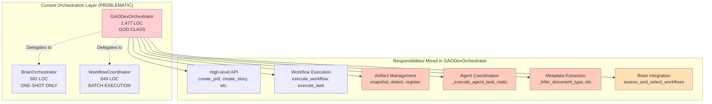
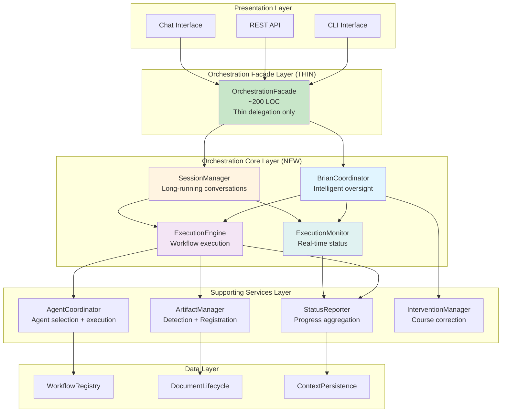

# Orchestration Layer Architecture Review

**Date**: 2025-11-08
**Purpose**: Critical analysis of orchestration layer and proposal for clean architecture
**Status**: Architectural Review

---

## Table of Contents

1. [Executive Summary](#executive-summary)
2. [Current Architecture Problems](#current-architecture-problems)
3. [Detailed Responsibility Analysis](#detailed-responsibility-analysis)
4. [Architectural Violations](#architectural-violations)
5. [Future Requirements](#future-requirements)
6. [Proposed Architecture](#proposed-architecture)
7. [Refactoring Plan](#refactoring-plan)
8. [Migration Strategy](#migration-strategy)

---

## Executive Summary

### Critical Findings

**🚨 Major Issues**:

1. **GAODevOrchestrator is becoming a god class** (1,477 LOC, 24 methods)
   - Violates Single Responsibility Principle
   - Mixes high-level API, workflow execution, artifact management, and agent coordination
   - Growing with each feature addition

2. **Brian's role ends after initial workflow selection**
   - No ongoing monitoring or course correction
   - Cannot provide real-time feedback
   - Not designed for interactive orchestration

3. **No architecture for real-time interaction**
   - Batch/sequential execution model
   - No session management for long-running conversations
   - No mechanism for user intervention during execution

4. **Unclear boundaries between orchestration components**
   - BrianOrchestrator, WorkflowCoordinator, and GAODevOrchestrator overlap
   - Responsibilities not cleanly separated
   - Tight coupling makes extension difficult

### Architectural Debt

Despite Epic 6's refactor to extract services, the orchestration layer was **not properly decomposed**. The orchestrator remains a facade that also contains significant business logic.

### Impact

**Current limitations**:
- ❌ Cannot implement Brian as infinite loop chat
- ❌ Cannot provide real-time status updates
- ❌ Cannot adjust course mid-execution
- ❌ Difficult to add new orchestration features
- ❌ Testing is complex due to tight coupling

---

## Current Architecture Problems

### Current Component Structure



### Execution Flow Problems

```mermaid
sequenceDiagram
    participant User
    participant Orch as GAODevOrchestrator
    participant Brian as BrianOrchestrator
    participant WC as WorkflowCoordinator

    User->>Orch: execute_workflow_sequence_from_prompt(prompt)

    Note over Orch,Brian: Brian's involvement (STARTS)
    Orch->>Brian: assess_and_select_workflows(prompt)
    Brian->>Brian: Analyze complexity
    Brian-->>Orch: WorkflowSequence
    Note over Orch,Brian: Brian's involvement (ENDS)

    Note over Orch,WC: Brian has NO visibility from here on
    Orch->>WC: execute_sequence(workflow_sequence)

    loop For each workflow
        WC->>WC: execute_workflow()
        Note over WC: Could fail, need adjustment<br/>Brian can't help
    end

    WC-->>Orch: WorkflowResult
    Orch-->>User: Result

    Note over User,Brian: No real-time updates<br/>No course correction<br/>No interactive feedback

    style Brian fill:#ffcdd2
```

**Problems**:
1. Brian analyzes once, then disconnects
2. No feedback loop for adjustment
3. No real-time status reporting
4. No mechanism for intervention

---

## Detailed Responsibility Analysis

### GAODevOrchestrator - God Class Analysis

**File**: `gao_dev/orchestrator/orchestrator.py`
**Lines of Code**: 1,477
**Methods**: 24 (16 public, 8 private)

#### Responsibility Breakdown

| Responsibility | LOC | Methods | Should Be In |
|----------------|-----|---------|--------------|
| **Initialization** | ~350 | `__init__`, `_initialize_default_services`, `create_default` | ✅ Factory/Builder |
| **High-level API** | ~150 | `create_prd`, `create_story`, `implement_story`, etc. (7 methods) | ✅ Facade/Orchestrator |
| **Brian Integration** | ~100 | `assess_and_select_workflows`, `handle_clarification`, `get_scale_level_description` | ⚠️ Should delegate to BrianCoordinator |
| **Workflow Execution** | ~250 | `execute_workflow`, `execute_workflow_sequence_from_prompt`, `execute_task` | ❌ Move to ExecutionEngine |
| **Artifact Detection** | ~140 | `_snapshot_project_files`, `_detect_artifacts` | ❌ Move to ArtifactManager |
| **Artifact Registration** | ~150 | `_register_artifacts`, `_infer_document_type` | ❌ Move to ArtifactManager |
| **Agent Coordination** | ~200 | `_execute_agent_task_static`, `_get_agent_for_workflow` | ❌ Move to AgentCoordinator |
| **Metadata Extraction** | ~80 | `_extract_feature_name` | ❌ Move to MetadataExtractor |
| **Context Management** | ~57 | `get_document_manager`, `close`, context methods | ✅ Keep in Orchestrator |

**Verdict**: ~970 LOC (~66%) should be extracted to separate services.

#### Method-by-Method Analysis

**Public Methods** (16 total):

| Method | LOC | Responsibility | Verdict |
|--------|-----|----------------|---------|
| `create_default()` | ~165 | Factory method | ✅ Keep (factory pattern) |
| `get_document_manager()` | ~14 | Context access | ✅ Keep |
| `close()` | ~15 | Resource cleanup | ✅ Keep |
| `execute_task()` | ~40 | Generic task execution | ⚠️ Delegate to ExecutionEngine |
| `create_prd()` | ~17 | High-level API | ✅ Keep (facade) |
| `create_story()` | ~16 | High-level API | ✅ Keep (facade) |
| `implement_story()` | ~8 | High-level API | ✅ Keep (facade) |
| `create_architecture()` | ~10 | High-level API | ✅ Keep (facade) |
| `run_health_check()` | ~8 | High-level API | ✅ Keep (facade) |
| `validate_story()` | ~10 | High-level API | ✅ Keep (facade) |
| `assess_and_select_workflows()` | ~30 | Brian delegation | ⚠️ Already delegates, simplify |
| `get_scale_level_description()` | ~13 | Brian delegation | ⚠️ Already delegates, simplify |
| `handle_clarification()` | ~37 | Clarification handling | ❌ Move to InteractionManager |
| `execute_workflow()` | ~210 | Workflow execution | ❌ Move to ExecutionEngine |
| `execute_workflow_sequence_from_prompt()` | ~30 | Convenience wrapper | ✅ Keep (facade) |

**Private Methods** (8 total):

| Method | LOC | Responsibility | Should Move To |
|--------|-----|----------------|----------------|
| `_initialize_default_services()` | ~118 | Service initialization | ✅ Keep (internal setup) |
| `_snapshot_project_files()` | ~70 | Filesystem snapshot | ❌ ArtifactManager |
| `_detect_artifacts()` | ~40 | Artifact detection | ❌ ArtifactManager |
| `_execute_agent_task_static()` | ~135 | Agent execution bridge | ❌ AgentCoordinator |
| `_infer_document_type()` | ~78 | Type inference | ❌ ArtifactManager |
| `_register_artifacts()` | ~98 | Document registration | ❌ ArtifactManager |
| `_get_agent_for_workflow()` | ~35 | Agent mapping | ❌ AgentCoordinator |
| `_extract_feature_name()` | ~27 | Metadata extraction | ❌ MetadataExtractor |

### BrianOrchestrator - One-Shot Analysis

**File**: `gao_dev/orchestrator/brian_orchestrator.py`
**Lines of Code**: 582

**Current Responsibilities**:
- ✅ Prompt analysis (complexity assessment)
- ✅ Workflow selection (scale-adaptive routing)
- ✅ Project type detection (greenfield, brownfield, game)
- ❌ **NO** ongoing monitoring
- ❌ **NO** course correction
- ❌ **NO** real-time feedback
- ❌ **NO** session management

**Problem**: Brian is designed as a **one-shot analyzer**, not a **continuous orchestrator**.

```python
# Current Brian usage (ONE-SHOT)
workflow_sequence = await brian.assess_and_select_workflows(prompt)
# Brian's work is done here - no further involvement
```

**Needed**: Brian as a **continuous coordinator**:

```python
# Proposed Brian usage (CONTINUOUS)
async with brian.start_session(prompt) as session:
    # Brian monitors execution
    async for update in session.execute():
        print(f"Brian: {update.status}")
        if update.needs_adjustment:
            await session.adjust_course(update.recommendation)
```

### WorkflowCoordinator - Batch Executor Analysis

**File**: `gao_dev/core/services/workflow_coordinator.py`
**Lines of Code**: 649

**Current Responsibilities**:
- ✅ Sequence execution (setup phase + story loop)
- ✅ Workflow step execution with retry logic
- ✅ Event publishing for lifecycle
- ❌ **NO** real-time status reporting
- ❌ **NO** interruption handling
- ❌ **NO** adaptive execution (can't adjust based on feedback)

**Problem**: Designed for **batch execution**, not **interactive execution**.

---

## Architectural Violations

### 1. Single Responsibility Principle (SRP) - VIOLATED

**GAODevOrchestrator violates SRP** by handling:
1. High-level API (facade)
2. Workflow execution orchestration
3. Artifact detection and management
4. Agent coordination
5. Metadata extraction
6. Brian integration
7. Context management

**Impact**: Changes to any of these concerns require modifying the orchestrator.

### 2. Open/Closed Principle (OCP) - VIOLATED

**Cannot extend orchestration without modifying core classes**:
- Want to add new artifact detection strategy? Modify orchestrator.
- Want to add new agent coordination logic? Modify orchestrator.
- Want to change how Brian monitors execution? No extension point.

**Impact**: Every feature addition risks breaking existing functionality.

### 3. Dependency Inversion Principle (DIP) - PARTIALLY VIOLATED

**Orchestrator depends on concrete implementations**:
- Directly instantiates BrianOrchestrator
- Directly calls specific artifact detection methods
- Tight coupling to DocumentLifecycleManager

**Impact**: Difficult to test, difficult to swap implementations.

### 4. Interface Segregation Principle (ISP) - VIOLATED

**Orchestrator exposes too many methods**:
- 16 public methods (too many responsibilities)
- Clients depend on methods they don't use
- No clear interface separation

**Impact**: Clients have access to methods they shouldn't use.

### 5. Don't Repeat Yourself (DRY) - VIOLATED

**Duplicate logic**:
- `_get_agent_for_workflow` exists in both GAODevOrchestrator and WorkflowCoordinator
- Artifact detection logic partially duplicated
- Agent mapping duplicated

**Impact**: Maintenance burden, inconsistency risk.

---

## Future Requirements

### Brian as Infinite Loop Chat Manager

**Vision**: Brian should act as a **real-time project manager** who:

1. **Continuously monitors execution**
   - Watches workflow progress
   - Detects issues early
   - Provides running commentary

2. **Provides real-time feedback**
   - Status updates: "Creating PRD... 30% complete"
   - Quality insights: "Test coverage looking good"
   - Warnings: "This story is taking longer than expected"

3. **Adjusts course mid-execution**
   - Detects complexity underestimation
   - Suggests workflow changes
   - Adds/removes steps dynamically

4. **Manages interactive sessions**
   - Handles user interruptions
   - Answers questions during execution
   - Collaborates in real-time

5. **Maintains conversation context**
   - Remembers previous decisions
   - Explains rationale for choices
   - Learns from execution history

### Example Interaction

```
User: Build a todo app with authentication

Brian: 🤔 Analyzing your request...
       This looks like a Level 2 project (medium complexity).
       Estimated 10 stories across 2 epics.

       I'll create a PRD, then architecture, then stories.
       Sound good? [y/n]

User: y

Brian: 📝 Starting workflow execution...

       [Step 1/4] Creating PRD... ⏳
       John is drafting the Product Requirements Document.

       [Step 1/4] Creating PRD... ✅ Complete
       PRD looks comprehensive. I see you want OAuth support.

       [Step 2/4] Creating Architecture... ⏳
       Winston is designing the system architecture.

       ⚠️  Wait, I'm noticing Winston is adding database sharding.
       That seems over-engineered for this scale. Should I ask him to simplify? [y/n]

User: y

Brian: 👍 Adjusting course... I'll ask Winston to keep it simple.

       [Step 2/4] Creating Architecture... ✅ Complete (revised)
       Much better. Clean architecture with PostgreSQL, no sharding.

       [Step 3/4] Creating Stories (1/10)... ⏳
       Bob is creating story 1.1: User Registration

       ...

Brian: 🎉 All workflows complete!

       Summary:
       - PRD: docs/PRD.md
       - Architecture: docs/Architecture.md
       - Stories: 10 stories created in docs/stories/
       - Estimated time to implement: 2 weeks

       Ready to start implementation, or want to review first? [implement/review]
```

### Requirements

To support this vision, we need:

1. **Session Management**
   - Long-running conversations
   - State persistence
   - Interruption handling

2. **Event-Driven Architecture**
   - Workflow events (started, progress, completed, failed)
   - Real-time event streaming
   - Event aggregation for status

3. **Adaptive Execution**
   - Mid-execution adjustments
   - Workflow modification
   - Dynamic workflow selection

4. **Real-Time Communication**
   - Streaming status updates
   - Chat-based interface
   - Async event handling

5. **Monitoring and Observability**
   - Execution metrics
   - Progress tracking
   - Quality indicators

---

## Proposed Architecture

### Clean Orchestration Layer



### Component Descriptions

#### 1. OrchestrationFacade (NEW - replaces GAODevOrchestrator)

**Responsibility**: Thin public API (facade pattern only)

**Lines of Code**: ~200 LOC (down from 1,477)

**Public API**:
```python
class OrchestrationFacade:
    """Thin facade for orchestration layer."""

    async def execute_prompt(self, prompt: str) -> ExecutionResult:
        """Execute prompt with Brian's coordination."""
        session = await self.session_manager.create_session(prompt)
        return await self.brian_coordinator.execute_with_oversight(session)

    async def create_prd(self, project_name: str) -> Document:
        """Create PRD (convenience method)."""
        return await self.execution_engine.execute_workflow("prd", {"project_name": project_name})

    async def start_interactive_session(self, prompt: str) -> InteractiveSession:
        """Start long-running interactive session with Brian."""
        return await self.session_manager.create_interactive_session(prompt)
```

**NO business logic** - only delegation.

#### 2. BrianCoordinator (ENHANCED - replaces BrianOrchestrator)

**Responsibility**: Intelligent oversight and continuous monitoring

**Key Changes**:
- Not just one-shot workflow selection
- Continuous monitoring during execution
- Course correction based on feedback
- Real-time status commentary

**API**:
```python
class BrianCoordinator:
    """Brian - Intelligent continuous coordinator."""

    async def execute_with_oversight(
        self,
        session: Session
    ) -> AsyncGenerator[ExecutionUpdate, None]:
        """
        Execute workflows with Brian's continuous oversight.

        Yields real-time updates as execution progresses.
        """
        # Initial analysis
        plan = await self.analyze_and_plan(session.prompt)
        yield ExecutionUpdate(type="plan_ready", plan=plan)

        # Execute with monitoring
        async for update in self.execution_engine.execute(plan):
            # Monitor execution
            assessment = await self.assess_progress(update)

            # Provide commentary
            yield ExecutionUpdate(
                type="status",
                message=assessment.commentary,
                progress=assessment.progress
            )

            # Check if adjustment needed
            if assessment.needs_adjustment:
                adjustment = await self.decide_adjustment(assessment)
                yield ExecutionUpdate(type="adjustment", recommendation=adjustment)
                await self.apply_adjustment(adjustment)

    async def analyze_and_plan(self, prompt: str) -> ExecutionPlan:
        """Initial complexity analysis and planning."""
        analysis = await self.ai_analysis_service.analyze(prompt)
        workflow_sequence = self._build_workflow_sequence(analysis)
        return ExecutionPlan(analysis=analysis, workflows=workflow_sequence)

    async def assess_progress(self, update: WorkflowUpdate) -> ProgressAssessment:
        """Assess current execution progress and quality."""
        # Check if workflow is taking too long
        # Check if artifacts meet quality standards
        # Detect scope creep
        # etc.
        return ProgressAssessment(...)

    async def decide_adjustment(self, assessment: ProgressAssessment) -> Adjustment:
        """Decide what course correction to apply."""
        # Ask Brian (AI) what to do
        return await self.ai_analysis_service.decide_course_correction(assessment)
```

**Benefits**:
- Brian stays involved throughout execution
- Can provide real-time feedback
- Can adjust course mid-execution
- Supports interactive sessions

#### 3. SessionManager (NEW)

**Responsibility**: Manage long-running conversations and state

**API**:
```python
class SessionManager:
    """Manages long-running orchestration sessions."""

    async def create_session(self, prompt: str, mode: str = "batch") -> Session:
        """Create new execution session (batch or interactive)."""
        session_id = str(uuid.uuid4())
        session = Session(
            id=session_id,
            prompt=prompt,
            mode=mode,
            created_at=datetime.now(),
            state={}
        )
        await self.persistence.save_session(session)
        return session

    async def create_interactive_session(self, prompt: str) -> InteractiveSession:
        """Create interactive session with chat interface."""
        session = await self.create_session(prompt, mode="interactive")
        return InteractiveSession(session, self.brian_coordinator)

    async def resume_session(self, session_id: str) -> Session:
        """Resume existing session."""
        return await self.persistence.load_session(session_id)

    async def handle_interruption(self, session_id: str, user_input: str) -> Response:
        """Handle user interruption during execution."""
        session = await self.resume_session(session_id)
        return await self.brian_coordinator.handle_user_input(session, user_input)
```

**Features**:
- Session persistence (survive restarts)
- Interruption handling
- State management
- Conversation history

#### 4. ExecutionEngine (NEW - extracts from GAODevOrchestrator + WorkflowCoordinator)

**Responsibility**: Pure workflow execution (no intelligence)

**API**:
```python
class ExecutionEngine:
    """Pure execution engine for workflows."""

    async def execute(
        self,
        plan: ExecutionPlan
    ) -> AsyncGenerator[WorkflowUpdate, None]:
        """
        Execute workflow plan, yielding updates.

        NO intelligence - just executes what it's told.
        """
        for workflow in plan.workflows:
            yield WorkflowUpdate(type="workflow_started", workflow=workflow)

            result = await self.execute_workflow(workflow, plan.context)

            yield WorkflowUpdate(
                type="workflow_completed",
                workflow=workflow,
                result=result
            )

    async def execute_workflow(
        self,
        workflow: WorkflowInfo,
        context: ExecutionContext
    ) -> WorkflowResult:
        """Execute single workflow."""
        # Variable resolution
        variables = self.workflow_executor.resolve_variables(workflow, context.params)

        # Render instructions
        instructions = self.workflow_executor.render_template(
            workflow.instructions,
            variables
        )

        # Execute via agent
        result = await self.agent_coordinator.execute(
            workflow=workflow,
            instructions=instructions,
            tools=workflow.required_tools
        )

        # Detect artifacts
        artifacts = await self.artifact_manager.detect_and_register(
            workflow=workflow,
            result=result
        )

        return WorkflowResult(output=result, artifacts=artifacts)
```

**Benefits**:
- Pure execution logic (no decision-making)
- Testable in isolation
- Clear responsibility

#### 5. ExecutionMonitor (NEW)

**Responsibility**: Real-time execution monitoring and metrics

**API**:
```python
class ExecutionMonitor:
    """Monitors workflow execution and collects metrics."""

    async def start_monitoring(self, session_id: str) -> None:
        """Start monitoring session."""
        self.active_sessions[session_id] = MonitoringState()

    def record_event(self, session_id: str, event: ExecutionEvent) -> None:
        """Record execution event."""
        state = self.active_sessions[session_id]
        state.events.append(event)
        self._update_metrics(state, event)

    def get_status(self, session_id: str) -> ExecutionStatus:
        """Get current execution status."""
        state = self.active_sessions[session_id]
        return ExecutionStatus(
            phase=state.current_phase,
            progress=state.progress_percentage,
            artifacts_created=len(state.artifacts),
            current_workflow=state.current_workflow,
            estimated_remaining=state.estimated_time_remaining
        )

    async def subscribe_to_updates(
        self,
        session_id: str
    ) -> AsyncGenerator[ExecutionStatus, None]:
        """Subscribe to real-time status updates."""
        while self.is_active(session_id):
            yield self.get_status(session_id)
            await asyncio.sleep(1)  # Update every second
```

**Benefits**:
- Real-time progress tracking
- Metrics collection
- Status aggregation

#### 6. ArtifactManager (NEW - extracted from GAODevOrchestrator)

**Responsibility**: Artifact detection, registration, and management

**Extracted Methods**:
- `_snapshot_project_files()` → `snapshot_filesystem()`
- `_detect_artifacts()` → `detect_artifacts()`
- `_infer_document_type()` → `infer_document_type()`
- `_register_artifacts()` → `register_artifacts()`

**API**:
```python
class ArtifactManager:
    """Manages artifact detection and registration."""

    def snapshot_filesystem(self, project_root: Path) -> FilesystemSnapshot:
        """Capture filesystem state."""
        # Extract from _snapshot_project_files
        ...

    def detect_artifacts(
        self,
        before: FilesystemSnapshot,
        after: FilesystemSnapshot
    ) -> List[Path]:
        """Detect created/modified files."""
        # Extract from _detect_artifacts
        ...

    def infer_document_type(
        self,
        path: Path,
        workflow: WorkflowInfo
    ) -> str:
        """Infer document type from workflow and path."""
        # Extract from _infer_document_type
        ...

    async def detect_and_register(
        self,
        workflow: WorkflowInfo,
        result: WorkflowResult
    ) -> List[Document]:
        """Detect artifacts and register with document lifecycle."""
        # Combine detection + registration logic
        before = self.snapshot_before[workflow.id]
        after = self.snapshot_filesystem(self.project_root)

        artifacts = self.detect_artifacts(before, after)

        documents = []
        for artifact_path in artifacts:
            doc_type = self.infer_document_type(artifact_path, workflow)
            doc = await self.doc_lifecycle.register_document(
                path=artifact_path,
                doc_type=doc_type,
                author=workflow.author,
                metadata={"workflow": workflow.name}
            )
            documents.append(doc)

        return documents
```

**LOC Reduction**: ~300 LOC extracted from orchestrator

#### 7. AgentCoordinator (NEW - extracted from GAODevOrchestrator)

**Responsibility**: Agent selection and task execution

**Extracted Methods**:
- `_get_agent_for_workflow()` → `select_agent()`
- `_execute_agent_task_static()` → `execute_task()`

**API**:
```python
class AgentCoordinator:
    """Coordinates agent selection and execution."""

    def select_agent(self, workflow: WorkflowInfo) -> AgentInfo:
        """Select appropriate agent for workflow."""
        # Extract from _get_agent_for_workflow
        # But make it more sophisticated (use agent configs)
        ...

    async def execute_task(
        self,
        workflow: WorkflowInfo,
        instructions: str,
        tools: List[str]
    ) -> AgentResult:
        """Execute agent task."""
        # Extract from _execute_agent_task_static
        agent = self.select_agent(workflow)

        result = await self.process_executor.execute_agent_task(
            task=instructions,
            tools=tools,
            agent_config=agent.config
        )

        return AgentResult(output=result, agent=agent.name)
```

**LOC Reduction**: ~200 LOC extracted from orchestrator

#### 8. StatusReporter (NEW)

**Responsibility**: Aggregate and report execution status

**API**:
```python
class StatusReporter:
    """Aggregates execution status for reporting."""

    def __init__(self, execution_monitor: ExecutionMonitor):
        self.monitor = execution_monitor

    def get_summary(self, session_id: str) -> StatusSummary:
        """Get execution summary."""
        status = self.monitor.get_status(session_id)
        return StatusSummary(
            phase=status.phase,
            progress=status.progress,
            artifacts=status.artifacts_created,
            current_task=status.current_workflow,
            estimated_completion=status.estimated_remaining
        )

    def format_for_user(self, summary: StatusSummary) -> str:
        """Format status for user display."""
        return f"""
Brian: 📊 Current Status

Phase: {summary.phase}
Progress: {summary.progress}% complete
Artifacts created: {summary.artifacts}
Current task: {summary.current_task}
Estimated completion: {summary.estimated_completion}
        """
```

#### 9. InterventionManager (NEW)

**Responsibility**: Handle course corrections and adjustments

**API**:
```python
class InterventionManager:
    """Manages course corrections during execution."""

    async def request_adjustment(
        self,
        session_id: str,
        issue: ExecutionIssue
    ) -> AdjustmentDecision:
        """Request adjustment decision from Brian."""
        # Ask Brian's AI what to do
        decision = await self.brian_coordinator.decide_adjustment(issue)
        return decision

    async def apply_adjustment(
        self,
        session_id: str,
        adjustment: Adjustment
    ) -> None:
        """Apply course correction."""
        if adjustment.type == "add_workflow":
            await self.execution_engine.insert_workflow(adjustment.workflow)
        elif adjustment.type == "skip_workflow":
            await self.execution_engine.skip_workflow(adjustment.workflow_id)
        elif adjustment.type == "modify_parameters":
            await self.execution_engine.update_parameters(adjustment.params)
```

---

## Refactoring Plan

### Phase 1: Extract Services (Week 1-2)

**Goal**: Extract ~900 LOC from GAODevOrchestrator into new services

**Steps**:

1. **Extract ArtifactManager** (Day 1-2)
   - Create `gao_dev/core/services/artifact_manager.py`
   - Move `_snapshot_project_files()` → `snapshot_filesystem()`
   - Move `_detect_artifacts()` → `detect_artifacts()`
   - Move `_infer_document_type()` → `infer_document_type()`
   - Move `_register_artifacts()` → `register_artifacts()`
   - Add comprehensive tests
   - **LOC Reduction**: ~300 LOC

2. **Extract AgentCoordinator** (Day 3-4)
   - Create `gao_dev/core/services/agent_coordinator.py`
   - Move `_get_agent_for_workflow()` → `select_agent()`
   - Move `_execute_agent_task_static()` → `execute_task()`
   - Enhance agent selection with agent configs
   - Add tests
   - **LOC Reduction**: ~200 LOC

3. **Extract MetadataExtractor** (Day 5)
   - Create `gao_dev/core/services/metadata_extractor.py`
   - Move `_extract_feature_name()` → `extract_feature()`
   - Add more metadata extraction logic
   - Add tests
   - **LOC Reduction**: ~50 LOC

4. **Update GAODevOrchestrator to use new services** (Day 6-7)
   - Inject new services in `__init__`
   - Replace method calls with service calls
   - Update tests
   - **Verify**: All existing tests still pass

**Result**: GAODevOrchestrator reduced from 1,477 LOC to ~900 LOC

### Phase 2: Create ExecutionEngine (Week 3)

**Goal**: Extract workflow execution logic

**Steps**:

1. **Create ExecutionEngine** (Day 1-3)
   - Create `gao_dev/core/services/execution_engine.py`
   - Move workflow execution logic from GAODevOrchestrator
   - Move workflow execution logic from WorkflowCoordinator
   - Integrate with ArtifactManager and AgentCoordinator
   - Add tests

2. **Update WorkflowCoordinator** (Day 4)
   - Make WorkflowCoordinator use ExecutionEngine
   - Remove duplicate logic
   - Simplify to focus on coordination only

3. **Update GAODevOrchestrator** (Day 5)
   - Delegate workflow execution to ExecutionEngine
   - Remove execution logic
   - **LOC Reduction**: ~250 LOC

**Result**: GAODevOrchestrator reduced to ~650 LOC

### Phase 3: Enhance BrianOrchestrator (Week 4)

**Goal**: Transform Brian into continuous coordinator

**Steps**:

1. **Rename BrianOrchestrator → BrianCoordinator** (Day 1)
   - Rename class and file
   - Update all imports
   - Keep existing functionality working

2. **Add ExecutionMonitor** (Day 2)
   - Create `gao_dev/core/services/execution_monitor.py`
   - Implement monitoring and metrics collection
   - Integrate with event bus

3. **Add StatusReporter** (Day 3)
   - Create `gao_dev/core/services/status_reporter.py`
   - Implement status aggregation
   - Add formatting for user display

4. **Enhance BrianCoordinator with monitoring** (Day 4-5)
   - Add `execute_with_oversight()` method
   - Integrate ExecutionMonitor
   - Add progress assessment logic
   - Add tests

**Result**: Brian can now monitor execution and provide real-time feedback

### Phase 4: Add SessionManager (Week 5)

**Goal**: Support long-running conversations

**Steps**:

1. **Create SessionManager** (Day 1-2)
   - Create `gao_dev/core/services/session_manager.py`
   - Implement session creation and persistence
   - Add interruption handling
   - Add tests

2. **Create InteractiveSession** (Day 3)
   - Create `gao_dev/orchestrator/interactive_session.py`
   - Implement chat interface
   - Integrate with BrianCoordinator
   - Add tests

3. **Add InterventionManager** (Day 4)
   - Create `gao_dev/core/services/intervention_manager.py`
   - Implement course correction logic
   - Add tests

4. **Integration** (Day 5)
   - Wire all components together
   - End-to-end testing
   - Update documentation

**Result**: Support for interactive sessions with Brian

### Phase 5: Create OrchestrationFacade (Week 6)

**Goal**: Replace GAODevOrchestrator with thin facade

**Steps**:

1. **Create OrchestrationFacade** (Day 1-2)
   - Create `gao_dev/orchestrator/orchestration_facade.py`
   - Implement thin delegation-only API
   - Wire to new services
   - Target ~200 LOC

2. **Update CLI and API** (Day 3)
   - Update commands to use OrchestrationFacade
   - Update tests

3. **Deprecate GAODevOrchestrator** (Day 4)
   - Mark as deprecated
   - Add migration guide
   - Keep for backward compatibility (temporarily)

4. **Documentation** (Day 5)
   - Update architecture docs
   - Update developer guide
   - Create migration guide

**Result**: Clean, maintainable orchestration layer

---

## Migration Strategy

### Backward Compatibility

**Goal**: Zero breaking changes during migration

**Strategy**:

1. **Keep GAODevOrchestrator as facade** (temporarily)
   ```python
   class GAODevOrchestrator:
       """
       DEPRECATED: Use OrchestrationFacade instead.

       This class is kept for backward compatibility.
       """
       def __init__(self, ...):
           warnings.warn(
               "GAODevOrchestrator is deprecated. Use OrchestrationFacade.",
               DeprecationWarning
           )
           self._facade = OrchestrationFacade(...)

       async def execute_workflow(self, ...):
           return await self._facade.execute_workflow(...)
   ```

2. **Parallel implementation**
   - New services coexist with old code
   - Gradually migrate methods
   - Keep tests passing

3. **Feature flags**
   ```python
   # Enable new orchestration architecture
   USE_NEW_ORCHESTRATION = os.getenv("GAO_DEV_NEW_ORCH", "false") == "true"
   ```

4. **Remove GAODevOrchestrator** (after 2-3 releases)
   - Announce deprecation
   - Provide migration guide
   - Remove deprecated code

### Testing Strategy

**Goal**: Maintain 100% test coverage during refactor

**Approach**:

1. **Test new services independently**
   - Unit tests for each new service
   - Mock dependencies
   - Test edge cases

2. **Integration tests**
   - Test service interactions
   - Test full execution flow
   - Compare results with old implementation

3. **Regression tests**
   - Keep existing tests passing
   - Add new tests for new functionality
   - Use snapshot testing for complex flows

4. **Benchmark tests**
   - Run workflow-driven benchmarks
   - Compare metrics (old vs new)
   - Ensure no performance regression

---

## Summary

### Current Problems

1. ❌ GAODevOrchestrator is a god class (1,477 LOC)
2. ❌ Brian's role ends after workflow selection
3. ❌ No real-time interaction support
4. ❌ Violates SRP, OCP, DIP, ISP, DRY
5. ❌ Difficult to test and extend

### Proposed Solution

1. ✅ Extract 6 new services (~900 LOC from orchestrator)
2. ✅ Create thin OrchestrationFacade (~200 LOC)
3. ✅ Enhance Brian as continuous coordinator
4. ✅ Add SessionManager for long-running conversations
5. ✅ Support real-time monitoring and feedback
6. ✅ Clean SOLID architecture

### Benefits

1. **Maintainability**: Each service has single responsibility
2. **Extensibility**: Easy to add new features via plugins
3. **Testability**: Services can be tested in isolation
4. **Real-time**: Supports Brian as infinite loop chat
5. **Quality**: Cleaner code, better separation of concerns

### Timeline

**6 weeks** for complete refactor:
- Week 1-2: Extract services
- Week 3: Create ExecutionEngine
- Week 4: Enhance BrianCoordinator
- Week 5: Add SessionManager
- Week 6: Create OrchestrationFacade

### Next Steps

1. **Review and approve** this architectural plan
2. **Create Epic** for orchestration layer refactor
3. **Break down into stories** (one per service)
4. **Begin Phase 1** (Extract ArtifactManager)

---

**Document Version**: 1.0
**Last Updated**: 2025-11-08
**Status**: Proposed - Awaiting Review
