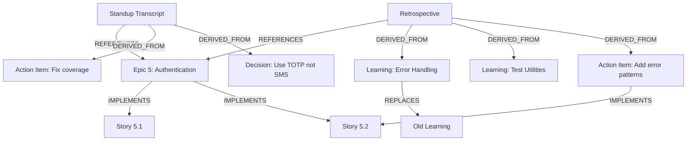
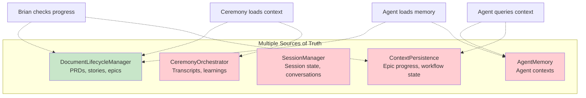
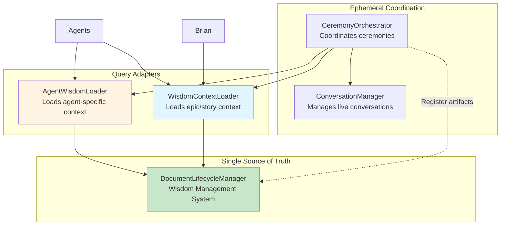

# Wisdom Management System - Unified Architecture

**Date**: 2025-11-08
**Purpose**: Integrate ceremonies and context into DocumentLifecycle as unified wisdom management
**Status**: Critical Architectural Insight

---

## Executive Summary

**Key Insight**: We're creating unnecessary duplication. The DocumentLifecycleManager **IS** the wisdom management system. Ceremony artifacts, context, learnings, and action items should ALL be documents tracked by this single system.

### The Problem

Current proposed architecture creates **multiple sources of truth**:

| System | Stores | Duplication |
|--------|--------|-------------|
| **DocumentLifecycleManager** | PRDs, architecture, stories, epics | ✅ Core docs |
| **ContextPersistence** | Workflow context, epic progress | ❌ Duplicates document state |
| **SessionManager** | Session state, conversation history | ❌ Should be documents |
| **AgentMemory** | Agent context, epic context | ❌ Should query documents |
| **CeremonyOrchestrator** | Stand-up transcripts, retro learnings | ❌ Should be documents |

**This violates**: Single Source of Truth (SSOT) principle

### The Solution

**DocumentLifecycleManager = Wisdom Management System**

- ✅ ALL artifacts are documents (including ceremony transcripts)
- ✅ ALL context is derived from document state + relationships
- ✅ ALL learnings are documents that can be queried
- ✅ ALL action items are documents with state
- ✅ Single query interface for all wisdom

---

## Current Document Lifecycle Capabilities

### What DocumentLifecycleManager Already Does

```python
class DocumentLifecycleManager:
    """High-level document lifecycle manager."""

    # Core Operations
    def register_document(path, doc_type, author, metadata)
    def transition_state(doc_id, new_state, reason)
    def get_current_document(doc_type, feature)
    def get_document_lineage(doc_id)
    def archive_document(doc_id)
    def query_documents(**filters)
```

**Capabilities**:
- ✅ Document registration with metadata extraction
- ✅ State transitions (DRAFT → ACTIVE → OBSOLETE → ARCHIVED)
- ✅ Relationships (DERIVED_FROM, IMPLEMENTS, TESTS, REPLACES, REFERENCES)
- ✅ Query by type, state, feature, epic, owner, tags
- ✅ Content hashing for change detection
- ✅ Path metadata extraction (feature, epic, story)
- ✅ YAML frontmatter extraction
- ✅ Version control (through relationships)

**This is EXACTLY what we need for wisdom management.**

### Current Document Types

```python
class DocumentType(str, Enum):
    PRD = "prd"
    ARCHITECTURE = "architecture"
    EPIC = "epic"
    STORY = "story"
    ADR = "adr"                  # Architecture Decision Records
    POSTMORTEM = "postmortem"
    RUNBOOK = "runbook"
    QA_REPORT = "qa_report"
    TEST_REPORT = "test_report"
```

**Missing**: Ceremony artifacts, learnings, action items, decisions

---

## Ceremony Artifacts as Documents

### Why Ceremony Artifacts Should Be Documents

**Stand-up transcripts ARE documents**:
- File: `docs/ceremonies/epic-5/standup.md`
- Content: Markdown with conversation transcript
- Metadata: date, participants, epic_num, duration
- Lifecycle: Created → ACTIVE → ARCHIVED
- Relationships: References epic, stories, action items

**Retrospective learnings ARE documents**:
- File: `docs/ceremonies/epic-5/retrospective.md`
- Content: What went well, challenges, action items, learnings
- Metadata: date, participants, epic_num
- Lifecycle: ACTIVE (current learnings) → ARCHIVED (when superseded)
- Relationships: DERIVED_FROM epic, generates action items

**Action items ARE documents**:
- File: `docs/action-items/epic-5-ai-1.md`
- Content: Action description, assignee, due date, completion notes
- Metadata: assignee, due_date, priority, parent_ceremony
- Lifecycle: DRAFT → ACTIVE (in progress) → ARCHIVED (completed)
- Relationships: DERIVED_FROM stand-up/retro, IMPLEMENTS in story

**Learnings ARE documents**:
- File: `docs/learnings/error-handling-patterns.md`
- Content: What we learned, context, recommendations
- Metadata: topic, epic_num, date, relevance
- Lifecycle: ACTIVE (current best practice) → OBSOLETE (when superseded)
- Relationships: DERIVED_FROM retrospective, REFERENCES stories

**This means**:
- Unified query: "Show me all learnings about testing from last 3 epics"
- Relationship tracking: "Which action items came from this retro?"
- State management: "Show me all active action items"
- Searchability: "Find retros where we discussed performance"

### Proposed Document Type Extensions

```python
class DocumentType(str, Enum):
    # Existing
    PRD = "prd"
    ARCHITECTURE = "architecture"
    EPIC = "epic"
    STORY = "story"
    ADR = "adr"
    POSTMORTEM = "postmortem"
    RUNBOOK = "runbook"
    QA_REPORT = "qa_report"
    TEST_REPORT = "test_report"

    # NEW - Ceremony Artifacts
    STANDUP = "standup"                   # Stand-up transcripts
    RETROSPECTIVE = "retrospective"       # Retrospective transcripts + learnings
    SPRINT_PLANNING = "sprint_planning"   # Sprint/epic planning sessions
    SPRINT_REVIEW = "sprint_review"       # Demo/review sessions

    # NEW - Wisdom Artifacts
    LEARNING = "learning"                 # Lessons learned (extracted from retros)
    ACTION_ITEM = "action_item"           # Action items from ceremonies
    DECISION = "decision"                 # Decisions made (like ADR but from ceremonies)

    # NEW - Context Artifacts
    EPIC_SUMMARY = "epic_summary"         # Epic completion summary
    SPRINT_SUMMARY = "sprint_summary"     # Sprint/epic summary
```

**Total**: 9 existing + 9 new = 18 document types

---

## Context as Document State

### The Problem with Separate Context Storage

Current proposed architecture has:

```python
class ContextPersistence:
    """Stores workflow execution context."""

    def save_context(context: WorkflowContext)
    def load_context(workflow_id: str)

# Context stored separately in context.db or context.json
```

**This duplicates information already in documents**:

| Context Data | Already In Documents |
|--------------|---------------------|
| Current epic number | Epic document state |
| Current story number | Story document state |
| Stories completed | Story documents with state=ACTIVE |
| Artifacts created | Document registry |
| Epic progress % | Count of ACTIVE vs DRAFT stories |
| Workflow phase | Epic/story document metadata |

**We don't need separate context storage - we can derive it from documents.**

### Context from Document Queries

```python
class WisdomContextLoader:
    """Loads context by querying DocumentLifecycleManager."""

    def __init__(self, doc_manager: DocumentLifecycleManager):
        self.doc_manager = doc_manager

    def get_epic_context(self, epic_num: int) -> EpicContext:
        """Get epic context from documents."""

        # Get epic document
        epic_docs = self.doc_manager.query_documents(
            doc_type=DocumentType.EPIC,
            metadata={"epic_num": epic_num}
        )
        if not epic_docs:
            raise ValueError(f"Epic {epic_num} not found")
        epic_doc = epic_docs[0]

        # Get all stories in epic (using relationships)
        story_docs = self.doc_manager.registry.get_child_documents(
            epic_doc.id,
            doc_type=DocumentType.STORY
        )

        # Calculate progress
        total_stories = len(story_docs)
        completed_stories = len([s for s in story_docs if s.state == DocumentState.ACTIVE])
        progress = (completed_stories / total_stories * 100) if total_stories else 0

        # Get artifacts created in this epic
        artifacts = self.doc_manager.query_documents(
            metadata={"epic_num": epic_num},
            state=DocumentState.ACTIVE
        )

        # Get previous ceremonies for this epic
        standups = self.doc_manager.query_documents(
            doc_type=DocumentType.STANDUP,
            metadata={"epic_num": epic_num}
        )

        retros = self.doc_manager.query_documents(
            doc_type=DocumentType.RETROSPECTIVE,
            metadata={"epic_num": epic_num}
        )

        # Get relevant learnings from previous epics
        relevant_learnings = self.doc_manager.query_documents(
            doc_type=DocumentType.LEARNING,
            state=DocumentState.ACTIVE
        )

        return EpicContext(
            epic_num=epic_num,
            epic_doc=epic_doc,
            stories=story_docs,
            total_stories=total_stories,
            completed_stories=completed_stories,
            progress_percentage=progress,
            artifacts=artifacts,
            standups=standups,
            retros=retros,
            learnings=relevant_learnings
        )

    def get_current_epic(self) -> Optional[int]:
        """Get current epic number."""
        # Get active epic documents
        active_epics = self.doc_manager.query_documents(
            doc_type=DocumentType.EPIC,
            state=DocumentState.ACTIVE
        )

        if not active_epics:
            return None

        # Return the highest epic number
        epic_nums = [doc.epic for doc in active_epics if doc.epic]
        return max(epic_nums) if epic_nums else None

    def get_current_story(self, epic_num: int) -> Optional[str]:
        """Get current story identifier for epic."""
        # Get epic context
        context = self.get_epic_context(epic_num)

        # Find first non-completed story
        for story in context.stories:
            if story.state == DocumentState.DRAFT:
                return story.story  # e.g., "5.3"

        return None  # All stories complete
```

**No separate context storage needed - it's all derived from documents.**

---

## AgentMemory from Document Queries

### Current Problem

Proposed AgentMemory creates separate storage:

```python
class AgentMemory:
    def initialize_context(agent, conversation)  # Separate storage
    def record_turn(turn, conversation)  # Separate storage
```

### Solution: Query Documents

```python
class AgentWisdomLoader:
    """Loads agent-specific context from wisdom management system."""

    def __init__(self, doc_manager: DocumentLifecycleManager):
        self.doc_manager = doc_manager

    def load_agent_context(
        self,
        agent: AgentInfo,
        epic_num: int
    ) -> Dict[str, Any]:
        """Load context relevant to agent's role."""

        base_context = {
            "role": agent.role,
            "responsibilities": agent.responsibilities,
        }

        # Load role-specific documents
        if agent.role == "Scrum Master":
            # Bob needs: stories, velocity, issues, ceremonies
            context = self._load_scrum_master_context(epic_num)

        elif agent.role == "Developer":
            # Amelia needs: stories, code artifacts, test coverage
            context = self._load_developer_context(epic_num)

        elif agent.role == "QA":
            # Murat needs: test reports, coverage, quality issues
            context = self._load_qa_context(epic_num)

        elif agent.role == "Product Manager":
            # John needs: PRD, epics, stories, user feedback
            context = self._load_pm_context(epic_num)

        elif agent.role == "Architect":
            # Winston needs: architecture docs, ADRs, tech debt
            context = self._load_architect_context(epic_num)

        else:
            context = {}

        return {**base_context, **context}

    def _load_scrum_master_context(self, epic_num: int) -> Dict[str, Any]:
        """Load Scrum Master specific context."""
        return {
            "stories": self.doc_manager.query_documents(
                doc_type=DocumentType.STORY,
                metadata={"epic_num": epic_num}
            ),
            "standups": self.doc_manager.query_documents(
                doc_type=DocumentType.STANDUP,
                metadata={"epic_num": epic_num}
            ),
            "retros": self.doc_manager.query_documents(
                doc_type=DocumentType.RETROSPECTIVE,
                metadata={"epic_num": epic_num}
            ),
            "action_items": self.doc_manager.query_documents(
                doc_type=DocumentType.ACTION_ITEM,
                metadata={"epic_num": epic_num},
                state=DocumentState.ACTIVE  # Only active action items
            ),
        }

    def _load_developer_context(self, epic_num: int) -> Dict[str, Any]:
        """Load Developer specific context."""
        return {
            "stories": self.doc_manager.query_documents(
                doc_type=DocumentType.STORY,
                metadata={"epic_num": epic_num, "author": "amelia"}
            ),
            "test_reports": self.doc_manager.query_documents(
                doc_type=DocumentType.TEST_REPORT,
                metadata={"epic_num": epic_num}
            ),
            "action_items": self.doc_manager.query_documents(
                doc_type=DocumentType.ACTION_ITEM,
                metadata={"assignee": "amelia"},
                state=DocumentState.ACTIVE
            ),
            "learnings": self.doc_manager.query_documents(
                doc_type=DocumentType.LEARNING,
                metadata={"topic": ["testing", "code-quality", "architecture"]},
                state=DocumentState.ACTIVE
            ),
        }

    def _load_qa_context(self, epic_num: int) -> Dict[str, Any]:
        """Load QA specific context."""
        return {
            "test_reports": self.doc_manager.query_documents(
                doc_type=DocumentType.TEST_REPORT,
                metadata={"epic_num": epic_num}
            ),
            "qa_reports": self.doc_manager.query_documents(
                doc_type=DocumentType.QA_REPORT,
                metadata={"epic_num": epic_num}
            ),
            "quality_learnings": self.doc_manager.query_documents(
                doc_type=DocumentType.LEARNING,
                metadata={"topic": ["testing", "quality", "coverage"]},
                state=DocumentState.ACTIVE
            ),
        }
```

**Benefits**:
- No separate storage
- Query flexibility
- Role-specific context
- Always up-to-date (source of truth)

---

## Ceremonies Create and Query Documents

### CeremonyOrchestrator Integration

```python
class CeremonyOrchestrator:
    """Orchestrates ceremonies and registers artifacts as documents."""

    def __init__(
        self,
        doc_manager: DocumentLifecycleManager,
        conversation_manager: ConversationManager,
        wisdom_loader: WisdomContextLoader
    ):
        self.doc_manager = doc_manager
        self.conversation_manager = conversation_manager
        self.wisdom_loader = wisdom_loader

    async def hold_standup(
        self,
        epic_num: int
    ) -> StandupResult:
        """
        Hold stand-up at end of epic.

        Creates documents:
        - Stand-up transcript (STANDUP)
        - Action items (ACTION_ITEM)
        - Epic summary (EPIC_SUMMARY)
        """
        # Load context from wisdom management
        epic_context = self.wisdom_loader.get_epic_context(epic_num)

        # Load agent contexts
        participants = self._select_participants(epic_context)
        agent_contexts = {
            agent: self.wisdom_loader.load_agent_context(agent, epic_num)
            for agent in participants
        }

        # Execute conversation (ephemeral)
        conversation = await self.conversation_manager.start_conversation(
            participants=participants,
            topic=f"Epic {epic_num} Stand-up",
            context=epic_context
        )

        transcript = []
        async for turn in conversation.execute():
            transcript.append(turn)
            yield turn  # Stream to user

        # Extract artifacts from conversation
        action_items = self._extract_action_items(transcript)
        decisions = self._extract_decisions(transcript)

        # Register transcript as document
        transcript_path = Path(f"docs/ceremonies/epic-{epic_num}/standup.md")
        transcript_content = self._format_transcript(transcript)
        transcript_path.parent.mkdir(parents=True, exist_ok=True)
        transcript_path.write_text(transcript_content)

        transcript_doc = self.doc_manager.register_document(
            path=transcript_path,
            doc_type=DocumentType.STANDUP,
            author="brian",  # Facilitator
            metadata={
                "epic_num": epic_num,
                "participants": [p.name for p in participants],
                "date": datetime.now().isoformat(),
                "duration_minutes": len(transcript) * 2,  # Rough estimate
            }
        )

        # Register action items as documents
        for i, action in enumerate(action_items, 1):
            action_path = Path(f"docs/action-items/epic-{epic_num}-ai-{i}.md")
            action_content = self._format_action_item(action)
            action_path.parent.mkdir(parents=True, exist_ok=True)
            action_path.write_text(action_content)

            action_doc = self.doc_manager.register_document(
                path=action_path,
                doc_type=DocumentType.ACTION_ITEM,
                author=action.assignee,
                metadata={
                    "epic_num": epic_num,
                    "assignee": action.assignee,
                    "priority": action.priority,
                    "due_date": action.due_date,
                    "parent_standup": transcript_doc.id,
                }
            )

            # Create relationship: action DERIVED_FROM standup
            self.doc_manager.registry.add_relationship(
                parent_id=transcript_doc.id,
                child_id=action_doc.id,
                rel_type=RelationshipType.DERIVED_FROM
            )

        # Register decisions as documents
        for i, decision in enumerate(decisions, 1):
            decision_path = Path(f"docs/decisions/epic-{epic_num}-decision-{i}.md")
            decision_content = self._format_decision(decision)
            decision_path.parent.mkdir(parents=True, exist_ok=True)
            decision_path.write_text(decision_content)

            decision_doc = self.doc_manager.register_document(
                path=decision_path,
                doc_type=DocumentType.DECISION,
                author="brian",
                metadata={
                    "epic_num": epic_num,
                    "decision_type": decision.type,
                    "context": decision.context,
                    "parent_standup": transcript_doc.id,
                }
            )

            # Create relationship: decision DERIVED_FROM standup
            self.doc_manager.registry.add_relationship(
                parent_id=transcript_doc.id,
                child_id=decision_doc.id,
                rel_type=RelationshipType.DERIVED_FROM
            )

        # Create epic summary
        summary_path = Path(f"docs/ceremonies/epic-{epic_num}/summary.md")
        summary_content = self._format_epic_summary(epic_context, transcript_doc, action_items)
        summary_path.write_text(summary_content)

        summary_doc = self.doc_manager.register_document(
            path=summary_path,
            doc_type=DocumentType.EPIC_SUMMARY,
            author="brian",
            metadata={
                "epic_num": epic_num,
                "stories_completed": epic_context.completed_stories,
                "total_stories": epic_context.total_stories,
                "action_items_count": len(action_items),
            }
        )

        return StandupResult(
            epic_num=epic_num,
            transcript_doc=transcript_doc,
            action_items=[action_doc for action_doc in action_items],
            decisions=[decision_doc for decision_doc in decisions],
            summary_doc=summary_doc
        )

    async def hold_retrospective(
        self,
        epic_num: int
    ) -> RetrospectiveResult:
        """
        Hold retrospective at end of epic.

        Creates documents:
        - Retrospective transcript (RETROSPECTIVE)
        - Learnings (LEARNING)
        - Action items (ACTION_ITEM)
        """
        # Load context
        epic_context = self.wisdom_loader.get_epic_context(epic_num)

        # Execute conversation
        conversation = await self.conversation_manager.start_conversation(
            participants=self._select_retro_participants(epic_context),
            topic=f"Epic {epic_num} Retrospective",
            context=epic_context
        )

        transcript = []
        async for turn in conversation.execute():
            transcript.append(turn)
            yield turn

        # Extract artifacts
        learnings = self._extract_learnings(transcript)
        action_items = self._extract_action_items(transcript)

        # Register retrospective transcript
        retro_path = Path(f"docs/ceremonies/epic-{epic_num}/retrospective.md")
        retro_content = self._format_retrospective(transcript, learnings, action_items)
        retro_path.parent.mkdir(parents=True, exist_ok=True)
        retro_path.write_text(retro_content)

        retro_doc = self.doc_manager.register_document(
            path=retro_path,
            doc_type=DocumentType.RETROSPECTIVE,
            author="bob",  # Bob facilitates retros
            metadata={
                "epic_num": epic_num,
                "participants": [p.name for p in conversation.participants],
                "learnings_count": len(learnings),
                "action_items_count": len(action_items),
            }
        )

        # Register learnings as documents
        for i, learning in enumerate(learnings, 1):
            learning_path = Path(f"docs/learnings/{learning.topic}-epic-{epic_num}.md")
            learning_content = self._format_learning(learning)
            learning_path.parent.mkdir(parents=True, exist_ok=True)
            learning_path.write_text(learning_content)

            learning_doc = self.doc_manager.register_document(
                path=learning_path,
                doc_type=DocumentType.LEARNING,
                author=learning.contributor,
                metadata={
                    "epic_num": epic_num,
                    "topic": learning.topic,
                    "relevance": learning.relevance,
                    "parent_retro": retro_doc.id,
                }
            )

            # Create relationship
            self.doc_manager.registry.add_relationship(
                parent_id=retro_doc.id,
                child_id=learning_doc.id,
                rel_type=RelationshipType.DERIVED_FROM
            )

            # If learning supersedes previous learning, mark old one obsolete
            previous_learnings = self.doc_manager.query_documents(
                doc_type=DocumentType.LEARNING,
                metadata={"topic": learning.topic},
                state=DocumentState.ACTIVE
            )
            for old_learning in previous_learnings:
                if old_learning.id != learning_doc.id:
                    self.doc_manager.transition_state(
                        old_learning.id,
                        DocumentState.OBSOLETE,
                        reason=f"Superseded by learning from Epic {epic_num}"
                    )

                    # Create REPLACES relationship
                    self.doc_manager.registry.add_relationship(
                        parent_id=learning_doc.id,
                        child_id=old_learning.id,
                        rel_type=RelationshipType.REPLACES
                    )

        # Register action items (same as stand-up)
        # ... (similar code)

        return RetrospectiveResult(
            epic_num=epic_num,
            retro_doc=retro_doc,
            learnings=[learning_doc for learning_doc in learnings],
            action_items=[action_doc for action_doc in action_items]
        )
```

---

## Benefits of Unified Wisdom Management

### 1. Single Source of Truth

**Before** (multiple systems):
```
Need epic progress? → Query ContextPersistence
Need learnings? → Query CeremonyOrchestrator storage
Need action items? → Query SessionManager
Need documents? → Query DocumentLifecycle
```

**After** (unified):
```
Need anything? → Query DocumentLifecycleManager
```

### 2. Unified Query Interface

```python
# Get all wisdom about "error handling"
learnings = doc_manager.query_documents(
    doc_type=DocumentType.LEARNING,
    metadata={"topic": "error-handling"},
    state=DocumentState.ACTIVE
)

# Get all action items for Amelia
action_items = doc_manager.query_documents(
    doc_type=DocumentType.ACTION_ITEM,
    metadata={"assignee": "amelia"},
    state=DocumentState.ACTIVE
)

# Get all ceremonies for epic 5
ceremonies = doc_manager.query_documents(
    doc_type=[DocumentType.STANDUP, DocumentType.RETROSPECTIVE],
    metadata={"epic_num": 5}
)

# Get current epic progress
epic_context = wisdom_loader.get_epic_context(5)
print(f"Progress: {epic_context.progress_percentage}%")
print(f"Stories: {epic_context.completed_stories}/{epic_context.total_stories}")
```

**Single API for all wisdom.**

### 3. Relationship Tracking



**Full traceability**: From epic → ceremony → learnings → action items → stories

### 4. Searchability

```python
# Find all retros where we discussed "performance"
retros = doc_manager.query_documents(
    doc_type=DocumentType.RETROSPECTIVE
)
performance_retros = [
    r for r in retros
    if "performance" in r.metadata.get("transcript", "").lower()
]

# Find all learnings from last 3 epics
recent_learnings = doc_manager.query_documents(
    doc_type=DocumentType.LEARNING,
    state=DocumentState.ACTIVE
)
last_3_epics = [max(all_epics) - i for i in range(3)]
filtered = [l for l in recent_learnings if l.epic in last_3_epics]
```

### 5. State Management

```python
# Action items have lifecycle
action_item = doc_manager.register_document(
    path=Path("docs/action-items/fix-coverage.md"),
    doc_type=DocumentType.ACTION_ITEM,
    author="amelia",
    metadata={"assignee": "amelia", "priority": "high"}
)

# Amelia starts work
doc_manager.transition_state(
    action_item.id,
    DocumentState.ACTIVE,
    reason="Started work on test coverage"
)

# Amelia completes
doc_manager.transition_state(
    action_item.id,
    DocumentState.ARCHIVED,
    reason="Test coverage now at 90%"
)

# Query only active action items
active_items = doc_manager.query_documents(
    doc_type=DocumentType.ACTION_ITEM,
    state=DocumentState.ACTIVE
)
```

### 6. Version Control

```python
# Learning evolution
learning_v1 = doc_manager.register_document(
    path=Path("docs/learnings/error-handling.md"),
    doc_type=DocumentType.LEARNING,
    content="Use try-catch everywhere"
)

# Later, superseded
learning_v2 = doc_manager.register_document(
    path=Path("docs/learnings/error-handling-v2.md"),
    doc_type=DocumentType.LEARNING,
    content="Use circuit breakers and retry strategies"
)

# Mark old one obsolete
doc_manager.transition_state(
    learning_v1.id,
    DocumentState.OBSOLETE,
    reason="Superseded by updated error handling patterns"
)

# Create REPLACES relationship
doc_manager.registry.add_relationship(
    parent_id=learning_v2.id,
    child_id=learning_v1.id,
    rel_type=RelationshipType.REPLACES
)

# Query always returns current
current_learnings = doc_manager.query_documents(
    doc_type=DocumentType.LEARNING,
    state=DocumentState.ACTIVE
)
# Only learning_v2 returned
```

---

## Simplified Architecture

### Before (Duplicated Systems)



**Problems**:
- 5 different systems to query
- Duplication of data
- Synchronization issues
- Complex maintenance

### After (Unified Wisdom Management)



**Benefits**:
- Single query destination
- No duplication
- Always synchronized
- Simple to maintain

---

## Updated Component Responsibilities

### DocumentLifecycleManager (ENHANCED)

**Responsibility**: **Unified wisdom management system**

**Manages**:
- ALL documents (PRDs, stories, ceremonies, learnings, action items)
- Document state (DRAFT, ACTIVE, OBSOLETE, ARCHIVED)
- Relationships (DERIVED_FROM, IMPLEMENTS, TESTS, REPLACES, REFERENCES)
- Metadata (epic, story, feature, tags, custom fields)
- Queries (type, state, metadata filters)

**NEW Document Types**: +9 types for ceremonies and wisdom

### WisdomContextLoader (NEW)

**Responsibility**: Load context by querying DocumentLifecycleManager

**API**:
- `get_epic_context(epic_num)` → Epic progress, stories, artifacts, ceremonies
- `get_current_epic()` → Current active epic
- `get_current_story(epic_num)` → Current story in epic
- `get_learnings(topic)` → Learnings about topic

### AgentWisdomLoader (NEW)

**Responsibility**: Load agent-specific context from wisdom

**API**:
- `load_agent_context(agent, epic_num)` → Role-specific documents
- `_load_scrum_master_context()` → Stories, ceremonies, action items
- `_load_developer_context()` → Code artifacts, test reports, learnings
- `_load_qa_context()` → Test reports, quality learnings

### CeremonyOrchestrator (UPDATED)

**Responsibility**: Coordinate ceremonies AND register artifacts

**API**:
- `hold_standup(epic_num)` → Creates transcript, action items, decisions as documents
- `hold_retrospective(epic_num)` → Creates retro, learnings, action items as documents
- Registers all artifacts with DocumentLifecycleManager
- Creates relationships between artifacts

### ConversationManager (UNCHANGED)

**Responsibility**: Manage ephemeral multi-agent conversations

**Does NOT**:
- Store context (queries from WisdomContextLoader)
- Store artifacts (CeremonyOrchestrator registers them)
- Persist state (only manages live conversation)

---

## Implementation Changes

### Phase 1: Extend DocumentLifecycle (Week 1)

**Story 1.1**: Add new DocumentType enums (1 day)
- Add STANDUP, RETROSPECTIVE, SPRINT_PLANNING, etc.
- Update schema validation
- Update tests

**Story 1.2**: Create WisdomContextLoader (2 days)
- Implement epic context loading
- Implement current epic/story queries
- Unit tests

**Story 1.3**: Create AgentWisdomLoader (2 days)
- Implement role-specific context loading
- Add tests for each role

### Phase 2: Update CeremonyOrchestrator (Week 2)

**Story 2.1**: Integrate WisdomContextLoader (1 day)
- Replace separate context with queries
- Update tests

**Story 2.2**: Register stand-up artifacts (2 days)
- Write transcript to file
- Register as document
- Create relationships
- Tests

**Story 2.3**: Register retrospective artifacts (2 days)
- Write retro to file
- Register learnings
- Register action items
- Create relationships
- Tests

### Phase 3: Remove Duplication (Week 3)

**Story 3.1**: Remove ContextPersistence (1 day)
- Replace with WisdomContextLoader
- Update all callers
- Remove old code

**Story 3.2**: Simplify SessionManager (1 day)
- Remove context storage
- Use WisdomContextLoader
- Tests

**Story 3.3**: Simplify AgentMemory (1 day)
- Remove context storage
- Use AgentWisdomLoader
- Tests

---

## Recommendation

**✅ APPROVE** this unified approach

**Why**:
1. **Eliminates duplication** - Single source of truth
2. **Simpler architecture** - Fewer components to maintain
3. **Better queries** - Unified interface for all wisdom
4. **Proper relationships** - Full traceability
5. **State management** - Proper lifecycle for all artifacts
6. **Aligns with vision** - This IS the wisdom management system

**Changes to refactor plan**:
- Add WisdomContextLoader and AgentWisdomLoader (Week 1)
- Update CeremonyOrchestrator to register documents (Week 2)
- Remove ContextPersistence, simplify SessionManager (Week 3)

**No major architectural changes** - this actually **simplifies** the design by unifying around DocumentLifecycle.

---

**Document Version**: 1.0
**Last Updated**: 2025-11-08
**Status**: Critical Insight - Simplifies Architecture
