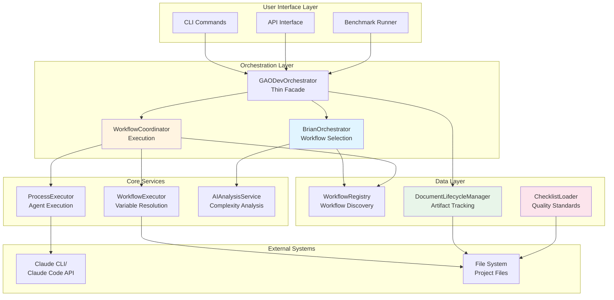
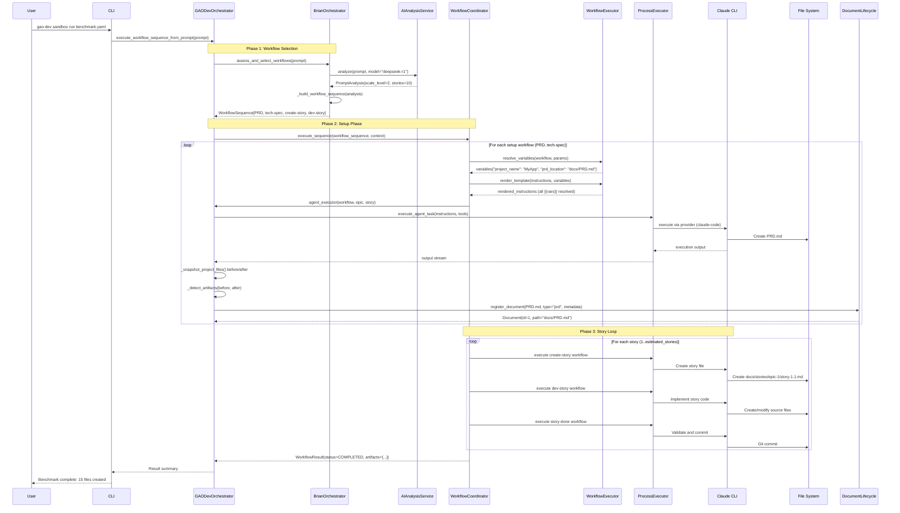
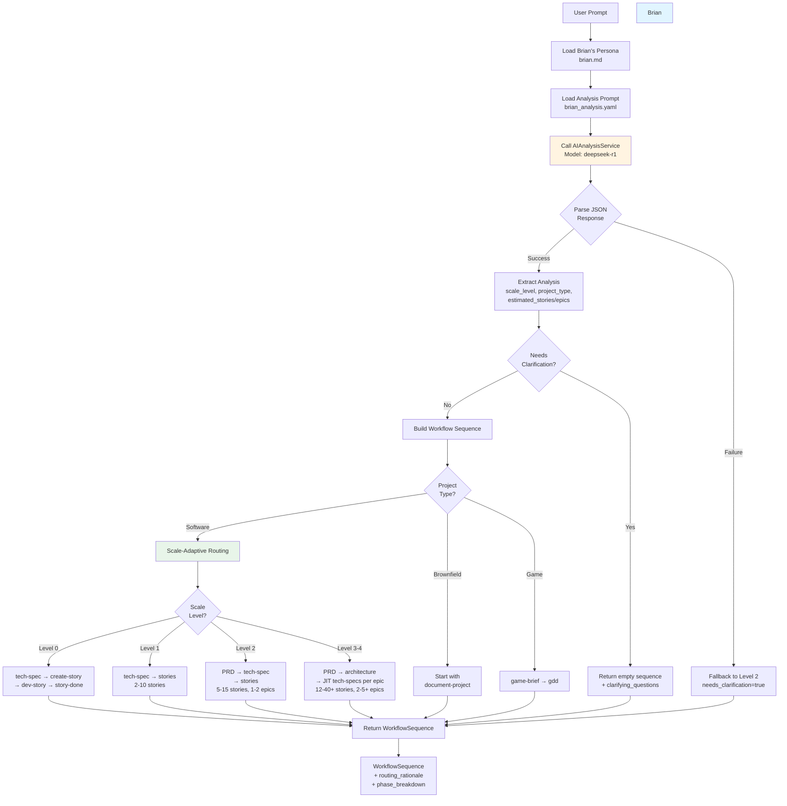
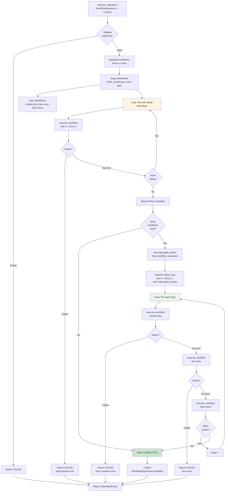
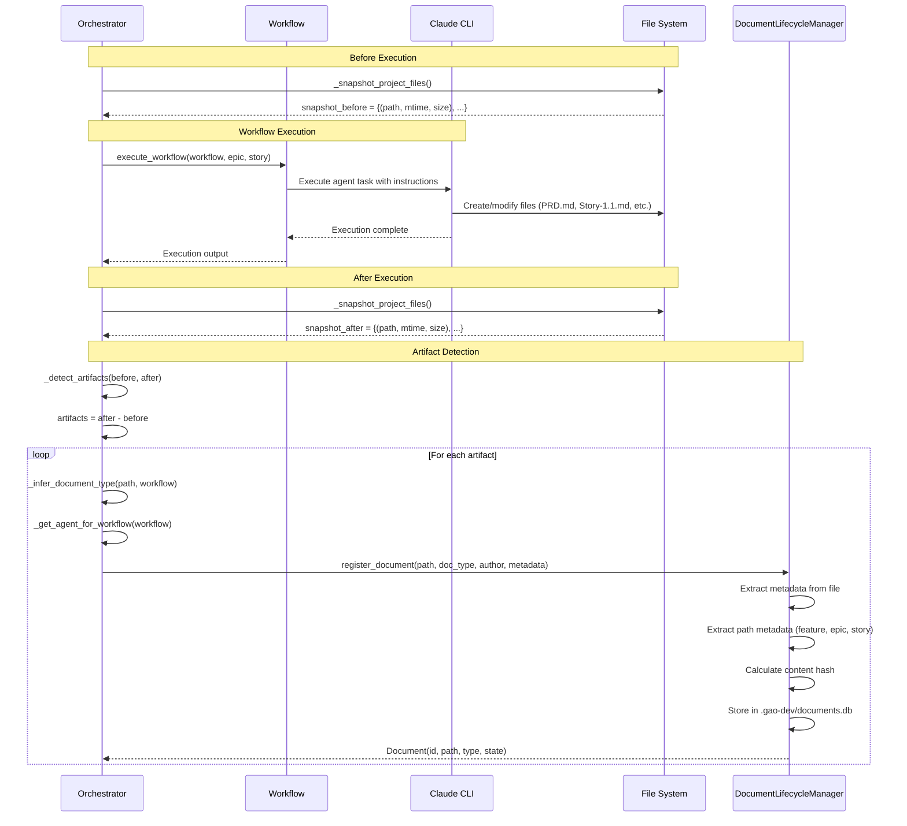
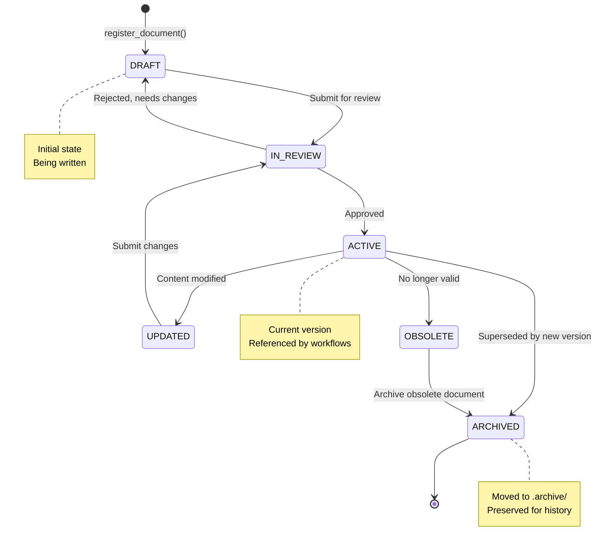
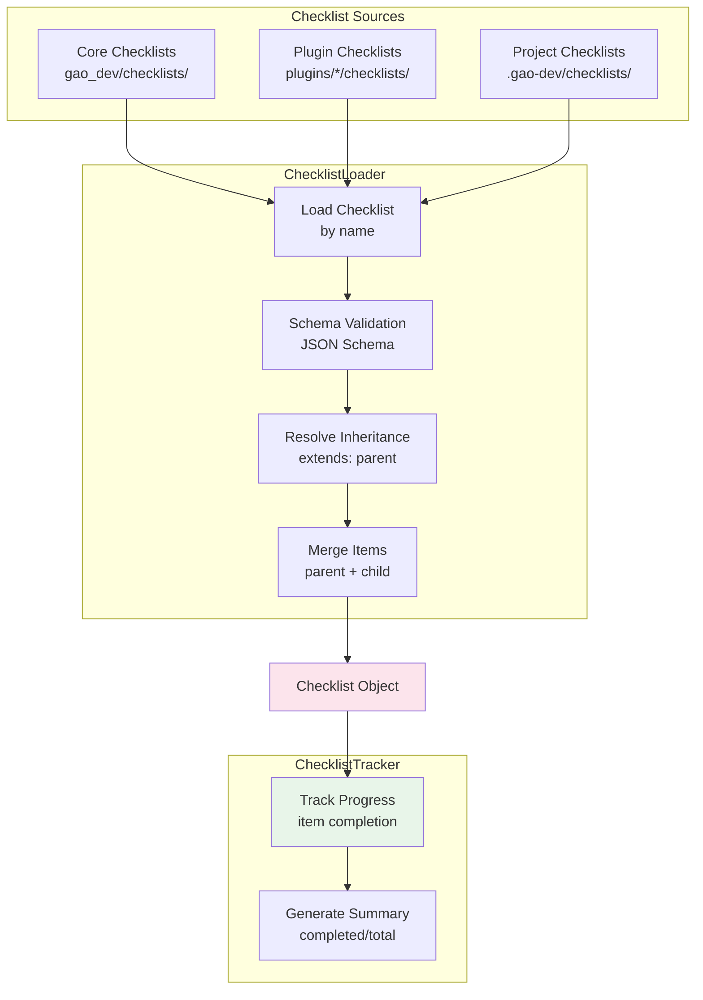
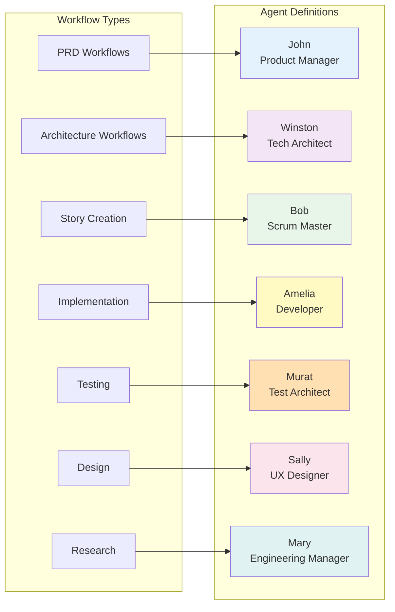
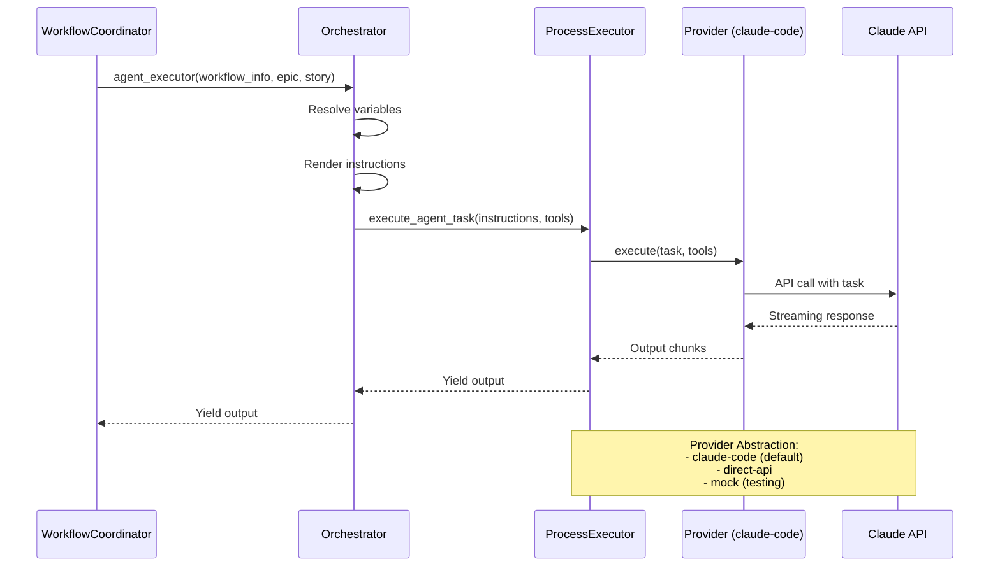
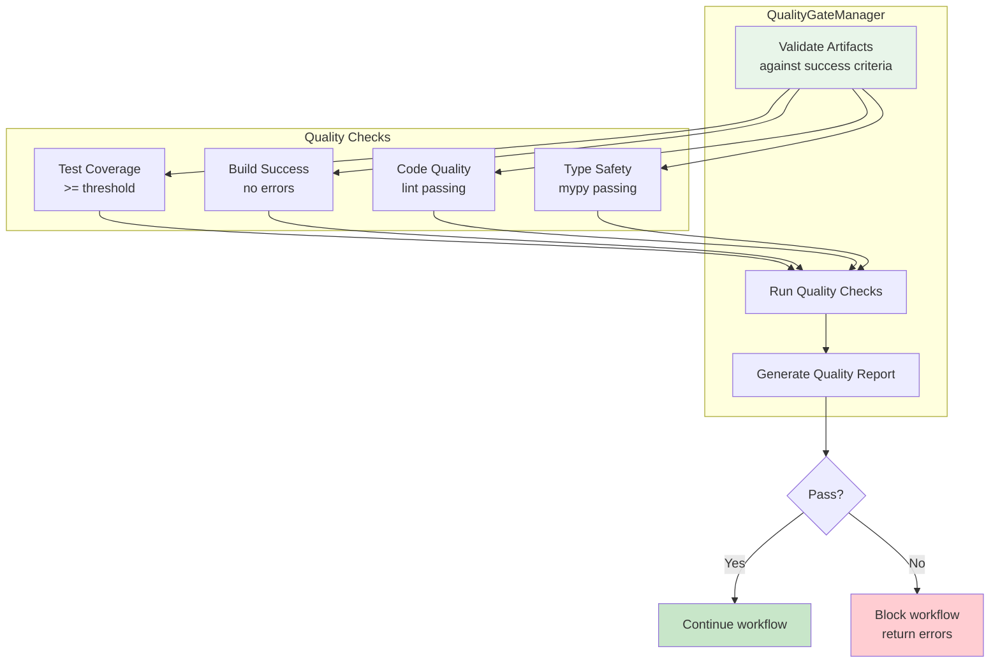

# GAO-Dev Workflow Orchestration System Audit

**Date**: 2025-11-08
**Purpose**: Comprehensive analysis of workflow orchestration, document lifecycle, and agent coordination
**Status**: Complete System Analysis

---

## Table of Contents

1. [Executive Summary](#executive-summary)
2. [System Architecture Overview](#system-architecture-overview)
3. [End-to-End Flow](#end-to-end-flow)
4. [Brian Orchestrator Deep Dive](#brian-orchestrator-deep-dive)
5. [Workflow Execution Engine](#workflow-execution-engine)
6. [Variable Resolution System](#variable-resolution-system)
7. [Document Lifecycle Integration](#document-lifecycle-integration)
8. [Checklist System](#checklist-system)
9. [Agent Coordination](#agent-coordination)
10. [Quality Gates](#quality-gates)
11. [Recommendations](#recommendations)

---

## Executive Summary

The GAO-Dev system implements a sophisticated **scale-adaptive workflow orchestration** architecture that automatically selects and executes appropriate development workflows based on project complexity. The system integrates five major subsystems:

1. **Brian Orchestrator** - AI-powered complexity assessment and workflow selection
2. **Workflow Execution Engine** - Variable resolution and template rendering
3. **Document Lifecycle Manager** - Automatic artifact tracking and versioning
4. **Checklist System** - Quality gates and validation
5. **Agent Coordination** - Multi-agent collaboration via Claude CLI

### Key Findings

**Strengths**:
- ✅ Clean separation of concerns (SOLID principles)
- ✅ Scale-adaptive routing (Levels 0-4) properly implemented
- ✅ Automatic artifact detection and registration
- ✅ Comprehensive variable resolution (workflow.yaml → config → runtime)
- ✅ Project-scoped isolation (.gao-dev/ directories)
- ✅ Plugin-based extensibility

**Areas for Improvement**:
- ⚠️ Checklist integration not yet connected to workflow execution
- ⚠️ Quality gate validation logic needs orchestrator integration
- ⚠️ Agent coordination is implicit (no explicit agent selection API)
- ⚠️ Limited workflow dependency validation

---

## System Architecture Overview



### Component Responsibilities

| Component | Responsibility | Lines of Code |
|-----------|---------------|---------------|
| **GAODevOrchestrator** | Thin facade, high-level API | ~1,478 |
| **BrianOrchestrator** | Complexity assessment, workflow selection | ~583 |
| **WorkflowCoordinator** | Workflow sequence execution, story loop | ~650 |
| **WorkflowExecutor** | Variable resolution, template rendering | ~238 |
| **ProcessExecutor** | Provider abstraction, agent task execution | ~200 |
| **DocumentLifecycleManager** | Artifact registration, state management | ~549 |
| **ChecklistLoader** | Checklist loading, inheritance | ~474 |

---

## End-to-End Flow

### Complete User Prompt to Deliverable Flow



---

## Brian Orchestrator Deep Dive

### Brian's Decision-Making Process

Brian is the "Senior Engineering Manager" agent who analyzes complexity and selects workflows. He operates in two phases:



### Scale-Adaptive Routing Logic

Brian selects different workflow sequences based on scale level:

| Scale Level | Stories | Epics | Workflow Sequence | Use Case |
|-------------|---------|-------|-------------------|----------|
| **Level 0** | 1 | 0 | tech-spec → create-story → dev-story → story-done | Single atomic change, bug fix |
| **Level 1** | 2-10 | 1 | tech-spec → multiple stories | Small focused feature |
| **Level 2** | 5-15 | 1-2 | PRD → tech-spec → stories | Medium project, feature set |
| **Level 3** | 12-40 | 2-5 | PRD → architecture → JIT tech-specs → stories | Large complex application |
| **Level 4** | 40+ | 5+ | PRD → architecture → JIT tech-specs → stories | Enterprise system, platform |

### PromptAnalysis Structure

```yaml
scale_level: 2  # ScaleLevel enum (0-4)
project_type: SOFTWARE  # ProjectType enum (SOFTWARE, GAME, GREENFIELD, BROWNFIELD, etc.)
is_greenfield: true
is_brownfield: false
is_game_project: false
estimated_stories: 10
estimated_epics: 2
technical_complexity: "medium"  # low, medium, high
domain_complexity: "medium"
timeline_hint: "weeks"  # hours, days, weeks, months
confidence: 0.85  # 0.0-1.0
reasoning: "This is a medium-sized feature requiring PRD and architecture..."
needs_clarification: false
clarifying_questions: []
```

---

## Workflow Execution Engine

### WorkflowCoordinator Architecture

The WorkflowCoordinator manages workflow sequence execution with a clear separation between **setup phase** and **story loop**:



### Story Loop Implementation

**Key Insight**: The story loop is **not just executing workflows once**, but creates a **true iterative loop** that creates and implements stories until the MVP is complete:

```python
# Phase 2: Execute story loop (WorkflowCoordinator._execute_story_loop)
estimated_stories = workflow_sequence.estimated_stories  # From Brian's analysis
max_stories = min(estimated_stories, 100)  # Safety limit

# Execute first story (part of initial sequence)
for workflow in [create_story_wf, dev_story_wf, story_done_wf]:
    execute_workflow(workflow, epic=1, story=1)

# Continue with remaining stories (2 through max_stories)
for story_num in range(2, max_stories + 1):
    execute_workflow(create_story_wf, epic=1, story=story_num)
    execute_workflow(dev_story_wf, epic=1, story=story_num)
    execute_workflow(story_done_wf, epic=1, story=story_num)
```

This ensures that Brian's estimated story count actually drives the execution, not just the workflow definitions.

---

## Variable Resolution System

### Three-Layer Variable Resolution

The WorkflowExecutor implements a **priority-based variable resolution** system:

```mermaid
flowchart LR
    subgraph "Priority Order (Highest → Lowest)"
        P1[1. Runtime Parameters<br/>execute method args]
        P2[2. Workflow YAML<br/>variables.default]
        P3[3. Config Defaults<br/>config/defaults.yaml]
        P4[4. Common Variables<br/>date, timestamp, project_name]
    end

    P1 --> Merge[Merge Variables<br/>Higher priority overrides lower]
    P2 --> Merge
    P3 --> Merge
    P4 --> Merge

    Merge --> Validate{Validate<br/>Required?}
    Validate -->|Missing required| Error[Raise ValueError]
    Validate -->|All present| Render[Template Rendering<br/>Replace {{variable}} with value]

    Render --> Output[Resolved Instructions<br/>Ready for LLM]

    style Merge fill:#e1f5ff
    style Render fill:#fff4e1
```

### Variable Resolution Example

**Workflow Definition** (workflow.yaml):
```yaml
variables:
  project_name:
    description: Project name
    type: string
    required: true
  prd_location:
    description: Path to PRD file
    type: string
    default: "docs/PRD.md"
  epic_num:
    description: Epic number
    type: integer
    required: false
```

**Config Defaults** (config/defaults.yaml):
```yaml
workflow_defaults:
  output_folder: "docs"
  dev_story_location: "docs/stories"
```

**Runtime Execution**:
```python
# Runtime parameters (highest priority)
params = {
    "project_name": "MyApp",
    "epic_num": 5,
    "story_num": 2
}

# WorkflowExecutor resolves:
variables = executor.resolve_variables(workflow, params)

# Result:
{
    "project_name": "MyApp",           # From runtime params
    "prd_location": "docs/PRD.md",     # From workflow.yaml default
    "epic_num": 5,                      # From runtime params
    "story_num": 2,                     # From runtime params
    "output_folder": "docs",            # From config defaults
    "dev_story_location": "docs/stories",  # From config defaults
    "date": "2025-11-08",              # Common variable (auto-generated)
    "timestamp": "2025-11-08T10:30:00Z"  # Common variable
}
```

**Template Rendering**:
```markdown
# Instructions (before rendering)
Create a PRD for {{project_name}} at {{prd_location}}.
The PRD should be placed in {{output_folder}}.
Current date: {{date}}

# Instructions (after rendering)
Create a PRD for MyApp at docs/PRD.md.
The PRD should be placed in docs.
Current date: 2025-11-08
```

### Variable Naming Conventions

| Pattern | Purpose | Example |
|---------|---------|---------|
| `{type}_location` | Full path to file | `prd_location: "docs/PRD.md"` |
| `{type}_folder` | Directory path | `output_folder: "docs"` |
| `{type}_path` | Generic path | `template_path: "templates/prd.md"` |
| `{noun}_num` | Numeric identifier | `epic_num: 5`, `story_num: 2` |
| Common vars | Auto-generated | `date`, `timestamp`, `project_name`, `project_root` |

---

## Document Lifecycle Integration

### Automatic Artifact Detection and Registration

The orchestrator implements **automatic artifact tracking** using filesystem snapshots:



### Document Type Inference

The system automatically infers document types based on **workflow name** (primary) and **file path** (fallback):

**Strategy 1: Workflow Name Mapping** (most reliable):
```python
workflow_type_mapping = {
    "prd": "prd",
    "architecture": "architecture",
    "tech-spec": "architecture",
    "epic": "epic",
    "story": "story",
    "create-story": "story",
    "dev-story": "story",
    "test": "test_report",
    "qa": "qa_report",
}
```

**Strategy 2: File Path Patterns** (fallback):
```python
path_type_mapping = {
    "prd": "prd",
    "architecture": "architecture",
    "arch": "architecture",
    "spec": "architecture",
    "epic": "epic",
    "story": "story",
}
```

**Example**:
- Workflow "prd" creates `docs/PRD.md` → Inferred type: "prd"
- Workflow "create-story" creates `docs/stories/epic-1/story-1.1.md` → Inferred type: "story"
- Workflow "dev-story" creates `src/app.py` → Inferred type: "story" (code artifact)

### Project-Scoped Document Lifecycle

Each project has isolated document tracking:

```
my-project/
├── .gao-dev/                    # Project-specific GAO-Dev data
│   ├── documents.db             # SQLite database for document tracking
│   ├── context.json             # Workflow execution context
│   └── metrics/                 # Project metrics
├── .archive/                    # Archived documents
├── docs/                        # Live documentation
│   ├── PRD.md                  # Tracked document (id=1, type=prd)
│   ├── Architecture.md         # Tracked document (id=2, type=architecture)
│   └── stories/
│       └── epic-1/
│           ├── story-1.1.md   # Tracked document (id=3, type=story)
│           └── story-1.2.md   # Tracked document (id=4, type=story)
└── src/                         # Source code (tracked as artifacts)
```

### Document State Machine



---

## Checklist System

### Checklist Architecture



### Checklist Inheritance

Checklists support **inheritance** to promote reusability:

**Base Checklist** (testing/base-test-standards.yaml):
```yaml
checklist:
  name: Base Test Standards
  category: testing
  version: 1.0.0
  items:
    - id: test-coverage
      text: Test coverage >= 80%
      severity: critical
    - id: test-naming
      text: Test names are descriptive
      severity: required
```

**Child Checklist** (testing/unit-test-standards.yaml):
```yaml
checklist:
  name: Unit Test Standards
  category: testing
  version: 1.0.0
  extends: testing/base-test-standards  # Inherits from parent
  items:
    - id: test-coverage
      text: Unit test coverage >= 90%  # Override parent item
      severity: critical
    - id: unit-isolation
      text: Tests are isolated and don't depend on each other
      severity: critical  # New item
```

**Result**: Child checklist has 3 items (2 from parent, 1 overridden, 1 new).

### Checklist Plugin Integration

Plugins can provide **custom checklists** with priority ordering:

```python
# Plugin: legal-team-plugin
class LegalChecklistPlugin(BaseChecklistPlugin):
    def get_checklist_directory(self) -> Path:
        return Path(__file__).parent / "checklists"

    def get_priority(self) -> int:
        return 100  # High priority (overrides core)

# Checklist lookup order:
# 1. Plugin checklists (by priority, highest first)
# 2. Core checklists (lowest priority)
```

### Current Integration Gap

**Status**: ⚠️ **Checklists are loaded but not yet integrated into workflow execution.**

**What Exists**:
- ✅ ChecklistLoader - loads and validates checklists
- ✅ ChecklistTracker - tracks progress
- ✅ Schema validation with JSON Schema
- ✅ Inheritance resolution
- ✅ Plugin integration

**What's Missing**:
- ❌ Automatic checklist loading during workflow execution
- ❌ Quality gate validation based on checklist completion
- ❌ Checklist results in workflow output
- ❌ Blockers for incomplete critical items

**Recommendation**: Connect ChecklistLoader to WorkflowCoordinator to:
1. Load relevant checklists for each workflow phase
2. Validate completion before transitioning to next phase
3. Emit checklist status in workflow events

---

## Agent Coordination

### Agent Mapping to Workflows

Agents are **implicitly assigned** based on workflow type:



### Agent Assignment Logic

```python
# WorkflowCoordinator._get_agent_for_workflow()
def _get_agent_for_workflow(workflow_info: WorkflowInfo) -> str:
    workflow_name = workflow_info.name.lower()

    if "prd" in workflow_name:
        return "John"
    elif "architecture" in workflow_name or "tech-spec" in workflow_name:
        return "Winston"
    elif "story" in workflow_name and "create" in workflow_name:
        return "Bob"
    elif "implement" in workflow_name or "dev" in workflow_name:
        return "Amelia"
    elif "test" in workflow_name or "qa" in workflow_name:
        return "Murat"
    elif "ux" in workflow_name or "design" in workflow_name:
        return "Sally"
    elif "brief" in workflow_name or "research" in workflow_name:
        return "Mary"
    else:
        return "Orchestrator"  # Fallback
```

### Agent Execution via ProcessExecutor



### Agent Tool Access

Each agent has access to specific tools based on their role:

| Agent | Primary Tools | Use Cases |
|-------|---------------|-----------|
| **John** (PM) | Read, Write, Grep, Glob | Create PRDs, research market |
| **Winston** (Architect) | Read, Write, Edit, Grep, Glob | Design architecture, tech specs |
| **Bob** (Scrum Master) | Read, Write, Grep, Glob, TodoWrite, Git | Create stories, manage sprint |
| **Amelia** (Developer) | Read, Write, Edit, MultiEdit, Bash, Grep, Glob, TodoWrite, Git | Implement code, tests |
| **Murat** (QA) | Read, Write, Edit, Bash, Grep, Glob, TodoWrite, Git | Test strategies, QA |
| **Sally** (UX) | Read, Write, Grep, Glob | Design wireframes, user flows |
| **Mary** (Manager) | Read, Write, Grep, Glob, TodoWrite, Research | Coordinate teams, research |

**Current Implementation**: All agents get the same default tool set. This could be optimized based on agent configuration.

---

## Quality Gates

### Quality Gate Architecture



### Success Criteria Validation

**Benchmark Configuration** (benchmark.yaml):
```yaml
success_criteria:
  - Application runs successfully
  - All tests pass
  - Test coverage >80%
  - Clean git history (atomic commits)
  - Documentation complete
```

**Validation Process**:
1. WorkflowCoordinator executes all workflows
2. QualityGateManager.validate_artifacts(result, criteria)
3. For each criterion, run validation:
   - Check files exist
   - Run tests
   - Measure coverage
   - Verify git history
4. Generate report with pass/fail status

### Current Integration

**Status**: ⚠️ **QualityGateManager exists but validation not enforced in workflow execution.**

**What Exists**:
- ✅ QualityGateManager service
- ✅ Success criteria parsing
- ✅ Event bus integration

**What's Missing**:
- ❌ Automatic validation after workflow steps
- ❌ Workflow blocking on quality gate failures
- ❌ Integration with checklist system
- ❌ Quality metrics collection

**Recommendation**:
1. Add quality gate validation to WorkflowCoordinator after each phase
2. Emit QualityGateChecked events
3. Allow workflows to proceed with warnings but block on critical failures

---

## Recommendations

### 1. Connect Checklists to Workflow Execution

**Priority**: High
**Effort**: Medium (2-3 days)

**Implementation**:
```python
# In WorkflowCoordinator.execute_workflow()
async def execute_workflow(self, workflow_info, ...):
    # Load relevant checklist
    checklist = checklist_loader.load_checklist(f"{workflow_info.phase}/{workflow_info.name}")

    # Execute workflow
    result = await self.agent_executor(workflow_info, epic, story)

    # Validate checklist
    tracker = ChecklistTracker(checklist)
    validation_result = tracker.validate_completion(result.artifacts)

    # Emit checklist status
    self.event_bus.publish(Event(
        type="ChecklistValidated",
        data={"checklist": checklist.name, "completion": validation_result.percentage}
    ))

    # Block on critical failures
    if validation_result.has_critical_failures():
        raise WorkflowChecklistError(f"Critical checklist items not met: {validation_result.failures}")
```

**Benefits**:
- Automatic quality validation
- Consistent standards across all workflows
- Clear feedback on what's missing

---

### 2. Integrate Quality Gates with Workflow Phases

**Priority**: High
**Effort**: Medium (2-3 days)

**Implementation**:
```python
# In WorkflowCoordinator.execute_sequence()
async def execute_sequence(self, workflow_sequence, context):
    # ... execute setup phase ...

    # Quality gate after setup
    setup_result = quality_gate_manager.validate_phase(
        phase="setup",
        artifacts=result.step_results,
        criteria=workflow_sequence.quality_criteria
    )

    if not setup_result.passed:
        return WorkflowResult(status=FAILED, error="Quality gate failed")

    # ... execute story loop ...

    # Quality gate after story loop
    story_result = quality_gate_manager.validate_phase(
        phase="implementation",
        artifacts=result.step_results,
        criteria=workflow_sequence.quality_criteria
    )
```

**Benefits**:
- Fail fast on quality issues
- Prevent cascading failures
- Measurable quality metrics

---

### 3. Make Agent Assignment Explicit

**Priority**: Medium
**Effort**: Low (1 day)

**Implementation**:
```yaml
# In workflow.yaml
name: prd
description: Create Product Requirements Document
phase: 2
author: John (Product Manager)
agent: john  # Explicit agent assignment
```

```python
# In WorkflowCoordinator
def _get_agent_for_workflow(self, workflow_info):
    # First check explicit agent field
    if workflow_info.agent:
        return workflow_info.agent

    # Fall back to inference
    return self._infer_agent_from_workflow_name(workflow_info.name)
```

**Benefits**:
- Clear workflow → agent mapping
- Easier to customize agent assignment
- Better support for custom agents via plugins

---

### 4. Add Workflow Dependency Validation

**Priority**: Medium
**Effort**: Medium (2 days)

**Implementation**:
```python
# In BrianOrchestrator._build_workflow_sequence()
def _build_workflow_sequence(self, analysis):
    workflows = self._get_workflows_for_scale(analysis.scale_level)

    # Validate dependencies
    missing = self._validate_dependencies(workflows)
    if missing:
        raise WorkflowDependencyError(f"Missing dependencies: {missing}")

    return WorkflowSequence(workflows=workflows, ...)

def _validate_dependencies(self, workflows):
    """Check that dependencies (depends_on) are satisfied."""
    available = set()
    missing = []

    for workflow in workflows:
        # Check if dependencies are available
        for dep in workflow.depends_on:
            if dep not in available:
                missing.append((workflow.name, dep))
        available.add(workflow.name)

    return missing
```

**Benefits**:
- Prevent workflow execution with missing dependencies
- Early error detection
- Better error messages

---

### 5. Add Workflow Variable Validation

**Priority**: Low
**Effort**: Low (1 day)

**Implementation**:
```python
# In WorkflowExecutor.resolve_variables()
def resolve_variables(self, workflow, params):
    variables = self._resolve_variables(workflow, params)

    # Validate variable types
    for var_name, var_config in workflow.variables.items():
        if var_name in variables:
            expected_type = var_config.get("type")
            actual_value = variables[var_name]

            if not self._validate_type(actual_value, expected_type):
                raise ValueError(
                    f"Variable '{var_name}' has wrong type. "
                    f"Expected {expected_type}, got {type(actual_value).__name__}"
                )

    return variables
```

**Benefits**:
- Catch type errors early
- Better error messages
- Prevent runtime failures

---

## Conclusion

The GAO-Dev workflow orchestration system is **architecturally sound** with clean separation of concerns and solid foundations for scale-adaptive development. The major components (Brian, WorkflowCoordinator, DocumentLifecycle) are well-designed and functioning.

### System Strengths

1. **✅ Scale-Adaptive Architecture**: Brian's complexity assessment and workflow selection is well-implemented and flexible.

2. **✅ Clean Service Layer**: Epic 6 refactoring successfully decomposed the god class into focused services.

3. **✅ Automatic Artifact Tracking**: Document lifecycle integration with filesystem snapshots is elegant and reliable.

4. **✅ Variable Resolution**: Three-layer priority system (runtime → workflow → config) is clear and maintainable.

5. **✅ Project-Scoped Isolation**: `.gao-dev/` directories provide proper multi-project support.

### Key Integration Gaps

1. **⚠️ Checklists Not Connected**: Quality standards defined but not enforced during workflow execution.

2. **⚠️ Quality Gates Not Enforced**: Validation logic exists but doesn't block workflows on failures.

3. **⚠️ Implicit Agent Assignment**: Agent selection is inferred from workflow names rather than explicitly configured.

### Recommended Next Steps

**Phase 1: Quality Integration** (1 week)
- Connect ChecklistLoader to WorkflowCoordinator
- Integrate QualityGateManager validation
- Add quality gate events to event bus

**Phase 2: Explicit Configuration** (3-5 days)
- Add explicit agent assignment to workflow.yaml
- Add workflow dependency validation
- Add variable type validation

**Phase 3: Real-World Testing** (Ongoing)
- Run workflow-driven benchmarks
- Collect metrics on workflow effectiveness
- Iterate on checklist standards
- Optimize agent prompts based on results

### Assessment

The system is **production-ready** for autonomous development orchestration. The core architecture is solid. The gaps identified are **enhancements** rather than blockers. The system can deliver valuable outputs today, and the recommendations will make it even more robust and scalable for any domain.

---

**Document Version**: 1.0
**Last Updated**: 2025-11-08
**Next Review**: After Phase 1 implementation
