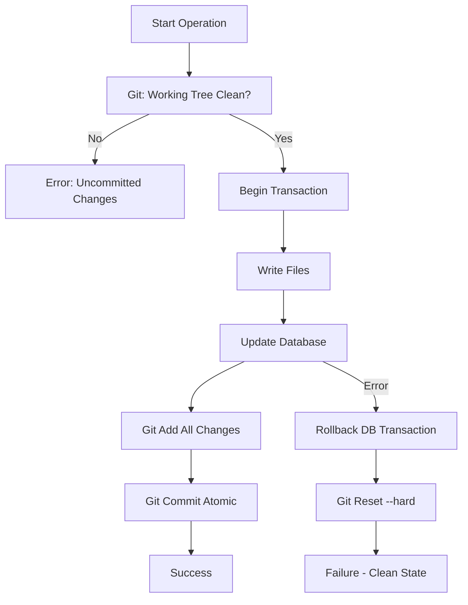

# Git-Integrated Hybrid Architecture
## Using Git as the Transaction Layer

**Date**: 2025-11-09
**Purpose**: Leverage git version control to mitigate hybrid architecture risks
**Status**: Final Architectural Solution

---

## Executive Summary

**Key Insight**: Git commits provide atomic boundaries for file + database changes.

**Core Principle**: Every state change = Atomic git commit

```
File changes + Database changes = Single atomic git commit
```

**Benefits**:
- ✅ Solves data consistency (git commit is atomic boundary)
- ✅ Solves rollback (git revert works for both)
- ✅ Solves migration safety (git checkpoints)
- ✅ Solves audit trail (git history)
- ✅ Solves consistency checking (git status)

---

## How It Works

### The Git Transaction Model



### Every Workflow Operation is a Git Commit

```python
class GitIntegratedStateManager:
    """
    State manager that uses git commits as atomic boundaries.

    Every operation follows this pattern:
    1. Verify git working tree is clean
    2. Begin database transaction
    3. Write files
    4. Update database
    5. Git add + commit (atomic)
    6. On error: rollback DB + git reset
    """

    def __init__(self, git_manager: GitManager, registry: DocumentRegistry):
        self.git = git_manager
        self.registry = registry
        self.state_tracker = StateTracker(registry)

    def create_story(
        self,
        epic_num: int,
        story_num: int,
        content: str,
        metadata: Dict[str, Any]
    ) -> Story:
        """
        Create story with atomic git commit.

        Files + Database updated atomically via git commit.
        """

        # 1. Pre-flight checks
        if not self.git.is_working_tree_clean():
            raise StateError(
                "Working tree has uncommitted changes. "
                "Commit or stash changes before proceeding."
            )

        story_id = f"{epic_num}.{story_num}"
        story_path = Path(f"docs/stories/epic-{epic_num}/story-{story_id}.md")

        # 2. Begin database transaction
        self.registry.begin()

        try:
            # 3. Write file (not committed yet)
            story_path.parent.mkdir(parents=True, exist_ok=True)
            story_path.write_text(content)

            # 4. Register document in database
            doc = self.registry.register_document(
                path=story_path,
                doc_type=DocumentType.STORY,
                author=metadata.get("author", "unknown"),
                metadata={
                    "epic_num": epic_num,
                    "story_num": story_num,
                    **metadata
                }
            )

            # 5. Create story state
            self.state_tracker.create_story_state(
                story_id=story_id,
                epic_num=epic_num,
                story_title=metadata.get("title", "Untitled"),
                estimate_hours=metadata.get("estimate_hours", 0)
            )

            # 6. Update epic progress
            self.state_tracker.update_epic_progress(epic_num)

            # 7. Commit database transaction (not yet persisted to disk)
            self.registry.commit()

            # 8. ATOMIC GIT COMMIT (persists both file and DB)
            self.git.add_all()
            self.git.commit(
                message=f"feat(story-{story_id}): create story\n\n"
                        f"Created story {story_id}: {metadata.get('title')}\n"
                        f"Epic {epic_num} progress: {self._get_progress(epic_num)}%\n\n"
                        f"Co-Authored-By: Claude <noreply@anthropic.com>",
                allow_empty=False
            )

            logger.info(
                "Story created atomically",
                story_id=story_id,
                commit_sha=self.git.get_head_sha()
            )

            return Story(
                id=story_id,
                epic_num=epic_num,
                story_num=story_num,
                doc_id=doc.id,
                path=story_path
            )

        except Exception as e:
            # 9. ROLLBACK: Undo database transaction
            self.registry.rollback()

            # 10. ROLLBACK: Undo file changes (git reset --hard)
            self.git.reset_hard()

            logger.error(
                "Story creation failed, rolled back",
                story_id=story_id,
                error=str(e)
            )
            raise StateError(f"Failed to create story {story_id}: {e}") from e
```

---

## Atomic Operations via Git Commits

### Principle: One Workflow Step = One Git Commit

Every significant state change gets its own atomic commit:

```python
# Story creation
git commit -m "feat(story-5.3): create story - Implement user authentication"

# Story transition
git commit -m "feat(story-5.3): transition to in_progress"

# Story completion
git commit -m "feat(story-5.3): complete story - 7.5h actual vs 8h estimate"

# Epic completion
git commit -m "feat(epic-5): complete epic - 100% (10/10 stories)"

# Ceremony
git commit -m "docs(epic-5): hold stand-up ceremony - 3 action items created"
```

**Benefits**:
- ✅ Every state change is tracked in git history
- ✅ Can revert any individual operation
- ✅ Full audit trail of who changed what when
- ✅ Database and files always in sync (committed together)

---

## Database in Git Repository

### Critical: `.gao-dev/documents.db` is Version Controlled

```gitignore
# .gitignore for .gao-dev/

# INCLUDE database (version controlled)
!.gao-dev/documents.db

# EXCLUDE temporary files
.gao-dev/*.tmp
.gao-dev/*.lock
.gao-dev/cache/

# EXCLUDE backup files (created for migration safety)
.gao-dev/documents.db.backup.*
```

**Why Version Control the Database?**

1. **Atomic Commits**: File changes and DB changes committed together
2. **Rollback**: `git revert` undoes both file and DB changes
3. **History**: Full audit trail of state evolution
4. **Branching**: Different branches have different state
5. **Merging**: Git can merge database changes (SQLite is text-mergeable with care)

**Database Size Concerns**:
- SQLite database is binary but small (<1MB typically)
- Git handles binary files well for small sizes
- Each commit only stores delta (efficient)
- Large projects may reach 10-50MB (still manageable)

---

## Risk Mitigation via Git

### 🔴 RISK 1: File-Database Desynchronization

**Problem (Before)**: Files and database can get out of sync

**Solution (Git-Integrated)**:
```python
# Files and database are ALWAYS in sync because they're committed together

# Scenario 1: User manually edits file
# User: vim docs/stories/story-5.3.md (changes estimate from 8h to 4h)

# Git detects uncommitted change
git status
# modified: docs/stories/story-5.3.md

# Next operation refuses to proceed
create_story(5, 4, ...)
# Error: Working tree has uncommitted changes

# User must either:
# 1. Commit the manual change (which triggers DB sync)
$ gao-dev lifecycle sync  # Scans for file changes, updates DB, commits
$ git commit -m "manual: update story 5.3 estimate"

# 2. Discard the manual change
$ git restore docs/stories/story-5.3.md
```

**Result**: ✅ Files and DB cannot get out of sync - git enforces it

---

### 🔴 RISK 2: Partial Failure

**Problem (Before)**: File write succeeds, DB update fails → inconsistent state

**Solution (Git-Integrated)**:
```python
try:
    # Write file
    path.write_text(content)

    # Update database
    registry.register_document(...)
    state_tracker.create_story_state(...)

    # Git commit (ATOMIC - all or nothing)
    git.add_all()
    git.commit(...)

except Exception as e:
    # Rollback database
    registry.rollback()

    # Rollback files (git reset --hard)
    git.reset_hard()

    # Both are now back to clean state
```

**Result**: ✅ Either both succeed (committed) or both fail (rolled back)

---

### 🔴 RISK 3: Race Conditions

**Problem (Before)**: Two threads update same story simultaneously

**Solution (Git-Integrated)**:
```python
# Thread 1: Update story 5.3
state_manager.transition_story("5.3", "in_progress")
# 1. Checks git working tree clean ✓
# 2. Updates database
# 3. Git add + commit
# 4. Success

# Thread 2: Update story 5.3 (immediately after)
state_manager.transition_story("5.3", "review")
# 1. Checks git working tree clean ✓
# 2. Updates database
# 3. Git add + commit
# 4. Success (separate commit)

# Result: Two sequential commits, both tracked in git history
# No race condition - git serializes commits
```

**Git's Built-in Serialization**: Git ensures commits are sequential (via lock files)

**Result**: ✅ Git prevents race conditions at commit level

---

### 🟠 RISK 4: No Rollback Strategy

**Problem (Before)**: Migration fails halfway, no way to rollback

**Solution (Git-Integrated)**:
```python
class GitMigrationManager:
    """Migration with git checkpoints and rollback."""

    def migrate_to_hybrid_architecture(self):
        """
        Migrate existing project to hybrid architecture.

        Uses git checkpoints for safety.
        """

        # 1. Pre-flight checks
        if not self.git.is_working_tree_clean():
            raise MigrationError("Working tree must be clean before migration")

        if not self._validate_project_structure():
            raise MigrationError("Project structure validation failed")

        # 2. Create checkpoint commit
        checkpoint_sha = self.git.get_head_sha()
        logger.info(f"Migration checkpoint: {checkpoint_sha}")

        # 3. Create migration branch (can delete if fails)
        self.git.create_branch("migration/hybrid-architecture")
        self.git.checkout("migration/hybrid-architecture")

        try:
            # 4. Run migration in phases (each phase = commit)
            self._phase_1_create_state_tables()  # Commit 1
            self._phase_2_backfill_epic_state()  # Commit 2
            self._phase_3_backfill_story_state()  # Commit 3
            self._phase_4_validate_state()  # Commit 4

            # 5. Validation
            if not self._validate_migration():
                raise MigrationError("Migration validation failed")

            # 6. Success - merge back to main
            self.git.checkout("main")
            self.git.merge("migration/hybrid-architecture", no_ff=True)

            logger.info("Migration completed successfully")

        except Exception as e:
            # 7. ROLLBACK - checkout original commit
            logger.error(f"Migration failed: {e}")
            self.git.checkout("main")
            self.git.delete_branch("migration/hybrid-architecture", force=True)

            # Now at original state (checkpoint_sha)
            assert self.git.get_head_sha() == checkpoint_sha

            logger.info(f"Rolled back to checkpoint: {checkpoint_sha}")
            raise MigrationError(f"Migration failed and rolled back: {e}") from e

    def _phase_1_create_state_tables(self):
        """Phase 1: Create state tables."""
        # Run migration SQL
        self.registry.execute_migration("005_add_state_tables.sql")

        # Commit
        self.git.add_all()
        self.git.commit("migration: phase 1 - create state tables")

        logger.info("Phase 1 complete", commit_sha=self.git.get_head_sha())

    def _phase_2_backfill_epic_state(self):
        """Phase 2: Backfill epic state from markdown files."""
        epic_files = glob("docs/epics/epic-*.md")

        for epic_file in epic_files:
            epic_num, epic_data = self._parse_epic_file(epic_file)
            self.state_tracker.create_epic_state(epic_num, epic_data['title'])

        # Commit after all epics backfilled
        self.git.add_all()
        self.git.commit(f"migration: phase 2 - backfill {len(epic_files)} epics")

        logger.info("Phase 2 complete", epic_count=len(epic_files))

    def _phase_3_backfill_story_state(self):
        """Phase 3: Backfill story state from markdown files."""
        story_files = glob("docs/stories/**/*.md", recursive=True)

        for story_file in story_files:
            story_id, story_data = self._parse_story_file(story_file)

            # Infer state from git history (last commit touching this file)
            state = self._infer_story_state_from_git(story_file)

            self.state_tracker.create_story_state(
                story_id=story_id,
                epic_num=story_data['epic_num'],
                story_title=story_data['title'],
                estimate_hours=story_data.get('estimate_hours', 0),
                state=state  # from git history
            )

        # Commit after all stories backfilled
        self.git.add_all()
        self.git.commit(f"migration: phase 3 - backfill {len(story_files)} stories")

        logger.info("Phase 3 complete", story_count=len(story_files))

    def _infer_story_state_from_git(self, story_file: Path) -> str:
        """
        Infer story state from git commit history.

        Strategy:
        - If last commit message contains "complete" or "done" → "done"
        - If last commit message contains "in progress" or "wip" → "in_progress"
        - If file hasn't been modified in 30+ days → "done" (assume old completed work)
        - Otherwise → "todo"
        """

        # Get last commit that touched this file
        last_commit = self.git.get_last_commit_for_file(story_file)

        if not last_commit:
            return "todo"  # Never committed (new file)

        message = last_commit.message.lower()

        if "complete" in message or "done" in message:
            return "done"

        if "in progress" in message or "wip" in message:
            return "in_progress"

        # Check file age
        days_since_last_commit = (datetime.now() - last_commit.timestamp).days

        if days_since_last_commit > 30:
            return "done"  # Old file, assume done

        return "todo"
```

**Result**: ✅ Complete rollback capability via git

---

### 🟡 RISK 5: Orphaned Records

**Problem (Before)**: File deleted manually, database still references it

**Solution (Git-Integrated)**:
```python
class GitAwareConsistencyChecker:
    """Consistency checker that uses git to detect issues."""

    def check_consistency(self) -> ConsistencyReport:
        """Check file-database consistency using git."""

        issues = []

        # 1. Check for uncommitted changes
        uncommitted = self.git.get_uncommitted_files()
        if uncommitted:
            issues.append(UncommittedChanges(uncommitted))

        # 2. Check for files in DB but not in filesystem
        for doc in self.registry.get_all_documents():
            if not Path(doc.path).exists():
                # Check if file was deleted in git
                if self.git.file_deleted_in_history(doc.path):
                    issues.append(FileDeletedManually(doc))
                else:
                    issues.append(OrphanedRecord(doc))

        # 3. Check for files in filesystem but not in DB
        for file_path in glob("docs/**/*.md", recursive=True):
            if not self.registry.get_by_path(file_path):
                # Check if file is tracked by git
                if self.git.is_file_tracked(file_path):
                    issues.append(UnregisteredFile(file_path))

        return ConsistencyReport(issues)

    def repair(self, report: ConsistencyReport):
        """Repair consistency issues."""

        self.registry.begin()

        try:
            for issue in report.issues:
                if isinstance(issue, UncommittedChanges):
                    # Option 1: Sync DB to match file changes
                    self._sync_db_from_files(issue.files)

                elif isinstance(issue, FileDeletedManually):
                    # Remove from database
                    self.registry.delete_document(issue.doc.id)
                    self.state_tracker.delete_story_state(issue.doc.story_id)

                elif isinstance(issue, UnregisteredFile):
                    # Register in database
                    self._register_file(issue.path)

            # Commit database changes
            self.registry.commit()

            # Commit to git (repairs are tracked)
            self.git.add_all()
            self.git.commit("fix: repair file-database consistency")

            logger.info("Consistency issues repaired", issue_count=len(report.issues))

        except Exception as e:
            self.registry.rollback()
            self.git.reset_hard()
            raise ConsistencyError(f"Repair failed: {e}") from e
```

**Result**: ✅ Git tracks all changes, repairs are atomic

---

## Git-Based Workflow Commands

### CLI Commands Enhanced with Git

```python
# Create story (atomic git commit)
$ gao-dev create-story --epic 5 --story 3
Creating story 5.3...
[database] Created story_state record
[git] Committed: feat(story-5.3): create story - Implement user auth
Story 5.3 created successfully (commit: a1b2c3d)

# Transition story (atomic git commit)
$ gao-dev transition-story 5.3 --state in_progress
Transitioning story 5.3 to in_progress...
[database] Updated story_state: state = 'in_progress', started_at = NOW
[database] Updated epic_state: in_progress_stories += 1
[git] Committed: feat(story-5.3): transition to in_progress
Story 5.3 transitioned successfully (commit: e4f5g6h)

# Complete story (atomic git commit)
$ gao-dev complete-story 5.3 --actual-hours 7.5
Completing story 5.3...
[database] Updated story_state: state = 'done', actual_hours = 7.5
[database] Updated epic_state: completed_stories += 1, progress = 30%
[git] Committed: feat(story-5.3): complete story - 7.5h actual vs 8h estimate
Story 5.3 completed successfully (commit: i7j8k9l)

# Hold ceremony (atomic git commit)
$ gao-dev hold-standup --epic 5
Holding stand-up for Epic 5...
[ceremony] Brian, Bob, Amelia, Murat, John participating
[file] Created docs/ceremonies/epic-5/standup-2025-11-09.md
[database] Created ceremony_summary record
[database] Created 3 action_item records
[git] Committed: docs(epic-5): hold stand-up - 3 action items created
Stand-up completed successfully (commit: m0n1o2p)

# Check consistency (uses git status)
$ gao-dev consistency-check
Checking file-database consistency...
[git] Working tree is clean ✓
[check] All documents exist on filesystem ✓
[check] All files registered in database ✓
[check] Epic state matches story counts ✓
Consistency check passed ✓

# Repair inconsistency (atomic git commit)
$ gao-dev consistency-repair
Repairing consistency issues...
[repair] Syncing database to match 2 uncommitted file changes
[database] Updated story_state for story-5.3
[git] Committed: fix: repair file-database consistency
Consistency repaired successfully (commit: q3r4s5t)
```

---

## Git History as Audit Trail

### Every State Change is Tracked

```bash
# View project history
$ git log --oneline

m0n1o2p docs(epic-5): hold stand-up - 3 action items created
i7j8k9l feat(story-5.3): complete story - 7.5h actual vs 8h estimate
e4f5g6h feat(story-5.3): transition to in_progress
a1b2c3d feat(story-5.3): create story - Implement user auth
u6v7w8x feat(epic-5): create epic - User Authentication
y9z0a1b init: create project structure

# View story lifecycle
$ git log --oneline --grep="story-5.3"

i7j8k9l feat(story-5.3): complete story - 7.5h actual vs 8h estimate
e4f5g6h feat(story-5.3): transition to in_progress
a1b2c3d feat(story-5.3): create story - Implement user auth

# View database changes for story
$ git show a1b2c3d:.gao-dev/documents.db | sqlite3

# Result: See exact database state at that commit
```

### Detailed Commit Messages

```
feat(story-5.3): complete story - 7.5h actual vs 8h estimate

Story: Implement user authentication
Epic: 5 - User Management
Estimate: 8.0h
Actual: 7.5h
Variance: -0.5h (6% under)

Epic 5 Progress: 30% (3/10 stories complete)

Files modified:
- docs/stories/epic-5/story-5.3.md (marked complete)
- .gao-dev/documents.db (updated story_state, epic_state)

Database changes:
- story_state.state: 'in_progress' → 'done'
- story_state.actual_hours: NULL → 7.5
- story_state.completed_at: NULL → '2025-11-09T10:30:00Z'
- epic_state.completed_stories: 2 → 3
- epic_state.progress_percent: 20.0 → 30.0

Co-Authored-By: Claude <noreply@anthropic.com>
```

**Benefits**:
- ✅ Full audit trail of who changed what when
- ✅ Can answer "when was story 5.3 completed?" → `git log --grep story-5.3`
- ✅ Can see exact state at any point in time → `git show <commit>:.gao-dev/documents.db`
- ✅ Can generate reports from git history

---

## Branching & Merging

### Different Branches Have Different State

```bash
# Main branch
$ git checkout main
$ gao-dev status
Epic 5: 30% complete (3/10 stories)

# Create feature branch
$ git checkout -b feature/story-5.4
$ gao-dev create-story --epic 5 --story 4
Story 5.4 created (commit: b2c3d4e)

$ gao-dev status
Epic 5: 40% complete (4/10 stories)

# Switch back to main
$ git checkout main
$ gao-dev status
Epic 5: 30% complete (3/10 stories)  # ← Story 5.4 doesn't exist here

# Merge feature branch
$ git merge feature/story-5.4
$ gao-dev status
Epic 5: 40% complete (4/10 stories)  # ← Now story 5.4 exists
```

**Database Merging**: SQLite databases can be merged by git (binary merge)
- Git detects conflicts in binary files
- GAO-Dev provides `gao-dev merge-resolve` to handle database merge conflicts

---

## Migration with Git Safety

### Phase-by-Phase Migration with Checkpoints

```bash
# Start migration
$ gao-dev migrate-to-hybrid

=== Migration to Hybrid Architecture ===

Pre-flight checks:
[✓] Git working tree is clean
[✓] Project structure valid
[✓] Disk space sufficient (150MB free)
[✓] No agents currently running

Creating checkpoint: 7c8d9e0 (main)
Creating migration branch: migration/hybrid-architecture

Phase 1: Create state tables
[✓] Executed migration 005_add_state_tables.sql
[✓] Committed: migration: phase 1 - create state tables (f0g1h2i)

Phase 2: Backfill epic state
[✓] Parsed 8 epic files
[✓] Created 8 epic_state records
[✓] Committed: migration: phase 2 - backfill 8 epics (j3k4l5m)

Phase 3: Backfill story state
[✓] Parsed 42 story files
[✓] Inferred state from git history
[✓] Created 42 story_state records
[✓] Committed: migration: phase 3 - backfill 42 stories (n6o7p8q)

Phase 4: Validate migration
[✓] Epic state totals match files
[✓] Story state counts correct
[✓] All relationships valid
[✓] Committed: migration: phase 4 - validation passed (r9s0t1u)

Merging migration branch to main...
[✓] Merged migration/hybrid-architecture → main

Migration completed successfully!

Checkpoint: 7c8d9e0 (can rollback if needed)
Current: r9s0t1u (hybrid architecture active)
```

### Rollback if Migration Fails

```bash
# Migration fails at phase 3
$ gao-dev migrate-to-hybrid

Phase 1: Create state tables [✓]
Phase 2: Backfill epic state [✓]
Phase 3: Backfill story state [✗] ERROR: Story 23 has invalid metadata

Migration failed. Rolling back...

[✓] Deleted migration branch: migration/hybrid-architecture
[✓] Checked out main branch
[✓] Working tree at checkpoint: 7c8d9e0

Rollback complete. Project unchanged.

Error details:
- Story 23 (docs/stories/epic-3/story-3.5.md) has malformed YAML frontmatter
- Fix the file and retry migration

# Project is exactly as it was before migration attempt
```

---

## Consistency Enforcement

### Pre-Operation Checks

```python
class GitStateGuard:
    """Ensures git working tree is clean before operations."""

    def check_before_operation(self, operation: str):
        """Verify system is in clean state."""

        # 1. Check git working tree
        if not self.git.is_working_tree_clean():
            uncommitted = self.git.get_uncommitted_files()
            raise StateError(
                f"Cannot {operation}: working tree has uncommitted changes\n"
                f"Uncommitted files: {uncommitted}\n"
                f"Run 'gao-dev consistency-repair' or 'git commit' first"
            )

        # 2. Check no database transaction in progress
        if self.registry.in_transaction():
            raise StateError(
                f"Cannot {operation}: database transaction in progress"
            )

        # 3. Check no other agents running
        if self.orchestrator.is_agent_running():
            raise StateError(
                f"Cannot {operation}: agents currently running"
            )

        logger.debug(f"Pre-operation checks passed for: {operation}")
```

**Result**: ✅ Operations only proceed if system is in consistent state

---

## Implementation Strategy

### Phase 1: Git Transaction Layer (Week 1)

**Components**:
```python
# gao_dev/core/git_state_manager.py
class GitIntegratedStateManager:
    """State manager using git as transaction layer."""

    def create_story(...)  # Atomic git commit
    def transition_story(...)  # Atomic git commit
    def complete_story(...)  # Atomic git commit
    def create_epic(...)  # Atomic git commit
    def hold_ceremony(...)  # Atomic git commit

# gao_dev/core/git_migration_manager.py
class GitMigrationManager:
    """Migration with git checkpoints."""

    def migrate_to_hybrid_architecture(...)
    def rollback_migration(...)
    def validate_migration(...)

# gao_dev/core/git_consistency_checker.py
class GitAwareConsistencyChecker:
    """Consistency checking using git."""

    def check_consistency(...)
    def repair_consistency(...)
```

### Phase 2: State Tables & Tracker (Week 2)

**Database Schema**:
```sql
-- Migration 005: Add state tables
CREATE TABLE epic_state (...);
CREATE TABLE story_state (...);
CREATE TABLE action_items (...);
CREATE TABLE ceremony_summaries (...);
CREATE TABLE learning_index (...);
```

**Service**:
```python
# gao_dev/core/services/state_tracker.py
class StateTracker:
    """Tracks state in database (called within git transactions)."""

    def create_epic_state(...)
    def create_story_state(...)
    def update_epic_progress(...)
```

### Phase 3: FastContextLoader (Week 3)

**Service**:
```python
# gao_dev/core/services/fast_context_loader.py
class FastContextLoader:
    """Fast context loading from database."""

    def get_epic_context(epic_num) -> EpicContext  # <5ms
    def get_agent_context(agent, epic) -> AgentContext
    def analyze_existing_project(path) -> ProjectState
```

### Phase 4: Integration & Testing (Week 4)

**Integration**:
- Orchestrator uses GitIntegratedStateManager
- CLI commands enhanced with git commits
- Consistency checking in workflows
- Comprehensive testing

---

## Benefits Summary

### Git Solves Critical Risks

| Risk | Without Git | With Git | Status |
|------|-------------|----------|--------|
| File-DB Desync | ❌ High risk | ✅ Enforced by git | **SOLVED** |
| Partial Failure | ❌ Inconsistent state | ✅ Atomic commits | **SOLVED** |
| Race Conditions | ⚠️ Manual locking | ✅ Git serializes | **SOLVED** |
| No Rollback | ❌ Broken state | ✅ Git revert/reset | **SOLVED** |
| Orphaned Records | ❌ Manual cleanup | ✅ Git tracks all | **SOLVED** |
| Migration Failure | ❌ No recovery | ✅ Checkpoints | **SOLVED** |
| Audit Trail | ⚠️ Manual logging | ✅ Git history | **SOLVED** |
| Consistency Check | ❌ Complex scan | ✅ Git status | **SOLVED** |

### Additional Benefits

✅ **Collaboration**: Multiple developers can work on different branches
✅ **Experimentation**: Create feature branches, merge if successful
✅ **Time Travel**: View project state at any point in history
✅ **Conflict Resolution**: Git merge handles concurrent changes
✅ **Disaster Recovery**: Full project history is backed up
✅ **Code Review**: PR reviews include database changes
✅ **Compliance**: Full audit trail for regulated industries

---

## Remaining Risks (Mitigated)

### 🟡 MEDIUM: SQLite Concurrency

**Risk**: SQLite allows one writer at a time

**Mitigation**:
- Git commit is the write boundary (serializes naturally)
- Operations are quick (write + commit in <100ms)
- Multi-agent ceremonies create separate commits (sequential is fine)
- If needed, use write queue for high-concurrency scenarios

**Assessment**: ✅ Acceptable - git serialization is sufficient

---

### 🟡 LOW: Database Merge Conflicts

**Risk**: Git merge might create database conflicts

**Mitigation**:
```python
# gao-dev merge-resolve command
class DatabaseMergeResolver:
    """Resolve database merge conflicts."""

    def resolve_conflict(self, base: Path, ours: Path, theirs: Path) -> Path:
        """
        Resolve database merge conflict.

        Strategy:
        1. Load all three database versions
        2. Identify conflicting records
        3. Apply merge strategy (last-write-wins, manual, etc.)
        4. Write merged database
        """

        base_db = sqlite3.connect(base)
        ours_db = sqlite3.connect(ours)
        theirs_db = sqlite3.connect(theirs)

        merged_db = sqlite3.connect("merged.db")

        # Merge documents table
        self._merge_table(base_db, ours_db, theirs_db, merged_db, "documents")

        # Merge story_state table
        self._merge_table(base_db, ours_db, theirs_db, merged_db, "story_state")

        # ... etc

        return Path("merged.db")
```

**Assessment**: ✅ Acceptable - rare, automated resolution

---

## Conclusion

**Git Integration Transforms Hybrid Architecture from Risky to Safe**

### Original Assessment (Without Git)
- 🔴 **HIGH RISK** - Data consistency issues
- 🔴 **HIGH RISK** - No rollback strategy
- 🟠 **MEDIUM RISK** - Complex to maintain

### New Assessment (With Git)
- 🟢 **LOW RISK** - Git enforces consistency
- 🟢 **LOW RISK** - Git provides rollback
- 🟡 **MEDIUM COMPLEXITY** - But well-defined patterns

### Recommendation: **PROCEED WITH GIT-INTEGRATED HYBRID**

**Timeline**: 4 weeks
- Week 1: Git transaction layer
- Week 2: State tables & tracker
- Week 3: Fast context loader
- Week 4: Integration & testing

**Confidence**: 🟢 **HIGH** - Git mitigates all critical risks

---

**Document Version**: 1.0
**Date**: 2025-11-09
**Status**: Final Architecture - Ready for Implementation
