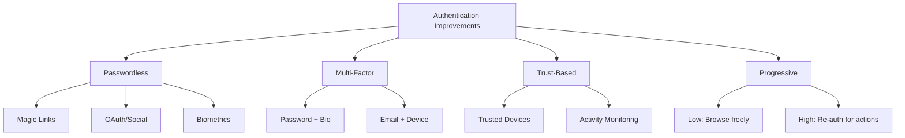

# Mary Examples - Business Analyst in Action

**Epic**: 31 - Full Mary Integration
**Version**: 1.0
**Last Updated**: 2025-11-10

This document provides 5+ complete examples demonstrating Mary's capabilities across all workflows: vision elicitation, brainstorming, requirements analysis, and domain-specific discovery.

---

## Example 1: Vision Elicitation - Team Collaboration Tool

**Scenario**: User has a vague idea for a team collaboration tool.

**Vagueness Score**: 0.9 (Very vague - triggers vision elicitation)

### User Request

```
User: "I want to build something that helps teams work better together"
```

### Brian's Response

```
Brian: Analyzing your request...
Brian: Vagueness score: 0.9 (very vague)
Brian: I recommend we start with Mary to clarify your vision.
Brian: This will take 20-30 minutes. Ready?

User: Yes
```

### Mary's Vision Canvas Session

```
Mary: Great! Let's use the Vision Canvas to clarify your idea.
Mary: This will help us understand who, what, why, and how.

=== TARGET USERS ===

Mary: Who would use this tool? What type of teams?

User: Small development teams, 5-10 people working on web apps

Mary: Perfect! Any specific characteristics of these teams?

User: They're mostly remote, use agile/scrum, and struggle with coordination

=== USER NEEDS ===

Mary: What problems are these teams experiencing?

User: They lose track of what everyone's working on, meetings are disorganized,
      and decisions get lost in Slack threads

Mary: What are the consequences of these problems?

User: Delays, duplicate work, team frustration, and missed deadlines

=== PRODUCT VISION ===

Mary: If this tool existed perfectly, what would it enable?

User: Teams would always know what's happening, decisions would be documented,
      and coordination would be effortless

=== KEY FEATURES ===

Mary: What are the 3-5 most important features?

User: 1. Real-time status dashboard showing what everyone's doing
      2. Quick async standups instead of meetings
      3. Decision log that's searchable
      4. Sprint planning made simple

=== SUCCESS METRICS ===

Mary: How would you measure success?

User: Daily active users, reduction in meeting time, faster sprint velocity

=== DIFFERENTIATORS ===

Mary: What makes this different from Jira, Trello, Slack?

User: It's focused JUST on coordination, not task management or chat.
      It sits between them and connects the dots.
```

### Mary's Output

```
Mary: Excellent! Here's your vision summary:

=== VISION SUMMARY ===

**Target Users**: Small remote development teams (5-10 people) using agile/scrum

**Core Problem**: Teams lose coordination in async remote work - decisions get lost,
duplicate work happens, meetings are disorganized

**Product Vision**: Effortless coordination layer between existing tools (Slack, Jira)
that keeps everyone aligned without adding overhead

**Key Features**:
1. Real-time team status dashboard (visual, glanceable)
2. Async standup tool (replace daily meetings)
3. Searchable decision log (capture and find decisions)
4. Lightweight sprint planning (simpler than Jira)

**Success Metrics**:
- 80%+ daily active users
- 50% reduction in meeting time
- 25% increase in sprint velocity

**Differentiator**: Focused coordination layer, not another chat/task tool.
Sits between Slack and Jira to connect the dots.

=== NEXT STEPS ===

Mary: I've saved this vision to: .gao-dev/mary/vision-documents/vision-2025-11-10-143022.md

Mary: This is ready for John (Product Manager) to create a comprehensive PRD.
      Would you like me to hand this off to Brian?

User: Yes please!

Mary: Excellent work! Handing back to Brian with clarified vision...
```

**Files Created**:
- `.gao-dev/mary/vision-documents/vision-2025-11-10-143022.md`
- `.gao-dev/context/mary-session-20251110.json`

**Prompt Used**: `mary_vision_canvas` (Epic 10 format)

---

## Example 2: Brainstorming - SCAMPER for Authentication

**Scenario**: User wants to improve authentication UX.

**Vagueness Score**: 0.75 (Moderate - could use brainstorming)

### User Request

```
User: "I need better authentication for my web app. Current password login is clunky."
```

### Mary's Brainstorming Session (SCAMPER)

```
Mary: Let's brainstorm! I recommend SCAMPER technique for generating creative ideas.
Mary: SCAMPER stands for: Substitute, Combine, Adapt, Modify, Put, Eliminate, Reverse

Ready to explore?

User: Yes!

=== S - SUBSTITUTE ===

Mary: What could you SUBSTITUTE passwords with?

User: - Biometric (fingerprint, face)
      - Hardware keys (YubiKey)
      - Magic links via email
      - OAuth (Google, GitHub)

Mary: Great ideas! Let's keep going.

=== C - COMBINE ===

Mary: What if you COMBINED two authentication methods?

User: - Password + fingerprint for high-security
      - Magic link + remember device
      - OAuth + 2FA for enterprise
      - Email code + trusted devices

=== A - ADAPT ===

Mary: What authentication patterns from OTHER domains could you ADAPT?

User: - Banking: Trusted devices with occasional re-auth
      - Gaming: Persistent sessions with activity monitoring
      - Physical security: Badge + PIN

=== M - MODIFY ===

Mary: How could you MODIFY the password experience itself?

User: - Visual passwords (pattern drawing)
      - Passphrase instead of password
      - Password manager integration
      - Progressive security (low for browsing, high for actions)

=== P - PUT TO OTHER USE ===

Mary: What if authentication also served ANOTHER purpose?

User: - Onboarding (collect preferences during setup)
      - Security audit (show login history)
      - Personalization (adapt UI based on device)

=== E - ELIMINATE ===

Mary: What if you ELIMINATED parts of authentication?

User: - No passwords at all (magic links only)
      - No signup (guest mode with progressive disclosure)
      - No logout (automatic session expiry)

=== R - REVERSE ===

Mary: What if you REVERSED the authentication flow?

User: - Authenticate device, not user
      - Prove who you're NOT (negative identity)
      - Server authenticates to user first
```

### Mary's Output

```
Mary: Fantastic brainstorming! You generated 24 ideas across 7 categories.

=== KEY THEMES ===

1. **Passwordless Options**: Magic links, OAuth, biometrics
2. **Multi-Factor**: Combining methods for security
3. **Trust & Context**: Device trust, activity monitoring
4. **Progressive Security**: Match security to action risk
5. **User Experience**: Eliminate friction, integrate with managers

=== MIND MAP ===



=== QUICK WINS ===

1. **Magic Links**: Easy to implement, big UX improvement
2. **OAuth Integration**: Leverage existing Google/GitHub accounts
3. **Trusted Devices**: Remember browser, re-auth after 30 days

=== LONG-TERM OPPORTUNITIES ===

1. **Progressive Security**: Match auth to risk (browse vs. delete)
2. **Biometric Support**: Fingerprint/Face ID for mobile
3. **Activity Monitoring**: ML-based anomaly detection

=== NEXT STEPS ===

Mary: I've saved this to: .gao-dev/mary/brainstorming-sessions/brainstorm-scamper-2025-11-10-143545.md

Mary: Recommend starting with magic links + OAuth as quick wins.
      Would you like me to help analyze requirements?

User: Yes, let's prioritize these ideas

Mary: Great! Moving to requirements analysis...
```

**Files Created**:
- `.gao-dev/mary/brainstorming-sessions/brainstorm-scamper-2025-11-10-143545.md`

**Prompt Used**: `mary_brainstorming_scamper` (Epic 10 format)

---

## Example 3: Requirements Analysis - MoSCoW Prioritization

**Scenario**: User has a list of features and needs prioritization.

### User Request

```
User: "Can you help me prioritize these features for my SaaS dashboard?
       - User login
       - Dashboard with metrics
       - Export to PDF
       - Dark mode
       - Real-time updates
       - AI-powered insights
       - Mobile app
       - Integrations with Slack/Teams"
```

### Mary's Requirements Analysis

```
Mary: Let's analyze these requirements! I'll use multiple techniques:
      1. MoSCoW prioritization
      2. Kano model categorization
      3. Dependency mapping
      4. Risk identification
      5. Constraint analysis

What's your timeline and team size?

User: 3 months, team of 3 developers

Mary: Perfect. Analyzing...

=== MoSCoW PRIORITIZATION ===

**MUST HAVE** (Non-negotiable for launch):
- User login (security requirement)
- Dashboard with metrics (core value prop)

**SHOULD HAVE** (Important but can wait):
- Export to PDF (requested by customers)
- Real-time updates (competitive advantage)
- Dark mode (modern UX expectation)

**COULD HAVE** (Nice to have):
- Integrations with Slack/Teams (extend reach)
- AI-powered insights (differentiator)

**WON'T HAVE** (Not in this release):
- Mobile app (different platform, 6+ month effort)

=== KANO MODEL ===

**Basic (Expected)**:
- User login
- Dashboard with metrics

**Performance (More = Better)**:
- Real-time updates (faster = more valuable)
- Export to PDF (more formats = better)

**Excitement (Delight)**:
- AI-powered insights (unexpected value)
- Dark mode (pleasant surprise)

=== DEPENDENCY MAPPING ===

```
User Login (Foundation)
    ↓
Dashboard with Metrics (Core)
    ↓
┌───────┬─────────┬──────────────┐
│       │         │              │
Export  Dark   Real-time    Integrations
to PDF  Mode   Updates          ↓
                ↓           AI Insights
            Mobile App
```

**Critical Path**: Login → Dashboard → Real-time Updates

**Blockers**: Login blocks everything

**Parallel Work**: Dark mode, Export, and Integrations can be built in parallel

=== RISK IDENTIFICATION ===

**Technical Risks**:
1. **Real-time Updates** (HIGH): WebSocket complexity, scaling challenges
   - Mitigation: Use proven library (Socket.io), load test early

2. **AI-powered Insights** (HIGH): Model training, accuracy, latency
   - Mitigation: Start with simple rules, add ML incrementally

3. **Integrations** (MEDIUM): API changes, authentication complexity
   - Mitigation: Focus on one integration first (Slack)

**Resource Risks**:
1. **Mobile App** (HIGH): Requires iOS/Android expertise
   - Mitigation: Defer to Phase 2

2. **3-month Timeline** (MEDIUM): Tight for 8 features
   - Mitigation: Cut mobile app, make AI optional

**Timeline Risks**:
1. **Feature Creep** (MEDIUM): AI insights could expand scope
   - Mitigation: Define MVP clearly, timebox AI work

=== CONSTRAINT ANALYSIS ===

**Time Constraints**:
- 3 months = ~12 weeks = ~36 dev-weeks
- Must have: Login + Dashboard = ~6 weeks
- Should have: Export + Dark + Real-time = ~6 weeks
- Could have: Integrations + AI = ~4 weeks

**Budget Constraints**:
- 3 developers × 3 months = finite capacity
- No budget for mobile developers

**Technical Constraints**:
- Team expertise: Web dev (strong), Mobile (weak), ML (weak)
- Infrastructure: Current stack supports web only

**Compliance Constraints**:
- User login requires GDPR/privacy compliance
- Data export must not leak sensitive info

=== RECOMMENDATION ===

**Phase 1 (3 months - MVP)**:
- MUST: User login, Dashboard with metrics
- SHOULD: Export to PDF, Dark mode, Real-time updates
- COULD: Slack integration (if time permits)

**Phase 2 (Months 4-6)**:
- AI-powered insights (hire ML expert)
- Teams integration
- Advanced export formats

**Phase 3 (Months 7-12)**:
- Mobile app (hire mobile devs)

=== NEXT STEPS ===

Mary: I've saved this analysis to: .gao-dev/mary/requirements-analysis/analysis-2025-11-10-152410.md

Mary: My recommendation: Focus Phase 1 on the MUST + SHOULD features.
      Defer AI and mobile to later phases.

      Ready to hand this to Brian for workflow planning?

User: Yes, makes sense!
```

**Files Created**:
- `.gao-dev/mary/requirements-analysis/analysis-2025-11-10-152410.md`

**Prompts Used**:
- `mary_requirements_moscow`
- `mary_requirements_kano`
- `mary_requirements_dependency`
- `mary_requirements_risk`
- `mary_requirements_constraint`

---

## Example 4: Domain-Specific Questions - Mobile App

**Scenario**: User wants to build a fitness tracking mobile app.

### User Request

```
User: "I want to build a mobile app for fitness tracking"
```

### Mary's Domain-Specific Discovery

```
Mary: Detected domain: Mobile App
Mary: Let me ask some mobile-specific questions to gather requirements...

=== PLATFORM ===

Mary: iOS, Android, or both?

User: Both

Mary: What's your minimum OS version? (iOS 14+, Android 10+?)

User: iOS 15+ and Android 11+

=== OFFLINE CAPABILITY ===

Mary: Will users need offline access? (e.g., tracking workouts without internet)

User: Yes, definitely. Gym often has poor signal.

Mary: What data needs to sync when they come back online?

User: Workout logs, progress photos, weight measurements

=== PUSH NOTIFICATIONS ===

Mary: Push notifications for reminders?

User: Yes - workout reminders, streak achievements, friend challenges

Mary: Time-based or activity-based?

User: Both. Scheduled workout reminders + real-time challenge notifications

=== DEVICE FEATURES ===

Mary: Use device sensors? (GPS, accelerometer, heart rate)

User: GPS for outdoor runs, maybe heart rate if available

Mary: Camera for progress photos?

User: Yes, with before/after comparison

Mary: Health app integration? (Apple Health, Google Fit)

User: Yes, sync workouts both ways

=== DATA & PRIVACY ===

Mary: Where will user data be stored? (Cloud, device, hybrid)

User: Hybrid - offline-first, sync to cloud for backup

Mary: Health data is sensitive. HIPAA compliance needed?

User: No, this is wellness not medical

Mary: How will you handle privacy? (photos, body measurements)

User: Private by default, optional sharing with friends

=== SOCIAL FEATURES ===

Mary: Social features? (friends, leaderboards, challenges)

User: Yes - friend challenges, private leaderboards

Mary: User authentication? (email, social login, phone)

User: Email + Google/Apple sign-in

=== PERFORMANCE ===

Mary: Expected user base size?

User: Start small (1000 users), grow to 100k

Mary: Data usage concerns? (photos, video)

User: Yes, compress photos, cache UI assets

=== MONETIZATION ===

Mary: Free, paid, freemium, subscription?

User: Freemium - basic free, premium for advanced features

Mary: In-app purchases?

User: Premium subscription ($5/month or $40/year)

=== TECHNICAL ===

Mary: Cross-platform framework? (React Native, Flutter, native)

User: React Native for faster development

Mary: Backend/API already exists?

User: No, need to build

=== NEXT STEPS ===

Mary: Excellent! I've captured 18 mobile-specific requirements:

**Summary**:
- Platform: iOS 15+, Android 11+ (React Native)
- Offline: Full offline support with sync
- Notifications: Scheduled + real-time
- Sensors: GPS, camera, heart rate (optional)
- Integrations: Apple Health, Google Fit
- Social: Friends, challenges, private leaderboards
- Data: Hybrid storage (offline-first, cloud backup)
- Privacy: Private by default, GDPR compliant
- Monetization: Freemium ($5/month premium)

Mary: This gives Winston (Architect) everything he needs for technical design.
      Ready to hand off to Brian?

User: Perfect, yes!
```

**Files Created**:
- `.gao-dev/mary/domain-requirements/mobile-app-2025-11-10-154123.md`

**Prompt Used**: `mary_domain_mobile_app` (Epic 10 format)

---

## Example 5: Full Flow - Vague Idea to PRD

**Scenario**: Complete flow from vague idea through Mary to PRD creation.

### Initial Request

```
User: "I want to do something with AI and education"
```

### Brian Detects Vagueness

```
Brian: Analyzing...
Brian: Vagueness score: 0.95 (extremely vague)
Brian: Recommended action: Vision elicitation with Mary (20-30 min session)
Brian: This will help you articulate your idea before we build anything.

Continue?

User: Yes
```

### Mary: Vision Elicitation (5W1H)

```
Mary: Let's clarify your vision using the 5W1H framework.
      This asks: Who, What, When, Where, Why, How

=== WHO ===

Mary: Who is this for? What type of learners?

User: High school students struggling with math

Mary: Any specific characteristics?

User: Ages 14-18, varying skill levels, many have math anxiety

=== WHAT ===

Mary: What exactly would this AI do for them?

User: Provide personalized tutoring, adapt to their level, make math less scary

Mary: What subjects? Algebra, geometry, calculus?

User: Start with algebra, expand later

=== WHEN ===

Mary: When would students use this?

User: Homework help in evenings, test prep, during class (supplemental)

=== WHERE ===

Mary: Where would they access it?

User: Mostly at home on laptop, sometimes phone

=== WHY ===

Mary: Why is this needed? What's the problem?

User: Teachers don't have time for 1-on-1 help. Khan Academy is great but
      not personalized. Students give up when they get stuck.

Mary: What happens if this problem isn't solved?

User: Students fall behind, develop math anxiety, close off STEM careers

=== HOW ===

Mary: How would this work technically?

User: AI chatbot that explains step-by-step, adapts difficulty,
      encourages them when stuck

Mary: How would it know their level?

User: Initial assessment, then track progress over time

Mary: How is this different from existing tools?

User: More patient, socratic method, builds confidence not just competence
```

### Mary: Vision Summary

```
Mary: Excellent! Here's your vision:

**Target Users**: High school students (ages 14-18) struggling with algebra,
many with math anxiety

**Problem Statement**: Students get stuck on homework, teachers lack time for
1-on-1 help, existing tools aren't personalized enough, students give up and
develop lasting math anxiety

**Solution**: AI-powered algebra tutor that:
- Adapts to each student's level
- Explains step-by-step using socratic method
- Provides patient, encouraging guidance
- Tracks progress over time
- Available 24/7 for homework help

**Key Differentiators**:
- Emotional support (addresses math anxiety, not just accuracy)
- Socratic teaching (asks questions, doesn't just give answers)
- Adaptive difficulty (meets students where they are)

**Success Metrics**:
- Student confidence increase (self-reported)
- Time to solve problems decreases over time
- Return usage (students come back voluntarily)
- Grade improvement

**Initial Scope**: Algebra only, web + mobile, freemium model

Mary: This is ready for John to create a PRD. Shall I hand off?

User: Yes!
```

### Brian Receives Vision Summary

```
Brian: Received clarified vision from Mary. Analyzing...

Brian: This is a Level 3 project (Medium Feature):
      - Estimated: 20-35 stories
      - Timeline: 2-3 months
      - Requires: PRD → Architecture → Story breakdown

Brian: Recommended workflow sequence:
      1. John creates PRD (analysis/create-prd)
      2. Winston creates Architecture (solutioning/create-architecture)
      3. Bob breaks down into stories (planning/epic-to-stories)
      4. Amelia implements (implementation/story-implementation)

Proceed with PRD creation?

User: Yes

Brian: Coordinating with John (Product Manager)...
```

### John Creates PRD

```
John: Creating PRD from Mary's vision summary...

[10 minutes later]

John: PRD complete! Saved to: docs/PRD-ai-algebra-tutor.md

Key sections:
- Executive Summary
- Problem Statement
- User Personas (struggling student, motivated learner, parent)
- Solution Overview
- Features (adaptive tutoring, step-by-step, progress tracking)
- Success Metrics
- Technical Considerations
- Go-to-Market

Ready for Winston to create architecture?

User: Yes

Brian: Coordinating with Winston...
```

### Winston Creates Architecture

```
Winston: Creating technical architecture...

[15 minutes later]

Winston: Architecture complete! Saved to: docs/ARCHITECTURE-ai-algebra-tutor.md

Key decisions:
- Frontend: React (web) + React Native (mobile)
- Backend: Node.js + Express
- AI: OpenAI GPT-4 with custom prompts + fine-tuning
- Database: PostgreSQL (user data) + MongoDB (conversation history)
- Hosting: Vercel (frontend) + Railway (backend)

Ready for Bob to break this into stories?

User: Yes
```

### Bob Creates Stories

```
Bob: Breaking epic into stories...

[5 minutes later]

Bob: Created 24 stories across 4 epics:

**Epic 1: Core Chat Interface** (8 stories, 21 points)
**Epic 2: AI Tutoring Engine** (6 stories, 18 points)
**Epic 3: Progress Tracking** (5 stories, 13 points)
**Epic 4: User Management** (5 stories, 13 points)

Total: 24 stories, 65 story points, ~10 weeks

Ready to start implementation?

User: Yes, let's start with Epic 1

Brian: Coordinating with Amelia...
```

### Summary

**Full Flow**:
1. User: Vague idea (95% vagueness)
2. Brian: Detects vagueness, delegates to Mary
3. Mary: Vision elicitation (5W1H technique, 25 minutes)
4. Mary → Brian: Hands off clarified vision
5. Brian: Selects workflow sequence (PRD → Arch → Stories)
6. John: Creates PRD (10 min)
7. Winston: Creates Architecture (15 min)
8. Bob: Breaks into 24 stories (5 min)
9. Amelia: Ready to implement

**Total Time**: ~1 hour from vague idea to implementation-ready stories

**Files Created**:
- `.gao-dev/mary/vision-documents/vision-ai-tutor-2025-11-10.md`
- `docs/PRD-ai-algebra-tutor.md`
- `docs/ARCHITECTURE-ai-algebra-tutor.md`
- `docs/epics/epic-1-chat-interface.md`
- `docs/stories/story-1.1-basic-chat-ui.md`
- [...24 total story files]

---

## Example 6: First Principles Brainstorming

**Scenario**: User wants to rethink documentation from scratch.

### User Request

```
User: "Our documentation is a mess. Help me brainstorm a better approach"
```

### Mary's First Principles Session

```
Mary: Let's use First Principles thinking. We'll strip away all assumptions
      and rebuild from fundamental truths.

=== STEP 1: Identify Current Assumptions ===

Mary: What assumptions are you making about documentation?

User: - It should be written in Markdown
      - It should live in a docs/ folder
      - Developers should write it
      - It should be versioned with code

Mary: Good. Let's question each one.

=== STEP 2: Break Down to Fundamentals ===

Mary: What is the CORE PURPOSE of documentation?

User: Help people understand and use the system

Mary: What are the FUNDAMENTAL TRUTHS?

User: - People need information to accomplish tasks
      - Information decays over time
      - Different people need different information
      - Finding information takes time

=== STEP 3: Rebuild from First Principles ===

Mary: If we start from "people need information to accomplish tasks",
      what follows?

User: - Information should be task-oriented, not structure-oriented
      - Should be searchable by task ("How do I...?")
      - Should be contextual (appear when needed)
      - Should be living (updated automatically)

Mary: How does this change your approach?

User: Instead of static docs, what if:
      - Docs are generated from code comments
      - Search is semantic ("find how to deploy")
      - Docs appear in-context (IDE, error messages)
      - AI keeps them fresh by detecting drift

=== GENERATED IDEAS ===

1. **AI-Generated Docs**: Extract from code + tests + commits
2. **Semantic Search**: Natural language queries
3. **Contextual Injection**: Show docs where people work (IDE, CLI)
4. **Living Documentation**: Auto-detect when docs are stale
5. **Task-Oriented Structure**: Organized by "How do I..." not "What is..."
6. **Multi-Modal**: Text, video, interactive examples
7. **Community-Driven**: Let users suggest updates
8. **Versioned Learning Paths**: Different docs for beginner vs. expert

Mary: This completely rethinks documentation! Instead of static files,
      it's a living, intelligent system.

Ready to analyze these ideas?

User: Yes!
```

**Prompt Used**: `mary_brainstorming_first_principles` (Epic 10 format)

---

## Summary

These 6 examples demonstrate Mary's versatility:

1. **Vision Canvas**: Vague idea → Clear vision
2. **SCAMPER**: Existing feature → Creative alternatives
3. **MoSCoW + Risk**: Feature list → Prioritized roadmap
4. **Domain Questions**: General idea → Detailed requirements
5. **Full Flow**: End-to-end (vague idea → implementation ready)
6. **First Principles**: Rethink assumptions → Novel approaches

**Key Takeaways**:

- Mary adapts technique to vagueness level
- All outputs are actionable (feed into PRD/Architecture)
- Sessions are saved for reference
- Epic 10 integration makes prompts customizable
- Mary → Brian handoff is seamless

---

**More Examples?** See:
- [USER_GUIDE_MARY.md](../USER_GUIDE_MARY.md) - Complete guide
- [DEMO_SCRIPT.md](../DEMO_SCRIPT.md) - Interactive demo

**Version**: 1.0
**Last Updated**: 2025-11-10 (Epic 31 Complete)
